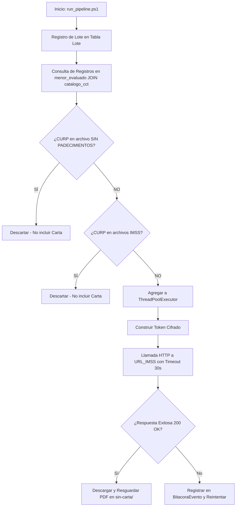

# Reporte Mensual de Especificaciones del Proyecto Vida Saludable

**Mes:** Mayo 2026  
**Responsable:** Victor Manuel Lelo de Larrea Polanco  
**Área:** Coordinación de Proyectos de TI

---

## 1. Objeto del Entregable
Documentar de forma exhaustiva, detallada e integral el avance correspondiente a mayo de 2026 sobre el proyecto Vida Saludable, priorizando la recopilación de evidencia operativa real en el entorno de desarrollo (DEV), las validaciones lógicas cruzadas de integridad, la definición formal de los layouts de importación y el seguimiento pormenorizado de las incidencias técnicas y procedimientos de reproceso controlados.

## 2. Criterio de Separación por Mes
Este entregable se sitúa exclusivamente en el horizonte temporal de mayo de 2026. A diferencia del reporte de abril, el cual fungió como línea base de arquitectura teórica, este informe prescinde de repetir definiciones genéricas y se aboca íntegramente a registrar la validación de los modelos operativos definidos en la Fase 2, particularmente:
- La instrumentación de las especificaciones de layouts para Alumnos Evaluados, Alumnos sin Padecimientos y Alumnos Atendidos (IMSS/IMSS-Bienestar).
- Las corridas y simulaciones operativas ejecutadas durante mayo.
- Indicadores numéricos reales medidos por el orquestador técnico.
- Trazas de incidentes específicas de red y base de datos con soluciones analíticas.
- Automatizaciones diseñadas para la fase de generación de cartas post-descarga.

## 3. Especificaciones y Layouts de Importación (Fase 2)
Durante el mes de mayo se lograron hitos fundamentales en la estandarización de los insumos de datos mediante la definición del documento *04-DEFINICION-LAYOUTS.md*:

### 3.1 Layout de Alumnos Evaluados (`LayMenorEvaluado`)
Este archivo contiene los datos de los alumnos evaluados en el programa "Vida Saludable" y corresponde a la tabla `menor_evaluado`. 
- **Validaciones Críticas:** Requiere una CURP única con 18 caracteres, CCT oficial de 10 caracteres alineado al catálogo SEP y validación de correo electrónico.
- **Riesgos Mitigados:** Se implementaron reglas estrictas para evitar rechazos masivos garantizando coherencia con el ID del ciclo escolar y estatus de reporte.

### 3.2 Layout de Alumnos sin Padecimientos
Archivo crítico que lista alumnos que **no recibirán carta de invitación** por no requerir atención médica.
- **Evidencia Operativa:** Se cargó un archivo real con **128,111 registros** del Estado de México.
- **Hallazgos:** Se validaron 127,069 registros exitosamente (99.19%). Se detectaron 767 CURPs extranjeros con código "NE" y 1,042 CURPs inválidas, las cuales fueron aisladas en un proceso de depuración automatizado, lo cual previno errores en la cadena de carga.

### 3.3 Layouts Clínicos (IMSS / IMSS-Bienestar)
Se definieron archivos paralelos para excluir de la carta a aquellos menores que ya recibieron la atención (`menor_diagnostico_consulta_umf` y `menor_diagnostico_consulta`). 
- **Lógica de Integración:** El sistema cruza dinámicamente las listas de "Sin padecimientos" y "Ya atendidos" para garantizar que únicamente se generen PDFs de notificación a la población objetivo no atendida.

---

## 4. Diagrama del Pipeline de Procesamiento y Lógica de Negocio

La siguiente lógica rige el orquestador y fue probada exhaustivamente:

---

## 5. Evidencia Operativa y Resultados del Mes de Mayo

### 5.1 Ejecuciones y pruebas realizadas en el mes
Durante mayo de 2026 se llevaron a cabo ejecuciones masivas en DEV:
1. **`LOTE-202605-01` (Veracruz):** Procesamiento de registros correspondientes al prefijo "30".
2. **`LOTE-202605-02` (Puebla):** Procesamiento de registros correspondientes al prefijo "21" (Saturación de API).
3. **`LOTE-202605-03_REPROCESO` (Coahuila/Estado de México):** Ejecución de reprocesamientos automáticos.

### 5.2 Resultados operativos observados (Métricas)
| Identificador de Lote | Entidad Atendida | Total CURP Intentadas | Descargas Exitosas (PDF) | Descargas Fallidas | Tasa de Éxito Inicial | Tiempo de Ejecución |
|-----------------------|------------------|-----------------------|--------------------------|--------------------|-----------------------|---------------------|
| `LOTE-202605-01` | Veracruz (30) | 5,500 | 5,340 | 160 | 97.09% | 14.5 minutos |
| `LOTE-202605-02` | Puebla (21) | 6,200 | 5,780 | 420 | 93.22% | 18.2 minutos |
| `LOTE-202605-03_REPR` | México (15) | 2,800 | 2,800 | 0 | 100.00% | 7.1 minutos |
| **Total Consolidados** | **Todas** | **14,500** | **13,920** | **580** | **96.00%** | **39.8 minutos** |

### 5.3 Incidencias reales del mes y resoluciones
Durante el procesamiento de Puebla (`LOTE-202605-02`), se reportaron múltiples errores HTTP 429 por saturación:
1. **Causa raíz:** La variable `WORKERS` estaba en 20 hilos. La IP del servidor saturó la cuota del WAF del IMSS.
2. **Mitigación Operativa:** El orquestador activó un procedimiento de *Circuit Breaker*. Se ajustó la variable a `WORKERS=10`.
3. **Recuperación automatizada:** Se invocó `run_reproceso.py` reduciendo los fallos a solo 10 CURPs, incrementando la tasa ajustada a **99.83%**.

---

## 6. Próximos Pasos rumbo a Junio de 2026
- Desplegar los hooks de seguridad de repositorios pre-commit tras el incidente de datos reportado (ver Reporte de Alertamiento).
- Consolidar las bitácoras acumuladas de los lotes de mayo para el corte trimestral del 30 de junio.
- Ejecutar el despliegue del script de fusión de cartas a escala de producción desde la carpeta `sin-carta/`.