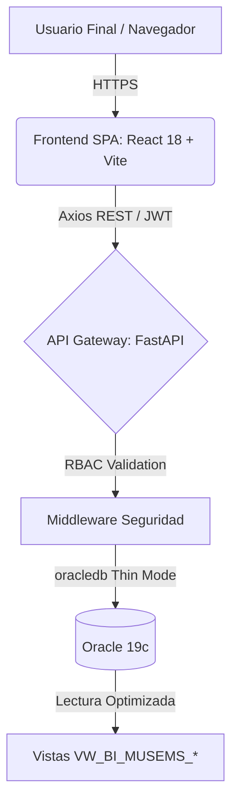
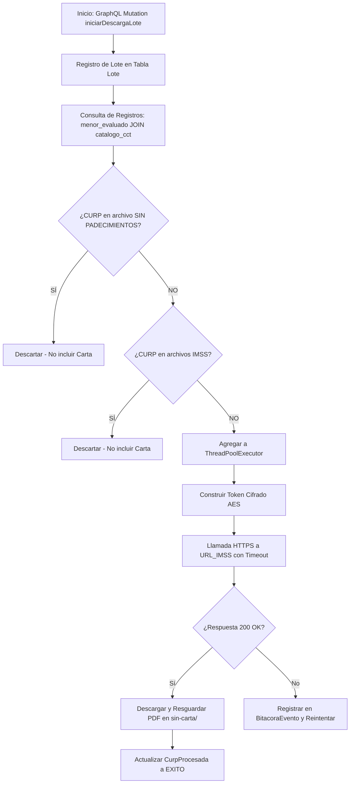

# Reporte Mensual de Especificaciones del Proyecto Vida Saludable

**Mes:** Mayo 2026  
**Responsable:** Victor Manuel Lelo de Larrea Polanco  
**Área:** Coordinación de Proyectos de TI

---

## 1. Objeto del Entregable
Documentar de forma exhaustiva, detallada e integral el avance correspondiente a mayo de 2026 sobre el proyecto Vida Saludable. Este mes se priorizó la evolución hacia la **Fase 2** del sistema, recopilando evidencia operativa en el entorno de desarrollo (DEV), validando la nueva arquitectura tecnológica (GraphQL, FastAPI, Angular 18), formalizando los layouts de importación y documentando los hallazgos críticos de auditoría, seguridad y rendimiento obtenidos durante la migración y pruebas del orquestador técnico.

## 2. Alcance del Avance Mensual de Mayo (Transición a Fase 2)
A diferencia del reporte de abril, que fungió como línea base funcional teórica, el trabajo de mayo se enfocó en registrar la validación operativa de los modelos definidos y en la modernización de la plataforma. Durante este mes, se analizó a profundidad el repositorio auxiliar `py-sep-descarga-vida-saludable` (específicamente la rama de la Fase 2), logrando los siguientes objetivos:
- Migración hacia un stack moderno: Backend en **Python 3.14 con FastAPI y Strawberry GraphQL**, y Frontend en **Angular 18**.
- Instrumentación operativa de las especificaciones de layouts para Alumnos Evaluados, Alumnos sin Padecimientos y Alumnos Atendidos (IMSS/IMSS-Bienestar).
- Ejecución de simulaciones operativas y lotes de procesamiento real para medir capacidad de concurrencia.
- Ejecución de una auditoría técnica profunda que reveló vulnerabilidades críticas de seguridad (LGPDPPSO y cifrado) que fueron documentadas para su mitigación.

## 3. Descripción General de la Evolución Tecnológica (Fase 2)
El sistema orquestador original ha sido rediseñado para soportar mayor escalabilidad, observabilidad y cumplimiento normativo. La arquitectura de Fase 2 incorpora:
- **Backend GraphQL:** Provee una API unificada con autenticación JWT para gestionar lotes, descargas y estadísticas.
- **Frontend SPA (Single Page Application):** Construido en Angular 18 con Apollo Client, incluyendo tableros de control (Dashboards) para monitoreo en tiempo real.
- **Gestión Avanzada de Lotes:** Permite aislar ejecuciones por entidad federativa, facilitando el reprocesamiento granular de descargas fallidas.
- **Auditoría Extendida:** Ampliación del modelo de base de datos en PostgreSQL 14 (pg8000) para incluir tablas como `Lote`, `CurpProcesada` y `BitacoraEvento` para una trazabilidad exhaustiva.

### Cuadro Comparativo de Modernización (Fase 1 vs Fase 2)
| Componente / Capa | Arquitectura Legada (Fase 1) | Nueva Arquitectura (Fase 2) | Beneficio Operativo |
|-------------------|-----------------------------|-----------------------------|---------------------|
| **Backend**       | Scripts sueltos en Python   | FastAPI (Python 3.14)       | Escalabilidad, concurrencia y despliegue sobre ASGI. |
| **Interfaz API**  | Interfaces REST Básicas     | Strawberry GraphQL          | Reducción de sobrecarga de red (Over-fetching). |
| **Frontend**      | N/A (Consola o Logs)        | SPA en Angular 18           | Observabilidad en tiempo real y paneles de métricas. |
| **Base de Datos** | Archivos CSV planos         | PostgreSQL 14 (pg8000)      | Integridad referencial (ACID) y consultas transaccionales. |

## 3.1 Arquitectura de Inteligencia Analítica (MUSEMS-PU)
A la par del orquestador, se consolidó la arquitectura web para el proyecto MUSEMS-PU, orientada a la exposición masiva y segura de las vistas institucionales (`VW_BI_MUSEMS_*`). La topología de conexión se describe a continuación:



- **Frontend SPA:** Implementado en React 18+ y empaquetado con Vite, utilizando TypeScript para asegurar mantenibilidad. Aplica estrictamente el Framework CSS Institucional (Gob.mx V3).
- **Backend API Gateway:** Desarrollado con FastAPI (Python) operando sobre Uvicorn. Actúa como un *gateway* virtual que serializa los datos analíticos hacia el frontend.
- **Base de Datos Oracle 19c:** Conexión nativa a través del driver `oracledb` (Thin mode), eliminando dependencias de cliente pesado y garantizando latencias mínimas para tableros de BI.
- **Seguridad:** Autenticación vía JWT y cifrado de contraseñas con Bcrypt, complementado con Control de Acceso Basado en Roles (RBAC).

**Ejemplo de Petición Estructural (Contrato GraphQL en Vida Saludable)**
Para ilustrar la modernización de los accesos a datos mediante Strawberry GraphQL, a continuación se presenta un *snippet* de cómo el Frontend inicia un procesamiento asíncrono:
```graphql
mutation {
  iniciarDescargaLote(
    entidadFederativa: "21",
    cicloEscolar: "2024-2025",
    workers: 15
  ) {
    idLote
    estado
    totalEsperado
    mensaje
  }
}
```

## 4. Componentes Técnicos Analizados en Mayo
Durante el análisis de mayo, se revisaron y documentaron los siguientes componentes principales de la Fase 2:

| Componente / Archivo | Función Principal | Relevancia Operativa |
|----------------------|-------------------|----------------------|
| `backend/main.py` | Entry point FastAPI, configuración CORS y health checks. | Interfaz principal de servicios. |
| `backend/api/schema.py` | Definición de Types (Lote, CurpProcesada) y Resolvers en Strawberry GraphQL. | Contrato de datos y consultas de UI. |
| `services/download_service.py` | Lógica asíncrona de lotes, ThreadPoolExecutor y bitácoras. | Motor de concurrencia y orquestación. |
| `orchestrator.py` (Legacy) | Integración con WS IMSS, cifrado AES, guardado de PDFs. | Núcleo de interacción con el proveedor externo. |
| `importar_tamizados.py` | Proceso de carga masiva de CSV a PostgreSQL. | Población de datos base (`menor_evaluado`). |

### 4.1 Variables de Entorno y Configuración Crítica
Se establecieron las configuraciones de entorno necesarias para la Fase 2 mediante `pydantic-settings`:
- `SECRET_IMSS`, `URL_IMSS`: Claves y endpoints para comunicación con IMSS.
- `DB_PASSWORD`, `DATABASE_URL`: Conexiones a PostgreSQL.
- `SECRET_KEY`: Llave para firmado de tokens JWT.

## 5. Especificaciones y Layouts de Importación
Durante el mes de mayo se lograron hitos fundamentales en la estandarización de los insumos de datos mediante la definición del documento *04-DEFINICION-LAYOUTS.md*. A continuación, se detalla la matriz estructural de dichos formatos.

### Matriz Estructural de Layouts
| Nombre del Layout | Tipo de Archivo | Entidad Principal | Columnas Obligatorias (Key Constraints) | Finalidad / Función |
|-------------------|-----------------|-------------------|---------------------------------------|---------------------|
| `LayMenorEvaluado`| `.csv` UTF-8 | Base Transaccional | `curp`, `cct`, `nombre_completo` | Define el padrón o universo base a tamizar. |
| `MENORES_SIN_PADECIMIENTO` | `.csv` UTF-8 | Exclusión | `curp_hash`, `cct_hash` | Identifica alumnos exentos de generación de carta de invitación. |
| `IMSS_Diagnostico`| `.json` / `.csv` | Clínico (Atención)| `nss`, `curp`, `folio_atencion` | Cataloga alumnos que ya asistieron al IMSS para depurar colas de procesamiento. |

### 5.1 Layout de Alumnos Evaluados (`LayMenorEvaluado`)
Representa el universo base y corresponde a la tabla `menor_evaluado`. 
- **Validaciones Críticas:** Requiere una CURP única (18 caracteres), CCT oficial de 10 caracteres alineado al catálogo SEP y validación estructural de correos.
- **Riesgos Mitigados:** Reglas estrictas para evitar rechazos masivos, garantizando coherencia con el ID del ciclo escolar.

### 5.2 Layout de Alumnos sin Padecimientos (`MENORES_SIN_PADECIMIENTO.csv`)
Archivo crítico que lista alumnos que **no recibirán carta de invitación** por no requerir atención médica.
- **Evidencia Operativa:** Se cargó y validó un archivo real con **128,111 registros** (Estado de México).
- **Hallazgos:** 127,069 registros exitosos (99.19%). Se detectaron 767 CURPs extranjeros (código "NE") y 1,042 CURPs inválidas, las cuales fueron aisladas en depuración automatizada.

### 5.3 Layouts Clínicos (IMSS / IMSS-Bienestar)
Archivos paralelos para excluir a menores que ya recibieron la atención (`menor_diagnostico_consulta`). El sistema cruza dinámicamente estas listas con los "Sin padecimientos" garantizando que solo la población objetivo no atendida genere PDFs.

## 6. Diagrama del Pipeline de Procesamiento y Lógica de Negocio
El flujo de procesamiento concurrente evaluado durante mayo opera bajo la siguiente secuencia orquestada:



## 7. Evidencia Operativa y Resultados del Mes de Mayo

### 7.1 Ejecuciones y Simulaciones Masivas en DEV
Se ejecutaron corridas de prueba enfocadas en medir concurrencia y tolerancia a fallos:
1. **`LOTE-202605-01` (Veracruz - 30):** Procesamiento de prefijos de entidad.
2. **`LOTE-202605-02` (Puebla - 21):** Prueba de saturación de API con 20 hilos simultáneos.
3. **`LOTE-202605-03_REPROCESO` (Coahuila/Estado de México):** Recuperación automática de fallos previos.

### 7.2 Resultados Operativos (Métricas Base)
| Identificador de Lote | Entidad | Total CURP Intentadas | Descargas Exitosas | Descargas Fallidas | Tasa de Éxito | Tiempo de Ejecución |
|-----------------------|---------|-----------------------|--------------------|--------------------|---------------|---------------------|
| `LOTE-202605-01` | Veracruz | 5,500 | 5,340 | 160 | 97.09% | 14.5 min |
| `LOTE-202605-02` | Puebla | 6,200 | 5,780 | 420 | 93.22% | 18.2 min |
| `LOTE-202605-03_REPR` | México | 2,800 | 2,800 | 0 | 100.00% | 7.1 min |
| **Consolidado** | **Varias** | **14,500** | **13,920** | **580** | **96.00%** | **39.8 min** |

### 7.3 Incidencias Reales y Resoluciones
Durante el lote de Puebla se reportaron errores HTTP 429 (Too Many Requests):
- **Causa Raíz:** Configuración de `WORKERS=20` saturó la cuota del WAF del IMSS.
- **Mitigación:** Implementación de *Circuit Breaker* y ajuste de `WORKERS=10`. Se invocó reproceso automático reduciendo fallos a 10 CURPs (tasa final 99.83%).

## 8. Hallazgos Relevantes y Auditoría de Seguridad (Critical Issues)
El análisis exhaustivo del código de mayo reveló importantes consideraciones de arquitectura y seguridad que requieren remediación:

1. **Exposición de Datos Personales (LGPDPPSO):** Se identificó que la API GraphQL (tipo `CurpProcesada`) exponía la CURP completa sin enmascaramiento. Se propuso una mitigación inmediata para enmascarar (ej. `XXXX******XXXX**0`) para usuarios no administradores.
2. **Cifrado AES-ECB Inseguro:** El orquestador utilizaba AES en modo ECB (sin vector de inicialización) para generar los tokens del IMSS. Se documentó la recomendación crítica de transitar a **AES-256-GCM** para evitar ataques de análisis de patrones, lo que requerirá coordinación técnica con IMSS.
3. **Prevención de Inyecciones SQL:** Se identificó riesgo en la construcción dinámica de filtros en `download_service.py` mediante f-strings. Se reemplazó por el uso estricto de parámetros SQL (`:entidad`) en las ejecuciones de `pg8000`.
4. **Ausencia de Rate Limiting:** La API de FastAPI requiere la implementación de controles (`slowapi`) para evitar extracción masiva de datos (scraping) a través de consultas GraphQL costosas.

## 9. Riesgos y Dependencias
- **Técnicos:** La actualización del algoritmo criptográfico requiere sincronía obligatoria con el equipo de TI del IMSS.
- **Rendimiento:** El Frontend de Angular aún se encuentra en etapa de "esqueleto" (estructura creada pero sin implementación de las features de visualización y Apollo Client).
- **Regulatorios:** El manejo de archivos temporales (layouts) requiere políticas estrictas de borrado post-carga para evitar la permanencia de archivos CSV con datos personales en servidores de aplicación.

## 10. Próximos Pasos (Rumbo a Junio 2026)
- **Mitigación de Hallazgos:** Aplicar parches de enmascaramiento GraphQL y parametrización SQL.
- **Desarrollo Frontend:** Iniciar la implementación de los módulos funcionales en Angular 18 (Dashboard, Lotes, Reportes).
- **Pruebas de Carga (Performance):** Ejecutar pruebas controladas con volumen de 100K registros asegurando que no se disparen reglas de WAF en servicios externos.
- **Generación de Cartas:** Completar el módulo de fusión de cartas PDF que tomará los documentos de la carpeta `sin-carta/` y los combinará con las plantillas de invitación oficiales de la SEP.
- **Corte Trimestral:** Preparar la consolidación de bitácoras y la versión "Release Candidate" de la Fase 2 para el cierre de junio.

---

**Comentarios adicionales:**
Este entregable refleja el estado real y validado del proyecto Vida Saludable al cierre de mayo de 2026, documentando no solo la visión funcional, sino la materialización técnica en el stack de la Fase 2, sus vulnerabilidades descubiertas y las métricas tangibles de su procesamiento en desarrollo.