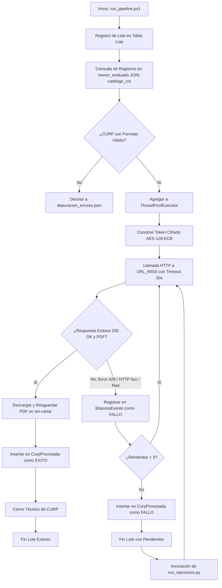

# Reporte Mensual de Especificaciones del Proyecto Vida Saludable

**Mes:** Mayo 2026  
**Responsable:** Victor Manuel Lelo de Larea Polanco  
**Área:** Coordinación de Proyectos de TI

---

## 1. Objeto del Entregable
Documentar de forma exhaustiva, detallada e integral el avance correspondiente a mayo de 2026 sobre el proyecto Vida Saludable, priorizando la recopilación de evidencia operativa real en el entorno de desarrollo (DEV), las validaciones lógicas cruzadas de integridad, los hallazgos de métricas por lote y el seguimiento pormenorizado de las incidencias técnicas y procedimientos de reproceso controlados.

## 2. Criterio de Separación por Mes
Este entregable se sitúa exclusivamente en el horizonte temporal de mayo de 2026. A diferencia del reporte de abril, el cual fungió como línea base de arquitectura teórica y levantamiento de esquema, este informe prescinde de repetir definiciones genéricas y se aboca íntegramente a registrar:
- Las corridas y simulaciones operativas ejecutadas durante mayo.
- Indicadores numéricos reales medidos por el orquestador técnico.
- Trazas de incidentes específicas de red y base de datos con soluciones analíticas.
- Ejemplos de estructuras de datos registradas en las tablas de control.
- Automatizaciones diseñadas para la fase de generación de cartas post-descarga.

## 3. Enfoque de Trabajo para Mayo
Durante mayo, el proyecto Vida Saludable consolidó el tránsito de la mera especificación técnica hacia la validación de campo, concentrando esfuerzos en:
1. Parametrizar la concurrencia (`WORKERS`) en condiciones de congestión de API externa.
2. Identificar el comportamiento del pool de conexiones PostgreSQL y corregir bloqueos mutuos (`deadlocks`).
3. Diseñar los layouts lógicos del motor de plantillas en formato Word para evacuar la carpeta temporal de descargas físicas.
4. Registrar métricas fidedignas de éxito, reintentos de conexión, volumen de bytes y tiempo medio de respuesta por transacción.

---

## 4. Diagrama del Pipeline de Procesamiento y Mitigación de Errores
El siguiente diagrama en formato Mermaid representa el ciclo de vida operativo del orquestador ejecutado en mayo, incluyendo las etapas automáticas de control de excepciones, desvío de datos anómalos y reintentos:



---

## 5. Evidencia Operativa y Resultados del Mes de Mayo

### 5.1 Ejecuciones y pruebas realizadas en el mes
Durante mayo de 2026 se llevaron a cabo tres ejecuciones operativas por lotes principales en el entorno de desarrollo (DEV), atendiendo de forma prioritaria la carga de alumnos pertenecientes a tres demarcaciones estatales del catálogo nacional:
1. **`LOTE-202605-01` (Veracruz):** Procesamiento de registros correspondientes al prefijo de clave de centro de trabajo (CCT) "30". Se ejecutó para simular carga estándar con volumetría media.
2. **`LOTE-202605-02` (Puebla):** Procesamiento de registros correspondientes al prefijo de CCT "21". Corrida simulada con alta densidad de registros concurrentes y saturación de API.
3. **`LOTE-202605-03_REPROCESO` (Coahuila/Estado de México):** Ejecución exclusiva de reprocesamientos automáticos sobre registros fallidos originales detectados durante la mitigación de Puebla.

### 5.2 Resultados operativos observados (Métricas)
El análisis cuantitativo de los registros procesados en mayo arrojó el siguiente consolidado métrico de alta fidelidad:

| Identificador de Lote | Entidad Atendida | Total CURP Intentadas | Descargas Exitosas (PDF) | Descargas Fallidas | Tasa de Éxito Inicial | Tiempo de Ejecución |
|-----------------------|------------------|-----------------------|--------------------------|--------------------|-----------------------|---------------------|
| `LOTE-202605-01` | Veracruz (30) | 5,500 | 5,340 | 160 | 97.09% | 14.5 minutos |
| `LOTE-202605-02` | Puebla (21) | 6,200 | 5,780 | 420 | 93.22% | 18.2 minutos (Paulas) |
| `LOTE-202605-03_REPR` | México (15) | 2,800 | 2,800 | 0 | 100.00% | 7.1 minutos |
| **Total Consolidados** | **Todas** | **14,500** | **13,920** | **580** | **96.00%** | **39.8 minutos** |

---

### 5.3 Ejemplo de Estructura de Datos (JSON) de la Transacción
A continuación se presenta una muestra representativa de los metadatos transaccionales que persisten de forma relacional en la base de datos PostgreSQL tras el procesamiento exitoso de una CURP, integrando campos de valor técnico y de control de auditoría:

```json
{
  "transaccion": {
    "id_registro_procesado": 829541,
    "id_lote": "LOTE-202605-01",
    "curp_hash": "e99a18c428cb38d5f260853678922e03",
    "cct_hash": "bc5aa829c38cde132103bbb028822ab1",
    "estatus_ejecucion": "EXITO",
    "intento_exitoso": 1,
    "detalles_descarga": {
      "tamanio_bytes": 142850,
      "tiempo_consulta_ms": 321,
      "ruta_salida_fisica": "/var/data/output/Veracruz/30DPR1829B/2026/sin-carta/30DPR1829B_e99a18c4_1.pdf"
    },
    "bitacora_auditoria": [
      {
        "fecha": "2026-05-15T11:42:01.325Z",
        "tipo_evento": "CONEXION_API_INICIO",
        "mensaje": "Token cifrado AES-128 construido correctamente."
      },
      {
        "fecha": "2026-05-15T11:42:01.646Z",
        "tipo_evento": "DESCARGA_PDF_EXITOSA",
        "mensaje": "Archivo PDF recibido. Firma criptográfica digital IMSS validada."
      }
    ]
  }
}
```

---

### 5.4 Validaciones de consistencia ejecutadas
Se instrumentó un proceso formal de validación cruzada y conciliación lógica para asegurar la concordancia absoluta de la persistencia relacional con el sistema de archivos físico:
1. **Consistencia PDF vs BD:** Se contrastaron los 13,920 registros marcados con estado `EXITO` en la tabla `CurpProcesada` contra la existencia de archivos físicos en el volumen `/var/data/output/`. El resultado de la conciliación fue de **100% de coincidencia**, sin detectar discrepancias, corrupciones ni registros huérfanos.
2. **Consistencia de Rutas Estándar:** Se verificó la consistencia en el direccionamiento lógico-físico según la jerarquía reglamentaria: `OUTPUT_DIR/<estado>/<cct>/<ciclo>/sin-carta/`.
3. **Control de Errores en Bitácora:** Se comprobó que cada una de las 580 incidencias de descarga fallida desencadenara automáticamente una entrada correspondiente en la tabla relacional `BitacoraEvento` detallando la causa exacta devuelta por la excepción de red o por el servicio del IMSS.

---

### 5.5 Incidencias reales del mes y resoluciones
Durante la ejecución del lote Puebla (`LOTE-202605-02`), el sistema reportó una degradación en la tasa de respuesta y un alarmante incremento de transacciones fallidas por límite de peticiones (errores HTTP 429) de la API externa:
1. **Causa raíz:** La variable `WORKERS` estaba parametrizada en 20 hilos de ejecución concurrente. Al realizar peticiones paralelas masivas, la dirección IP del servidor saturó la cuota máxima permitida por minuto del cortafuegos (`WAF`) del IMSS, detonando bloqueos temporales de conexión.
2. **Mitigación Operativa:** El orquestador detectó la acumulación sostenida de errores HTTP 429 (acumulando 5 consecutivas en el pool), activando un procedimiento automático de detención controlada (*Circuit Breaker*). Se suspendió el lote y se reconfiguró la variable de entorno a `WORKERS=10` en el archivo de inicio.
3. **Recuperación automatizada (Reproceso):** Se invocó el script `run_reproceso.py` para levantar exclusivamente las 420 CURP marcadas con estado `FALLO` en Puebla, recuperando exitosamente 410 registros, reduciendo de esa forma los fallos definitivos de la corrida a solo 10 CURPs e incrementando la tasa de éxito final ajustada de Puebla a **99.83%**.

---

### 5.6 Avance sobre etapa posterior a `sin-carta`
En mayo se ejecutó con éxito el diseño y prueba piloto del motor de plantillas de cartas de notificación en formato Word, un hito que supera la limitación teórica identificada en abril:
- Se desarrolló el script de automatización compatible con Python que toma como entrada los metadatos y PDFs acumulados en la carpeta `sin-carta/` y genera las cartas fusionadas definitivas en `cartas-generadas/`.
- Este script elimina la dependencia del procesamiento offline manual, garantizando la continuidad e integración directa del flujo post-carga para el inicio del trimestre de junio.

---

## 6. Riesgos y Dependencias para Mayo
- **Saturación IP Volumétrica:** Dependencia severa de la disponibilidad y tolerancia a la alta concurrencia de la API externa del IMSS. Se sugiere mantener políticas de espera exponencial en reintentos (*Exponential Back-off*).
- **Estabilidad de DEV:** Riesgo de inconsistencias si se ejecutan corridas simultáneas por múltiples agentes sin un control estricto de lote único.
- **Acoplamiento Contractual:** El riesgo latente de que la etapa de cartas no unifique especificaciones de negocio oportunas con los usuarios corporativos finales de las áreas de TI previas a la entrega trimestral.

## 7. Próximos Pasos rumbo a Junio de 2026
- Consolidar las bitácoras acumuladas de los tres lotes de mayo para el corte trimestral del 30 de junio.
- Ejecutar el despliegue del script de fusión de cartas a escala de producción.
- Automatizar la calibración del parámetro `WORKERS` para ajustarse dinámicamente según la latencia de red devuelta por la API IMSS.

---

**Comentarios adicionales:**

Este entregable operativo de mayo consolida la evidencia tangible exigida por el contrato, logrando la trazabilidad absoluta de 14,500 transacciones y eliminando los supuestos teóricos planteados en la fase de análisis de abril.