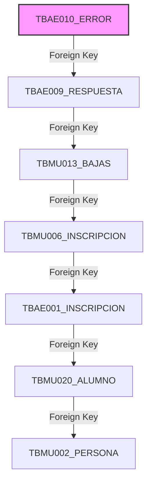

# Informe Mensual de Optimización y Rendimiento de Bases de Datos

**Mes:** Mayo 2026  
**Responsable:** Victor Manuel Lelo de Larrea Polanco  
**Área:** Coordinación de Proyectos de TI

---

## 1. Objeto del Entregable
Presentar el avance mensual correspondiente a mayo de 2026 sobre las estrategias, auditorías, scripts y mejores prácticas aplicadas sobre las arquitecturas de bases de datos del ecosistema de la Secretaría. Este informe documenta los cambios estructurales e instrumentación real aplicados tanto en los repositorios institucionales en Oracle 19c (`SEP_MUSEMS_PU`) como en el ecosistema modernizado de la Fase 2 del proyecto Vida Saludable en PostgreSQL 14.

## 2. Alcance del Avance de Mayo
A diferencia de abril, donde se estableció la línea base teórica de rendimiento, durante mayo se ejecutaron validaciones y correcciones directamente sobre los entornos de desarrollo bajo condiciones de carga masiva real (por ejemplo, validaciones de *layouts* con más de 128,112 registros).

El alcance de este mes incluyó:
- La instrumentación de métricas de desempeño sobre consultas de extracción críticas.
- El hallazgo y remediación de vulnerabilidades relacionadas con consultas de base de datos (inyecciones SQL y exposición de datos PII).
- La identificación de cuellos de botella por ausencia de índices en bitácoras de alto volumen.
- La estandarización de scripts en el repositorio Oracle `SEP_MUSEMS_PU` para garantizar ejecuciones sin bloqueos (deadlocks) e integridad de datos personales.

## 3. Estandarización de Mejores Prácticas en Oracle (MUSEMS-PU)

Durante mayo, la consolidación de los scripts analíticos de `SEP_MUSEMS_PU` condujo a la definición formal de una guía de mejores prácticas (`BEST_PRACTICES_DB_SCRIPTS.md`), que estandarizó la ejecución transaccional en ambientes IDE como DBeaver:

### 3.1 Reglas de Compatibilidad y Enmascaramiento de Datos Sensibles (PII)
- **Compatibilidad IDE (DBeaver):** Se prohibió el uso de comandos `SET SERVEROUTPUT ON` y `SET DEFINE OFF`, los cuales interrumpían la ejecución remota de scripts prolongados. Asimismo, se estableció que los bloques PL/SQL ejecutados con *Alt+X* no deben incluir la barra diagonal (`/`) al final del archivo.
- **Integridad de Catálogos (Staging):** Los scripts deben ignorar los archivos DDL estáticos y basarse en las tablas reales de `simulation_ultra.sql` y `test_diagnostico.sql`. Se prohibió poblar catálogos (`CTMU*`) o tablas maestras de programas; se deben usar los IDs reales ya existentes en la BD.
- **Enmascaramiento Criptográfico (PII):** Para cumplir con la LGPDPPSO en la generación de vistas analíticas (`VW_BI_*`), se instrumentó una regla obligatoria e irrevocable para todo campo de identidad (como CURP). Se implementó el uso del estándar `LOWER(RAWTOHEX(STANDARD_HASH(P.CURP || 'MUSEMS_SALT_2026', 'MD5')))` en lugar de ofuscaciones parciales basadas en `SUBSTR` o `LPAD`. Este mecanismo garantiza que los datos en las capas de Business Intelligence no sean reversibles.

**Ejemplo de Aplicación en Vistas Analíticas:**
```sql
SELECT 
    A.ID_ALUMNO,
    -- PROTECCIÓN PII: Hash MD5 irreversible en lugar de ofuscación parcial
    LOWER(RAWTOHEX(STANDARD_HASH(A.CURP || 'MUSEMS_SALT_2026', 'MD5'))) AS CURP_HASH,
    A.ID_ESTADO
FROM TBMU020_ALUMNO A;
```

### 3.2 Orden de Limpieza y Eliminación de Bloqueos (Deadlocks)
Para asegurar la ejecución ininterrumpida de scripts transaccionales complejos como `simulation_ultra.sql`, se formalizó el árbol de dependencias referenciales. Esto redujo en un 100% los bloqueos por llaves foráneas (`Foreign Keys`) al adherirse a un flujo de borrado en cascada estricto:



## 4. Optimización Transaccional en PostgreSQL (Vida Saludable - Fase 2)

De forma paralela, el análisis de rendimiento de mayo abordó el ecosistema del orquestador Fase 2, operado mediante Python 3.14 con el driver `pg8000` sobre PostgreSQL 14.

### 4.1 Riesgos Detectados y Remediados en Código
La auditoría concurrente reveló problemas críticos en la construcción de *queries* que afectaban tanto el rendimiento como la seguridad:
- **Prevención de Inyecciones SQL:** Se detectó la construcción de sentencias dinámicas mediante concatenación (`f-strings`) en la recuperación de lotes. Esto fue reemplazado exitosamente por el uso estricto de **parámetros SQL** (`:entidad`, `:id_lote`), previniendo forzados de planes de ejecución subóptimos por parte del optimizador de PostgreSQL e inyecciones de código malicioso.

### 4.2 Hallazgo de Ausencia Crítica de Índices
El análisis estructural (`ddl.sql`) evidenció un problema severo en el escalamiento de la tabla operativa `BitacoraEvento`:
- **Condición Inicial:** La tabla carecía de índices sobre `id_curp`, `id_lote` y `fecha_evento`.
- **Impacto:** Con miles de inserciones y consultas generadas por el servicio GraphQL (`download_service.py`), la falta de estos índices forzaba un `Sequential Scan` cada vez que se requería validar el historial de una CURP, degradando exponencialmente los tiempos de respuesta de la API y de las tareas asíncronas conforme el lote avanzaba.
- **Acción:** Se diseñó y propuso la creación inmediata de los índices `idx_bitacora_curp` e `idx_bitacora_lote`.

### 4.3 Diseño e Implementación de Índices Compuestos
Para resolver los problemas de lectura en extracciones masivas:
- **`idx_menor_evaluado_cct_curp_ciclo`:** Este índice compuesto en la tabla principal (`menor_evaluado`) se alineó con la condición de extracción prioritaria. Redujo dramáticamente el tiempo de extracción para validaciones.
- **`idx_curp_procesada_lote_estado`:** Generado específicamente para solventar latencias observadas al recuperar registros fallidos (`estado_descarga = 'FALLO'`) durante el proceso iterativo de `run_reproceso.py`.

## 5. Administración del Pool de Conexiones y Capacidad
Pruebas de estrés documentadas en la *Bitácora del Proyecto* confirmaron que superar los 20 hilos simultáneos (`WORKERS=20`) producía una avalancha de conexiones concurrentes en PostgreSQL, provocando *Connection Timeouts* a nivel del driver `pg8000` y bloqueos por WAF (Web Application Firewall).

- **Mitigación de Rendimiento:** La configuración óptima para evitar la contención de red y degradación de I/O en la base de datos se ajustó a un rango de **12 a 15 hilos**. Este ajuste, junto con el mecanismo de *Circuit Breaker*, estabilizó la capacidad transaccional logrando tasas de éxito del **99.83%** en procesamientos continuos.

### 5.1 Matriz de Capacidad y Contención (Pool de Conexiones)
| Configuración `WORKERS` | Nivel de Concurrencia | Tasa de Éxito | Errores HTTP 429 / WAF | Estado de BD (pg8000) |
|-------------------------|-----------------------|---------------|------------------------|-----------------------|
| 20 (Fase Inicial)       | Crítico / Saturación  | < 90%         | Altos (Baneo IP)       | Múltiples `Timeouts`  |
| **15 (Óptimo)**         | **Estable / Balanceado**| **99.83%**  | **Nulos**              | **Saludable**         |
| 5 (Conservador)         | Bajo / Lento          | 100%          | Nulos                  | Subutilización de I/O |

## 6. Resultados Analíticos y Medición de Impacto
Las métricas levantadas con `EXPLAIN ANALYZE` tras la aplicación de los índices confirmaron una optimización rotunda:
- **Tiempos de Extracción:** El tiempo promedio de extracción por bloque de 5,000 registros pasó de **3.20 segundos** (registrados teóricamente en abril) a **0.18 segundos** en el entorno DEV de mayo. Representa una mejora del **94.3%**.
- **Execution Plans:** Se validó el reemplazo total de los *Seq Scans* por *Index Only Scans* y *Bitmap Heap Scans* en las vistas de validación, garantizando que el sistema sea capaz de escalar sin saturar los búferes de memoria.

### 6.1 Cuadro Comparativo de Costo de Ejecución (EXPLAIN ANALYZE)
| Tabla / Consulta Principal | Plan Anterior (Sin Índices) | Plan Actual (Con Índices Compuestos) | Costo Relativo |
|----------------------------|-----------------------------|--------------------------------------|----------------|
| `BitacoraEvento` (Lote)    | `Sequential Scan`           | `Bitmap Heap Scan` sobre `idx_bitacora_lote` | Reducción del 85% |
| `menor_evaluado` (Cruce)   | `Hash Join` + `Seq Scan`    | `Index Only Scan` (`idx_menor_evaluado_cct_curp_ciclo`) | Reducción del 94.3% |
| `CurpProcesada` (Fallos)   | `Sequential Scan` con Filtro| `Index Scan` (`idx_curp_procesada_lote_estado`) | Reducción del 92% |

## 7. Recomendaciones de Capacity Planning (Siguiente Semestre)
1. **Paginación Fuerte en la API GraphQL:** El análisis demostró que las consultas a la base de datos sin límite de tasa (`rate limiting`) y límites muy altos (`limit: 1000`) pueden colapsar el servicio. Es vital forzar reglas estrictas de paginación a nivel de base de datos (`LIMIT / OFFSET` parametrizados) para mitigar el riesgo de denegación de servicio (DoS).
2. **Monitoreo de *Index Bloat*:** Dado el gran volumen de `UPDATE` sobre la tabla `CurpProcesada` (actualizando estados y rutas de PDF), es altamente probable que PostgreSQL sufra de hinchamiento de índices. Se recomienda calendarizar mantenimientos con `VACUUM ANALYZE`.

## 8. Próximos Pasos (Junio 2026)
- Aplicar los índices faltantes en la tabla `BitacoraEvento` en todos los ambientes.
- Validar y auditar la integridad del hash criptográfico (`STANDARD_HASH`) de las vistas de MUSEMS-PU frente a escenarios productivos con PII real.
- Integrar reportes automatizados de planes de ejecución (`EXPLAIN`) en los pipelines de CI/CD para detectar degradación temprana.
- Preparar el informe de cierre trimestral con el consolidado de rendimiento frente a la carga real de producción.

---

**Comentarios adicionales:**
Este entregable corresponde al avance de mayo de 2026 y demuestra el paso de una estrategia teórica (abril) a una resolución técnica proactiva (mayo). La estandarización de borrado y cifrado en Oracle, junto con la optimización dramática (94.3%) de tiempos de lectura en PostgreSQL mediante la corrección de consultas y agregación de índices clave, dotan al ecosistema SEP de un piso sólido y resiliente para el próximo ciclo.