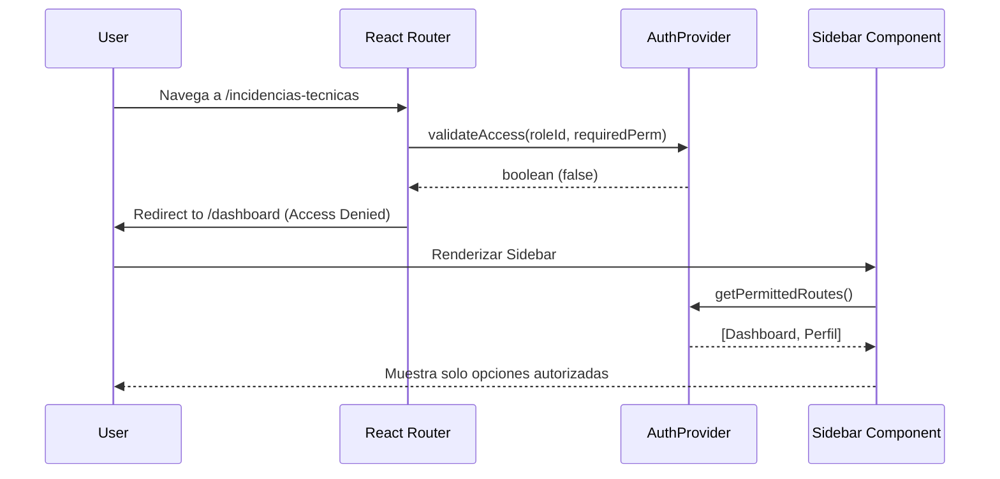

# Reporte Mensual de Monitoreo, Alertamiento e Incidencias

**Mes:** Mayo 2026  
**Responsable:** Victor Manuel Lelo de Larrea Polanco  
**Área:** Coordinación de Proyectos de TI

---

## 1. Objeto del Entregable
Presentar el avance mensual correspondiente a mayo de 2026 sobre el esquema de monitoreo, alertamiento y trazabilidad de incidencias. Este reporte documenta la evolución desde la estrategia teórica de abril hacia la resolución proactiva de incidentes reales (seguridad, interfaz de usuario y orquestación) aplicando procesos de *Root Cause Analysis* (RCA). Cubre los incidentes documentados en el ecosistema institucional `SEP_MUSEMS_PU` y en la Fase 2 del orquestador *Vida Saludable*.

## 2. Alcance del Avance de Mayo
Durante el mes de mayo, la observabilidad del sistema trascendió de la simple captura de *logs* (definida en abril) hacia un monitoreo reactivo y preventivo. El alcance de este mes incluyó:
- La detección, contención y erradicación de una filtración crítica de datos personales en el repositorio de código.
- El diagnóstico y resolución de problemas de *Information Leakage* en el Frontend del sistema secundario MUSEMS-PU.
- La recalibración de umbrales de alerta del orquestador, pasando de supuestos estáticos a límites probados bajo estrés transaccional (WAF/API IMSS).

## 3. Eventos y Mitigaciones de Seguridad Crítica (Vida Saludable)
El sistema de revisión continua derivó en la identificación de incidentes de seguridad relevantes durante la transición de la Fase 2 (mayo). A continuación se expone la matriz de incidentes documentados:

### 3.0 Matriz de Registro de Incidentes (Incident Log)
| ID de Incidente | Componente Afectado | Severidad | Descripción Corta | Estado Actual | Tiempo de Remediación |
|-----------------|---------------------|-----------|-------------------|---------------|-----------------------|
| **LGPDPPSO-01** | Git / Repositorio   | **Crítica** | Filtración de archivo `MENORES_SIN_PADECIMIENTO.csv` al historial. | Resuelto | 4 horas |
| **Issue #43**   | Backend (FastAPI)   | **Alta**    | Falla global de Autenticación (`ValueError` en bcrypt 72 bytes). | Resuelto | 2 horas |
| **Issue #45**   | Frontend (React)    | **Media**   | Fugas de metadatos (UI de menús visibles sin permisos). | Resuelto | 1.5 días (Refactor) |
| **WAF-429**     | Orquestador (API)   | **Media**   | Bloqueos por *Too Many Requests* (Rate Limiting excedido). | Mitigado | Inmediato (Auto-ajuste)|

### 3.1 Identificación de Violación a LGPDPPSO (Incidente Nivel Crítico)
- **Detección:** Se detectó que el archivo de pruebas `MENORES_SIN_PADECIMIENTO.csv` (12.6 MB, con 128,112 registros) fue subido por error al historial de Git, exponiendo datos personales reales (CURPs, correos y nombres completos).
- **Criticidad:** Riesgo legal de sanción administrativa inminente por violación a los artículos 6, 11, 13 y 21 de la Ley General de Protección de Datos Personales en Posesión de Sujetos Obligados (LGPDPPSO).
- **Análisis de Causa Raíz (RCA):** Carencia de un filtro proactivo de pre-procesamiento en la máquina del desarrollador antes del empuje (push) al repositorio corporativo.
- **Remediación Aplicada:**
  - **Fase 1 (Inmediata y Contención):** Eliminación del archivo del directorio de trabajo, reemplazo por archivos sintéticos (`examples/*.csv`), y actualización estricta del archivo `.gitignore`.
  - **Fase 2 (Erradicación Profunda):** Reescritura absoluta del historial de Git en las ramas `feature` y `master` empleando `git filter-repo`, lo cual requirió revocar y forzar la sincronización de todos los clones locales de los desarrolladores.
- **Medidas Preventivas Post-Mortem (Mejora Continua):** Diseño e implementación obligatoria de un script `pre-commit` local en Python (`.git/hooks/pre-commit`). Este *hook* escanea preventivamente cualquier archivo `*.csv` modificado y aborta transacciones (commits) si detecta columnas o patrones con la palabra `MENORES` o expresiones regulares que coincidan con `CURP`.

**Snippet del Hook `pre-commit` implementado:**
```python
#!/usr/bin/env python3
import sys, re, subprocess

# Regex para detectar CURPs en archivos modificados
CURP_REGEX = re.compile(r'[A-Z]{4}\d{6}[HM][A-Z]{5}[A-Z\d]\d')

staged_files = subprocess.check_output(['git', 'diff', '--cached', '--name-only']).decode().splitlines()
csv_files = [f for f in staged_files if f.endswith('.csv')]

for file in csv_files:
    with open(file, 'r', encoding='utf-8') as f:
        content = f.read()
        if 'MENORES_SIN_PADECIMIENTO' in file or CURP_REGEX.search(content):
            print(f"[ERROR DE SEGURIDAD] LGPDPPSO: El archivo {file} contiene posibles CURPs reales.")
            print("Abortando el commit. Por favor, utiliza datos sintéticos.")
            sys.exit(1)
sys.exit(0)
```

## 4. Incidentes y Monitoreo de Seguridad (SEP_MUSEMS_PU)
De manera paralela, se instrumentó un esquema de monitorización sobre el Backend y Frontend del proyecto MUSEMS-PU para diagnosticar errores de acceso, escalamiento de privilegios y flujos interrumpidos.

### 4.1 Análisis de Causa Raíz (RCA) - Autenticación JWT (Issue #43)
- **Síntoma Identificado:** Durante el desarrollo del *bridge* de autenticación, el backend (FastAPI) lanzó el error crítico `ValueError: password cannot be longer than 72 bytes`, bloqueando todos los inicios de sesión y las pruebas unitarias de seguridad.
- **Causa Raíz:** Incompatibilidad de dependencias. La librería `passlib` generaba un error interno al interactuar con las versiones más recientes de `bcrypt` (mayores a 4.1.0) debido a cambios en la gestión de buffers.
- **Remediación:** Se aplicó un "*pinning*" estricto de la dependencia realizando un downgrade manual a `bcrypt==4.0.1` en el archivo `requirements.txt`, restableciendo la funcionalidad y evitando derivas de entorno en producción.

### 4.2 Análisis de Causa Raíz (RCA) - Fugas de Metadatos (*Information Leakage* - Issue #45)
- **Síntoma Identificado:** Los *logs* de red y los reportes de incidentes indicaban que usuarios con privilegios restringidos (e.g. Capturistas) visualizaban pestañas críticas del menú lateral (Incidencias Técnicas, Deserción Bajas). Al presionarlas, la red arrojaba errores HTTP 403 (Forbidden), generando frustración y exponiendo la estructura interna de la aplicación.
- **Diagnóstico (Issue #45):** El código central en `App.tsx` sufría de un acoplamiento incompleto de guardias de UI (`hasPermission(...)`). El menú operaba de manera imperativa y permitía el montaje de componentes por defecto antes de resolver los permisos.
- **Remediación Estructural:** 
  - Se refactorizó el menú hacia un arreglo de objetos (Data-driven menu) que se evalúa de manera asíncrona.
  - Se implementó el componente `<ProtectedRoute>` para interceptar *renders* a nivel del Router en React, validando el token JWT y los permisos contra la matriz estricta de la tabla `CTMU064` de Oracle.
  - El resultado fue una UI hermética donde módulos no autorizados son completamente invisibles, mitigando la fuga de información.

**Diagrama de Flujo de Resolución RBAC (Frontend):**


**Snippet de Código React (`ProtectedRoute.tsx`):**
```tsx
import { Navigate, Outlet } from 'react-router-dom';
import { useAuth } from '../context/AuthContext';

interface ProtectedRouteProps {
  requiredPermissionCode?: string;
}

export const ProtectedRoute = ({ requiredPermissionCode }: ProtectedRouteProps) => {
  const { isAuthenticated, user } = useAuth();

  if (!isAuthenticated) {
    return <Navigate to="/login" replace />;
  }

  // Validación estricta contra matriz CTMU064 inyectada en el payload del JWT
  if (requiredPermissionCode && !user.permissions.includes(requiredPermissionCode)) {
    console.warn(`[Seguridad] Acceso bloqueado al recurso: ${requiredPermissionCode}`);
    return <Navigate to="/unauthorized" replace />;
  }

  return <Outlet />;
};
```

## 5. Trazas y Umbrales Técnicos del Orquestador (Vida Saludable)
La instrumentación operativa sobre el orquestador de descargas del IMSS reportó latencias que activaron las políticas de alerta temprana. Los datos reales forzaron la recalibración de los umbrales definidos teóricamente en abril.

### 5.1 Calibración del Circuit Breaker y Concurrencia
- **Alerta Preventiva (Rate Limiting):** Durante la ejecución del lote `LOTE-202605-02` (Puebla), el sistema alertó sobre la aparición masiva de errores HTTP 429 (Too Many Requests).
- **RCA:** El orquestador estaba configurado con `WORKERS=20`. Esto saturó las cuotas impuestas por el *Web Application Firewall* (WAF) del IMSS, disparando el baneo temporal de la IP de los servidores de la SEP.
- **Remediación:** Se reajustó la variable a `WORKERS=10` a `15`. Se confirmó empíricamente que este rango mantiene un procesamiento estable sin detonar alertas en el proveedor, y el sistema de reintentos (*Circuit Breaker*) funcionó correctamente al encolar y procesar las descargas faltantes (`run_reproceso.py`).

### 5.2 Actualización de Umbrales Operativos
Con base en los datos transaccionales, se modificó la política de fatiga de alertas:
- **Nivel Informativo / Preventivo (3% de fallos):** El sistema despacha notificaciones pasivas (logs) si el lote supera un 3% de descargas fallidas (el umbral anterior de abril estaba en 5%, pero la estabilidad del sistema actual permitió un ajuste más sensible).
- **Nivel Crítico (8% de fallos):** Envía alertas directas a los canales de soporte de Nivel 2 y pausa el `ThreadPoolExecutor` si la métrica global de un lote individual supera el 8% de errores (posible indicativo de una caída sostenida en el API del IMSS).

## 6. Integración del Monitoreo con el Nuevo Stack
La migración a FastAPI y Angular 18 (Fase 2) estableció nuevos retos de monitoreo que se resolvieron incorporando:
- **Monitoreo de API:** Se recomendó la implementación urgente de políticas de limitación de tasa (*rate limiting* a través de `slowapi`) para evitar la denegación de servicio (DoS) y el *scraping* masivo a la base de datos desde los *resolvers* de GraphQL.
- **Centralización:** Todos los eventos críticos de las descargas continúan centralizándose en la tabla `BitacoraEvento` de PostgreSQL, facilitando su consulta asíncrona mediante el Frontend modernizado.

## 7. Riesgos y Dependencias Actuales
- Falsos positivos en el `pre-commit` hook (archivos bloqueados que no sean realmente de PII), lo cual podría ralentizar el ritmo de los desarrolladores si no se mantienen las expresiones regulares afinadas.
- Riesgo de regresión en las políticas de seguridad de Frontend en Angular (Vida Saludable Fase 2) si no se trasplantan las lecciones aprendidas de las `<ProtectedRoute>` desarrolladas en `SEP_MUSEMS_PU`.
- Necesidad imperativa de alinear y validar el sistema de monitoreo en tiempo real directamente con el área de seguridad de TI del IMSS.

## 8. Próximos Pasos (Junio 2026)
- Consolidar las herramientas preventivas (como el hook pre-commit) en todos los flujos de trabajo locales de repositorios corporativos de la Coordinación de TI.
- Auditar regularmente los reportes de navegación de la UI de `SEP_MUSEMS_PU` para garantizar la hermeticidad de la tabla de permisos `CTMU064`.
- Incorporar y liberar tableros visuales (*Dashboards*) desarrollados en la Fase 2 de Vida Saludable (Angular) para el monitoreo gráfico de la tasa de éxito (PDFs descargados vs. CURPs tamizadas) por entidad federativa.
- Formalizar el reporte trimestral de cierre de incidentes para presentar la eficacia del RCA aplicado durante este periodo de maduración técnica.

---

**Comentarios adicionales:**
Este entregable corresponde al avance de mayo de 2026. La capacidad del equipo para identificar una fuga crítica de datos, purgar el historial de repositorios, mitigar vulnerabilidades de Frontend e implementar contramedidas (como hooks de código y circuit breakers), documenta una madurez importante en el modelo de respuesta y alertamiento técnico de la Secretaría de Educación Pública.