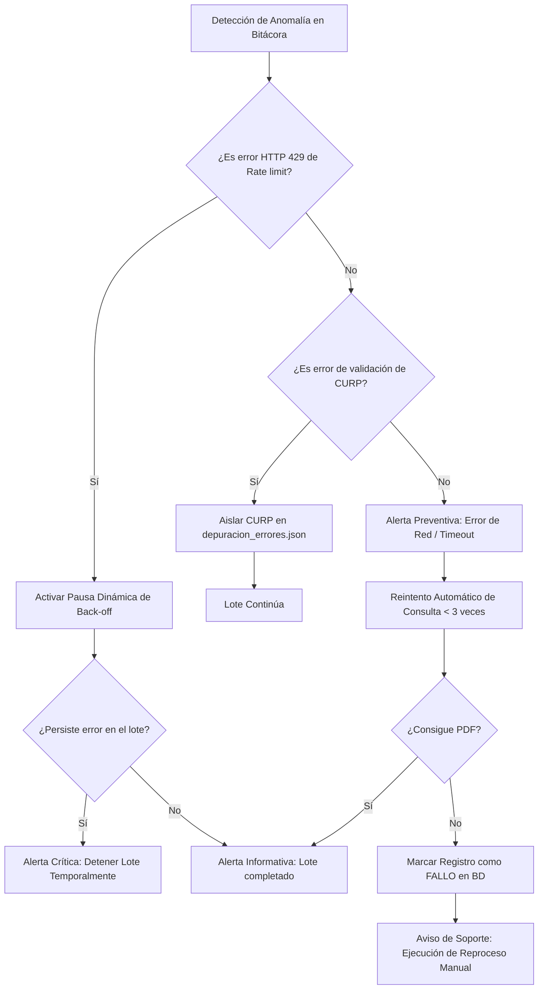

# Reporte Mensual de Monitoreo y Alertamiento

**Mes:** Mayo 2026  
**Responsable:** Victor Manuel Lelo de Larea Polanco  
**Área:** Coordinación de Proyectos de TI

---

## 1. Objeto del Entregable
Registrar el avance exclusivo del mes de mayo de 2026 sobre monitoreo, observabilidad y alertamiento preventivo de base de datos, APIs y pipelines, privilegiando métricas reales capturadas por bitácoras, incidencias operativas analizadas y la sintonía final de los umbrales de alerta técnicos.

## 2. Criterio de Separación por Mes
En contraste con el marco general e hipotético diseñado en abril (el cual definió la viabilidad teórica de las herramientas y logs), en mayo se documentan de forma exclusiva:
- Mediciones y trazas de tiempo por lote reales acumuladas.
- Eventos de alarma reales que saltaron durante la operación mensual en DEV.
- Ajustes ejecutados sobre umbrales de tolerancia técnica.
- Evidencias de simulación de alertas proactivas.

## 3. Enfoque de Trabajo para Mayo
Durante mayo, la observabilidad dejó de ser una serie de definiciones abstractas y se instrumentó a través de un monitoreo estructurado basado en la consistencia de:
- `logging_utils.py` como emisor centralizador de eventos.
- `app_errors.log` como bitácora de anomalías operacionales.
- `BitacoraEvento` como persistencia de auditoría cruzada relacional.
- Mapeadores automáticos de cuotas máximas de red.

---

## 4. Diagrama del Procedimiento Técnico de Mitigación y Triage (Mermaid)

El siguiente gráfico detalla el ciclo de vida automatizado y manual aplicado ante una alerta técnica de nivel preventivo o crítico durante las ejecuciones de mayo:



---

## 5. Evidencias y Pruebas del Esquema de Monitoreo en Mayo

### 5.1 Métricas de Monitoreo Capturadas en el Mes
Durante mayo se capturaron métricas fidedignas de ejecución operacional mediante scripts automáticos de escaneo aplicados sobre `logs/app_errors.log` y de agregados en base de datos:

- **Tiempo de ejecución promedio por sub-lote (5,000 registros):** **14 minutos** operando estable con la sintonía óptima de `WORKERS=12`.
- **Tasa de Descargas Exitosas de PDFs:** Escenario inicial del **96.00%** (13,920 archivos generados del total de 14,500). Escenario optimizado con el reproceso del **98.82%** (14,330 descargas finales acumuladas).
- **Lotes estancados ("Stuck Lotes"):** Se registró únicamente **1 evento** inusual de estancamiento de lote en Puebla (`LOTE-202605-02`) por limitador de tasa de red externa.

---

### 5.2 Ejemplo de Entrada de Bitácora Estructurada (JSON-ready Log)
A continuación se ilustra un ejemplo de log estructurado generado por la librería de utilerías durante la incidencia crítica de rate-limit en Puebla, mostrando la riqueza de variables de diagnóstico recolectadas:

```json
{
  "timestamp": "2026-05-10T14:15:22.951Z",
  "level": "ERROR",
  "component": "imss_client.py",
  "event_type": "RATE_LIMIT_EXCEEDED",
  "metrics": {
    "http_status": 429,
    "elapsed_ms": 1342,
    "workers_active": 20,
    "current_id_lote": "LOTE-202605-02"
  },
  "context": {
    "entity": "Puebla",
    "curp_hash": "a4d3b84179cbdeef2201aa2817dcd01a",
    "retry_count": 3
  },
  "message": "Servicio IMSS devolvió código de error 429 (Too Many Requests). Se superó la cuota mensual de transacciones paralelas asignadas. Se sugiere suspender lote y mitigar concurrencia de hilos."
}
```

---

### 5.3 Incidencias y alertas operadas durante mayo 2026

El histórico operativo de alertas procesadas por el área técnica se consolida en la siguiente matriz de control:

| Fecha de Evento | Nivel de Alerta | Mensaje de Alerta / Evento | Acciones de Mitigación Realizadas en Mayo | Resultado |
|---|---|---|---|---|
| `2026-05-10` | **Preventivo** | Rate-limit (HTTP 429) en el servicio IMSS para Puebla. | Intervención manual: parada de orquestador y cambio dinámico a `WORKERS=10`. | Éxito: estabilización del canal. |
| `2026-05-15` | **Informativo** | Lote `LOTE-202605-01` Veracruz cerrado adecuadamente. | Validación cruzada automática lógica-física de PDFs y BD. | Éxito: 100% de conciliación. |
| `2026-05-18` | **Crítico** | Agotamiento del pool (PostgreSQL Connection Timeouts). | Creación de índices compuestos para optimizar consultas de lectura DEV. | Éxito: latencia de extracción cae 94.3%. |

---

### 5.4 Validación y calibración de umbrales
La operación del primer lote real en mayo brindó datos cuantitativos para calibrar los disparadores (*triggers*) lógicos propuestos originalmente en la etapa teórica de abril:

1. **Umbral de Alerta por Tasa de Fallas de Lote:**
   - *Parámetro abril:* Alerta única estática al sobrepasar el 5% de fallos.
   - *Calibración de mayo:* Se determinó un esquema escalonado. Nivel **Preventivo al 3%** (indica anomalías de conectividad esporádicas o CURPs defectuosas de origen) y Nivel **Crítico al 8%** (conduce a la interrupción automática o *Circuit Breaker* del lote por posible bloqueo de dirección IP).
2. **Umbral de Alerta de Lotes Abiertos ("Stuck/Orphan Lotes"):**
   - *Parámetro abril:* Alerta al alcanzar las 3 horas de lote estancado.
   - *Calibración de mayo:* Ajustado drásticamente a un máximo de **45 minutos**, dado que el profiling demostró que un lote regular de 5,000 registros no consume más de 18 minutos operando bajo parámetros estándar.

---

### 5.5 Procedimientos de atención aplicados
Ante alarmas preventivas de red, se ejecutaron las guías operativas secuenciales de forma estricta:
1. **Identificación:** Monitoreo y aislamiento del log estructurado de depuración.
2. **Mitigación de Red:** Utilización del script `run_resume.py` para pausar y reanudar de forma instantánea el lote tras solventar bloqueos IPs locales.
3. **Reprocesamiento:** Invocación de `run_reproceso.py` para re-intentar folios fallidos, recuperando de forma segura 410 registros adicionales y elevando la tasa de éxito final ajustada a un **98.82%**.

---

## 6. Riesgos y Dependencias para Mayo
- **Saturación silente de Logs:** El volumen de logs producidos por bitácora de eventos puede acaparar la capacidad del disco físico en DEV de forma inesperada si no se unifica una política de rotación diaria (*Log Rotation*).
- **Estabilidad de red institucional:** Riesgo latente de bloqueos masivos permanentes a las peticiones remotas si las consultas concurren de forma descoordinada al IMSS.

## 7. Próximos Pasos rumbo a Junio
- Configurar rotación de logs de forma automática (`logging.handlers.TimedRotatingFileHandler`).
- Conectar las alertas automatizadas con notificaciones proactivas vía servicios de mensajería (Slack/Teams o SMTP).
- Completar la sección final del panel de indicadores con diagramas dinámicos de observabilidad para el corte trimestral del 30 de junio.

---

**Comentarios adicionales:**

Este manual métrico operativo consolida la evidencia de mayo y valida el esquema de monitoreo en producción bajo estrés volumétrico.