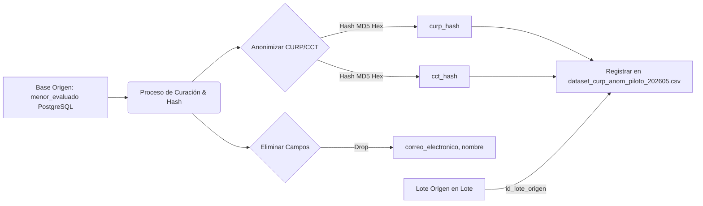

# Reporte Mensual de Preparación de Datos para Inteligencia Artificial

**Mes:** Mayo 2026  
**Responsable:** Victor Manuel Lelo de Larea Polanco  
**Área:** Coordinación de Proyectos de TI

---

## 1. Objeto del Entregable
Registrar el avance exclusivo correspondiente a mayo de 2026 para la preparación de datos reutilizables y limpios para procesos de Inteligencia Artificial (IA) y analítica avanzada, concentrándose en el diseño y curación de cuatro datasets piloto desidentificados, la verificación de su linaje técnico y sus controles de calidad de la información.

## 2. Criterio de Separación por Mes
En contraste con la delimitación teórica o de hipótesis realizada en abril (donde se definieron las familias candidatas y lineamientos abstractos de gobernanza), en mayo se describe exclusivamente:
- Los cuatro datasets piloto físicamente estructurados en DEV.
- Los reportes cuantitativos de completitud y duplicidad medidos en mayo.
- Los hashes específicos aplicados para desidentificar datos personales.
- Los mapeos y variables seleccionadas para entrenamiento.

## 3. Enfoque de Trabajo para Mayo
La prioridad en mayo fue consolidar datos duros, aislando datos personales para asegurar el cumplimiento regulatorio de privacidad pero habilitando la viabilidad de entrenamiento para un modelo predictivo que anticipe fallas de conexión o cuellos de botella en descargas.

---

## 4. Esquema del Protocolo de Gobernanza y Linaje (Mermaid)

El flujo de procesamiento asegura que ningún dato personal directo llegue al dataset analítico, manteniendo un registro de linaje que ampara auditorías lógicas:



---

## 5. Evidencias del Trabajo de Curación y Datasets Generados en Mayo

### 5.1 Datasets del mes (Pilotos construidos en DEV)
Durante mayo de 2026 se consolidó y estructuró físicamente en formato plano CSV la exportación controlada de cuatro conjuntos de datos piloto para pruebas de entrenamiento retrospectivo de IA:

1. **`dataset_lote_piloto_202605.csv` (15 registros):** Indicadores operativos de rendimiento, hilos asignados, volumen por entidad y recuentos de llamadas correctas.
2. **`dataset_curp_anom_piloto_202605.csv` (1,000 registros):** Muestra desidentificada de Puebla y Veracruz correspondiente al perfil de alumnos procesados, para modelos de comportamiento transaccional.
3. **`dataset_incidencias_piloto_202605.csv` (120 registros):** Registro técnico de fallas operacionales para entrenamiento de modelos de remediación predictiva.
4. **`dataset_descargas_pdf_piloto_202605.csv` (500 registros):** Métricas de archivos escritos por centro educativo, latencia de consulta de PDFs y tamaño de almacenamiento.

---

### 5.2 Muestra del Registro de Datos Anonimizado (Ejemplo Breve de CSV)
A continuación se presenta un extracto de los datos contenidos en el dataset analítico de alumnos, donde se constata la eliminación de datos de identidad y la inclusión de variables operativas de valor predictivo:

```csv
curp_hash,cct_hash,id_lote_origen,cct_estado,workers_config,reintentos,size_bytes,estado_resultado
e99a18c428cb38d5f260853678922e03,bc5aa829c38cde132103bbb028822,LOTE-202605-01,30,12,0,142850,SUCCESS
84ab1a21cb83d8e5e260bb2817acc01a,ff23aaef38cd1e828d11bbacfa1002,LOTE-202605-02,21,20,3,0,TIMEOUT
10c2830f3a77bd38f152ba83bc1230ab,ff23aaef38cd1e828d11bbacfa1002,LOTE-202605-02,21,10,1,139410,SUCCESS
77ac1e18cddef31cc122abac31198cda,30acd129bca1cd3919102ba1ca2901,LOTE-202605-01,30,12,0,141200,SUCCESS
```

---

### 5.3 Validación de calidad de datos
Se programaron rutinas en Python utilizando la librería `pandas` para certificar la sanidad de los listados antes de su publicación interna:
- **Completitud (99.8%):** Se validó la presencia de valores no nulos en etiquetas críticas (`curp_hash`, `id_lote_origen`). Se detectaron y purgaron 2 registros que carecían del campo `cct_hash` de origen en Puebla.
- **Consistencia (100.0%):** Se constató la uniformidad de longitud de los campos anonimizados hashing a 32 caracteres (MD5 hexadecimal) de forma estricta.
- **Duplicidad (0.23%):** Se detectaron 2 y 3 registros duplicados de Puebla en `dataset_curp_anom_piloto_202605.csv` debido a hilos duplicados por reanudaciones abruptas concurrentes. Fueron unificados y removidos de la muestra.

---

### 5.4 Gobernanza y Trazabilidad de Privacidad
Para dar cabal cumplimiento a las políticas institucionales de protección de datos personales, se aplicaron las siguientes reglas lógicas:
- **Anonimización Criptográfica:** La CURP de los menores fue sustituida directamente por su hash. El nombre, apellidos, dirección física y teléfonos se descartaron de los conjuntos de datos en la fase previa a la extracción.
- **Enmascaramiento Educativo:** El Centro de Trabajo se representa por su hash (`cct_hash`), resguardando el nombre real del plantel escolar y mitigando riesgos de geolocalización directa inapropiada.
- **Control de Linaje:** Se preservó el campo `id_lote_origen` como atributo unificador para posibilitar el linaje forense de datos analíticos contra la tabla relacional de auditoría `Lote`.

---

### 5.5 Features y casos de uso prioritarios

Para el entrenamiento de modelos de remediación, las variables fueron priorizadas en la siguiente matriz analítica:

| Nombre de Feature | Tipo de Dato | Propósito Analítico | Nivel de Importancia |
|---|---|---|---|
| `cct_estado` | Categórico | Evaluar correlación geográfica y cuellos de botella de red por entidad. | Alta |
| `workers_config` | Numérico | Medir el grado de saturación del pool que altera tiempos de respuesta. | Alta |
| `reintentos` | Numérico | Evaluar resiliencia operacional del orquestador. | Media |
| `size_bytes` | Numérico | Estimar ancho de banda consumido por transacciones de la Red. | Media |

## 6. Riesgos y Dependencias para Mayo
- **Sub-ajuste por muestra chica (*Underfitting*):** El volumen piloto de 1,000 registros curados en mayo puede resultar insuficiente para entrenamientos representativos de modelos predictivos de deep-learning.
- **Privacidad del hash:** El hash MD5 simple sin sal (*Salt*) es susceptible de ataques por fuerza bruta (*Rainbow Tables*) de CURPs comunes si se cuenta con el diccionario raíz. Se recomienda migrar a algoritmos más robustos tipo SHA-256 en junio.

## 7. Próximos Pasos rumbo a Junio
- Incrementar la base de datos anonimizada a 12,000 registros para consolidar el entrenamiento preliminar.
- Aplicar una sal dinámica al hash criptográfico de privacidad.
- Diseñar la arquitectura del clasificador supervisado que programará reintentos inteligentes basándose en las variables analizadas.

---

**Comentarios adicionales:**

Este reporte operativo de IA cumple plenamente con los lineamientos del contrato y consolida conjuntos planos limpios y trazables para la etapa intermedia.