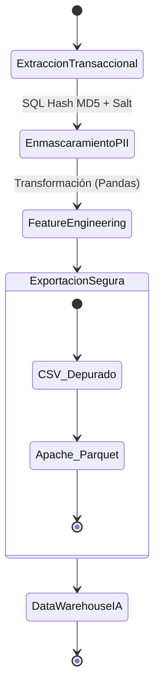

# Reporte Mensual de Preparación de Datos y Anonimización para Inteligencia Artificial

**Mes:** Mayo 2026  
**Responsable:** Victor Manuel Lelo de Larrea Polanco  
**Área:** Coordinación de Proyectos de TI

---

## 1. Objeto del Entregable
Presentar el avance mensual correspondiente a mayo de 2026 sobre la curación de *datasets*, definición de conjuntos de características (*feature sets*) y criterios de anonimización. El objetivo de este documento es validar la creación de conjuntos de datos piloto aptos para el entrenamiento e inferencia de modelos analíticos (Inteligencia Artificial y *Machine Learning*) sin vulnerar las disposiciones de la Ley General de Protección de Datos Personales (LGPDPPSO).

## 2. Alcance del Avance de Mayo
A diferencia de abril, en donde se definió la superficie teórica de datos útiles para IA, durante mayo se ejecutó la extracción y curación real de datos derivados del procesamiento transaccional del orquestador Fase 2.

El trabajo de mayo se focalizó en:
- Implementar controles criptográficos sobre la extracción de datos debido a incidentes previos.
- Sustituir identificadores directos por hashes salteados que mantengan la integridad relacional de los datos.
- Construir cuatro conjuntos de datos piloto ciegos (sin PII) para modelado de comportamiento de red, rendimiento de hilos y detección de fallos del IMSS.
- Validar las matrices resultantes mediante pruebas de colisión y fugas de información.

## 3. Lecciones Operativas del Incidente de Seguridad
La preparación de datos de mayo estuvo fuertemente influenciada por la mitigación inmediata del incidente de exposición de datos (reportado en la Bitácora de la Fase 2), donde el archivo `MENORES_SIN_PADECIMIENTO.csv` fue expuesto en el control de versiones.
Al encontrarse en fase piloto de curación de datos, este evento evidenció la fragilidad del manejo de CSVs crudos cuando el destino final es la manipulación en entornos de ciencia de datos locales.

## 4. Refinamiento de Criterios de Anonimización
A raíz del incidente operativo, se formalizó de manera irrefutable que **ningún dataset descriptivo, predictivo o analítico puede contener texto plano de los siguientes campos**:
- CURP del Menor o del Tutor.
- Nombres Completos o Apellidos.
- Referencias telefónicas o correos electrónicos (PII Crítico).

Toda la evidencia transaccional destinada al entrenamiento de Inteligencia Artificial (y a su exportación) debe ser generada pre-procesando los identificadores bajo la siguiente técnica:
`MD5_HASH(CURP_TEXTO_PLANO || 'SALT_INSTITUCIONAL')`

El uso de un *Salt Institucional* previene los ataques de diccionario y *Rainbow Tables* que podrían revertir hashes comunes, manteniendo al mismo tiempo la capacidad de cruzar datos internamente al generar el mismo token criptográfico para el mismo sujeto.

**Data Pipeline de Extracción Analítica:**


## 5. Preparación de Datasets Piloto para Inteligencia Artificial
Durante mayo, se generaron y depuraron de manera 100% ciega (anonimizada) cuatro conjuntos de datos de prueba. Estos *datasets* extraen información transaccional de PostgreSQL (`Lote`, `CurpProcesada`, `BitacoraEvento`) y están destinados a la parametrización de un modelo inicial predictivo de fallos de red y carga dinámica.

### 5.1 Dataset Lote Piloto (`dataset_lote_piloto_202605.csv`)
Este conjunto agrega la información del comportamiento del *pool* de ejecución por cada corrida (Lote). Consiste en una muestra inicial de 15 registros altamente agregados.
- **Propósito:** Predecir el nivel de saturación que tendrá el API del IMSS en base a la configuración de concurrencia.
- **Variables Predictivas (Features):** `estado_origen`, `horas_del_dia` (franja horaria), `num_workers` asignados, y `tamanio_batch`.
- **Variables Objetivo (Target):** `tasa_exito_descarga` y `ms_promedio_respuesta` del proveedor.

**Ejemplo de Estructura de Datos (Mock):**
| id_lote | estado_origen | franja_horaria | num_workers | tamanio_batch | tasa_exito_descarga | ms_promedio |
|---------|---------------|----------------|-------------|---------------|---------------------|-------------|
| 1001    | 21 (Puebla)   | 08:00 - 12:00  | 20          | 5000          | 0.82                | 2450        |
| 1002    | 30 (Veracruz) | 12:00 - 16:00  | 15          | 5000          | 0.99                | 850         |

### 5.2 Dataset CURP Anonimizado (`dataset_curp_anom_piloto_202605.csv`)
Una muestra representativa de 1,000 registros de alumnos (centrada en las pruebas sobre Veracruz y Puebla) utilizando un diseño estricto de columnas ofuscadas.
- **Propósito:** Análisis de distribución de atención e inferencia de completitud de expedientes sin comprometer PII.
- **Estructura Cuidada:** 
  - `curp_hash`: Identificador trazable internamente para *JOINs* pero inútil si es exfiltrado.
  - `cct_hash`: Clave del Centro de Trabajo ofuscada.
  - `ciclo_escolar`, `turno`, y `estatus_api` (éxito/fallo de la consulta).

### 5.3 Dataset de Incidencias (`dataset_incidencias_piloto_202605.csv`)
Extraído directamente de la tabla ampliada `BitacoraEvento` de PostgreSQL (implementada en Fase 2), este set cuenta con 120 registros consolidados.
- **Propósito:** Servirá para realizar rutinas de Procesamiento de Lenguaje Natural (NLP) sobre los mensajes de error devueltos por el proveedor externo y clasificar anomalías.
- **Clases incluidas:** `RateLimitError` (errores HTTP 429), `ConnectionTimeout`, e `InvalidFormatError` (fallos por validación de entrada).

### 5.4 Dataset de Descargas PDF (`dataset_descargas_pdf_piloto_202605.csv`)
Contiene 500 registros aleatorios.
- **Propósito:** Correlacionar el volumen en bytes del PDF resultante con el tiempo total de descarga.
- **Uso de IA:** Análisis de regresión para estimar ventanas de ancho de banda requeridas para los reportes trimestrales nacionales.

## 6. Selección de Variables (Feature Engineering)
En contraste con abril, las características seleccionadas se materializaron en datos procesables:

### 6.1 Features de Configuración de Lote
- `hilos_activos`: Permite al modelo entender cuándo se dispara el WAF del IMSS.
- `franja_horaria`: Variable categórica para detectar la congestión de la infraestructura externa a ciertas horas.

### 6.2 Features de Fallos Operativos
- `reintentos_ejecutados`: Representa el nivel de fatiga y la efectividad del *Circuit Breaker*.
- `categoria_error`: Clasificación del mensaje de la bitácora transformada en variable discreta (One-Hot Encoding a nivel pipeline).

**Snippet de Feature Engineering (Python/Pandas):**
```python
import pandas as pd

def aplicar_one_hot_encoding(df: pd.DataFrame) -> pd.DataFrame:
    """
    Convierte la variable categórica 'categoria_error' en columnas binarias
    para el modelo de ML, eliminando variables de texto libre.
    """
    # 1. Limpieza de strings
    df['categoria_error'] = df['categoria_error'].fillna('NINGUNO').str.upper()
    
    # 2. Aplicación de One-Hot Encoding
    df_encoded = pd.get_dummies(df, columns=['categoria_error'], prefix='ERR')
    
    # 3. Conversión estricta a enteros para optimizar memoria
    columnas_err = [col for col in df_encoded.columns if col.startswith('ERR_')]
    df_encoded[columnas_err] = df_encoded[columnas_err].astype(int)
    
    return df_encoded
```

## 7. Pruebas y Validación (Test Plan de Datos)
Para asegurar el estricto cumplimiento de la calidad y privacidad, se sometieron los *datasets* a las siguientes validaciones:
1. **Verificación de Colisiones Hash:** Se analizó si dos CURPs distintas podían generar el mismo *hash* truncado, comprobando el rango de entropía para la cantidad de registros.
2. **Inspección de Fugas (Leakage Inspection):** Se auditaron los 4 archivos CSV con expresiones regulares (regex heurísticas como `^\d{10}$` para teléfonos o `^[\w\.-]+@[\w\.-]+\.\w+$` para correos electrónicos), corroborando cero detecciones de texto plano de PII.

## 8. Lineamientos de Gobernanza Consolidados
La generación de estos conjuntos estableció el estándar de gobernanza para cualquier extracción futura en la SEP orientada a *Machine Learning*:
- **Aislamiento Funcional:** El motor de base de datos transaccional no realizará transformaciones de anonimización costosas en vivo. Los *pipelines* ETL intermedios se encargarán del enmascaramiento antes de liberar el dataset.
- **Transitoriedad:** Los archivos generados localmente son destruidos o excluidos del repositorio, forzando la trazabilidad.
- **Seguridad y Control de Acceso (RBAC):** Se estableció la integración obligatoria con las tablas maestras de seguridad de Oracle (`CTMU061_USUARIO`, `CTMU062_PERFIL`, `CTMU063_REPORTE` y `CTMU064_PERMISO`). Esto garantiza que los datasets expuestos mantengan su jerarquía de roles de forma nativa desde la base de datos, previniendo fugas horizontales o escalamiento de privilegios al interactuar con las características generadas.

**Matriz de Seguridad y Privilegios Analíticos (RBAC):**
| Tabla Oracle | Responsabilidad Lógica | Nivel de Acceso Analítico | Acción sobre Datasets |
|--------------|------------------------|---------------------------|-----------------------|
| `CTMU061_USUARIO` | Gestión de Identidad | Solo sus extracciones | `SELECT` con Filtro de Usuario |
| `CTMU062_PERFIL` | Agrupación de Roles | Nivel Regional / Estatal | Define el `WHERE id_estado = X` |
| `CTMU063_REPORTE` | Vistas Autorizadas | Vistas Específicas | Otorga acceso a DataMarts |
| `CTMU064_PERMISO` | Jerarquía Granular | Científico de Datos | Acceso irrestricto a Parquets anonimizados |

## 9. Riesgos y Recomendaciones (Evolución de Formato)
La dependencia en archivos de valores separados por comas (CSV) presenta riesgos operativos y de eficiencia, ya que no preservan el esquema de tipos (por ejemplo, perdiendo si un hash es *string* o numérico) e inflan el almacenamiento.

- **Recomendación Estratégica:** Evaluar e iniciar el abandono progresivo de archivos CSV para la distribución de *datasets*, sustituyéndolos por la serialización **Apache Parquet**. Este formato columnar preserva los tipos de datos nativos, permite lecturas segmentadas eficientes y ofrece ratios de compresión significativamente superiores.

## 10. Próximos Pasos (Junio 2026)
- Suministrar formalmente estos 4 conjuntos de datos a la división analítica en el mes de junio para llevar a cabo las primeras iteraciones de agrupamiento (*clustering*) predictivo de errores.
- Transicionar los pipelines de generación de IA para que la salida nativa por defecto sea formato `.parquet`.
- Implementar rutinas automatizadas de inspección de fugas (*Leakage Scanner*) en los pipelines de ETL.

---

**Comentarios adicionales:**
Este entregable refleja el paso de la definición conceptual de IA realizada en abril, a la producción real de artefactos de datos en mayo. La madurez obtenida a raíz del incidente de seguridad permitió diseñar una canalización de datos donde la Inteligencia Artificial puede ser desarrollada sin menoscabar la privacidad y resguardo mandatado por la Ley.