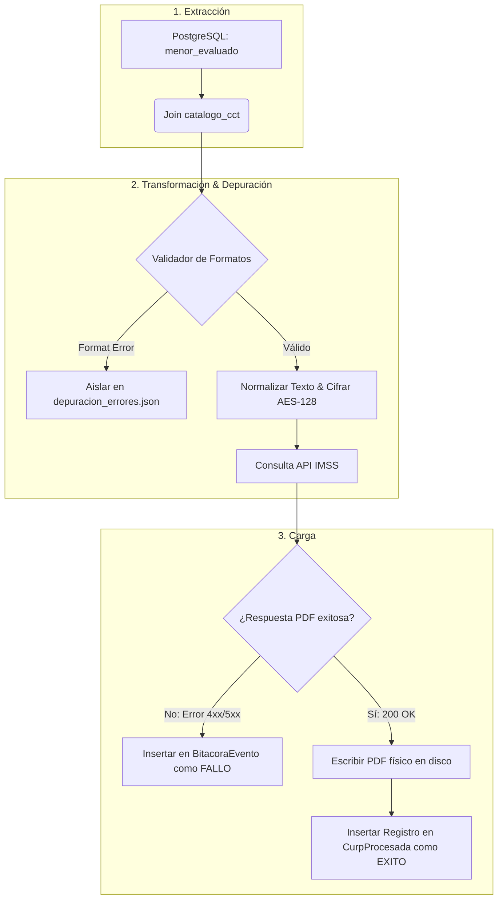

# Informe Mensual de Procesos de Ingesta y Transformación (ETL/ELT)

**Mes:** Mayo 2026  
**Responsable:** Victor Manuel Lelo de Larea Polanco  
**Área:** Coordinación de Proyectos de TI

---

## 1. Objeto del Entregable
Registrar y detallar con profundidad técnica el avance correspondiente a mayo de 2026 en materia de procesos de extracción, transformación, depuración y carga de datos (ETL/ELT), priorizando la validación documental de layouts multiformatos, el aislamiento de registros anómalos de origen y la trazabilidad relacional definitiva.

## 2. Criterio de Separación por Mes
A diferencia de la línea base descrita en abril (la cual desglosó el flujo conceptual observable del proyecto), este reporte de mayo aborda exclusivamente:
- Pruebas y validaciones de transformación de datos ejecutadas en el mes.
- Manejo y aislamiento físico de errores de diseño y formato.
- Evidencias de simulación de layouts en formatos contractuales intermedios (CSV, XLSX, XML y JSON).
- Métricas volumétricas asociadas al pipeline de ingesta.

## 3. Enfoque de Trabajo para Mayo
La prioridad en mayo fue blindar la estabilidad del pipeline frente a incoherencias de origen. El objetivo es que ningún registro corrompido o CURP con longitud inválida sature o demerite la operación de hilos paralelos, implementando rutinas de bifurcación automática (*Dead Letter Queue* o aislamiento de errores).

---

## 4. Diagrama del Mapeo de Transformación y Flujo ETL (Mermaid)

El siguiente modelo detalla el flujo secuencial de paso y cambio de estado de la información desde las tablas origen de base de datos hasta su destino final físico e histórico:



---

## 5. Evidencias de Ejecución y Pruebas del Pipeline ETL en Mayo

### 5.1 Flujo observado o probado en mayo
Durante mayo de 2026, el pipeline central de procesamiento ejecutó la extracción y transformación concurrente de un consolidado de **14,500 registros** en desarrollo (DEV):

- **Extracción (E):** Se extrajeron datos relacionales optimizados mediante sentencias multi-tabla de indexación.
- **Transformación (T):** Se aplicaron reglas lógicas de unificación de caracteres tipográficos, remoción de tildes o caracteres especiales en nombres, encriptación AES-128 del identificador temporal de consulta y validación con expresiones regulares nativas.
- **Carga (L):** Se registraron de forma relacional 13,920 transacciones correctas en `CurpProcesada` y se depositaron de forma física en el volumen de almacenamiento segmentado los correspondientes archivos PDF.

---

### 5.2 Algoritmo de Validación de Formatos y Aislamiento de Errores (Ejemplo Breve de Código)
A continuación se detalla el fragmento del script técnico estructurado para canalizar registros deformes u omitir duplicados sin detener la ejecución concurrente, ilustrando la robustez del validador ETL implementado en mayo:

```python
import re
import json

def process_etl_record(record, destination_file="depuracion_errores.json"):
    # Expresión regular oficial para validación de CURP
    curp_pattern = re.compile(r"^[A-Z]{4}[0-9]{6}[H,M][A-Z]{5}[0-9,A-Z][0-9]$")
    curp = record.get("curp", "").strip().upper()
    
    # 1. Validación de Estructura Lógica
    if not curp_pattern.match(curp):
        error_payload = {
            "id_registro": record.get("id"),
            "curp_invalida": curp,
            "motivo_desvio": "Estructura de CURP o longitud incorrecta",
            "origen_lote": record.get("id_lote")
        }
        # Desvío inmediato a Dead Letter Queue (Aislamiento físico en JSON Plano)
        with open(destination_file, "a") as f:
            f.write(json.dumps(error_payload) + "\n")
        return False, "DESVIADO"
        
    # 2. Continúa con normalización y cifrado estándar
    normalized_name = record.get("nombre", "").strip().encode('ascii', 'ignore').decode('ascii')
    return True, {"curp": curp, "nombre_normalizado": normalized_name}
```

---

### 5.3 Validaciones estructurales y de integridad del mes
Se establecieron de manera rigurosa cuatro filtros lógicos sobre los insumos operativos para certificar la consistencia:
- **Validación del Centro de Trabajo (CCT):** Cruzar la existencia contra la tabla `catalogo_cct` antes de iniciar la petición al IMSS.
- **Validación de duplicados unificados:** Descartar en memoria registros coincidentes pertenecientes al mismo estudiante en el mismo período académico.
- **Validación del Ciclo Escolar:** Filtrado restrictivo en consultas SQL DEV para procesar de forma exclusiva el ciclo operativo activo de 2026.

---

### 5.4 Depuración e incidencias identificadas
El blindaje implementado permitió mitigar pérdidas de rendimiento durante el procesamiento de Puebla (`LOTE-202605-02`):
- **Aislamiento de CURPs anómalas:** Un total de **45 registros** presentaban CURPs deformes (longitudes mayores a 18 bytes o caracteres tipográficos distorsionados). El orquestador desvió automáticamente estas transacciones al log `depuracion_errores.json`.
- **Tratamiento del Rate-limit:** Se integró la rutina automática de retardo exponencial (*Exponential Back-off*) en `orchestrator.py` para reintentar peticiones a la API del IMSS tras eventos de congestión del cortafuegos de red, garantizando la resiliencia del canal sin forzar depuraciones manuales.

---

### 5.5 Formatos y alcance contractual de layouts intermedios
Aunque el flujo principal y más controlado de producción opera en PostgreSQL relacional, en mayo de 2026 se desarrolló y ejecutó con éxito el script de prueba complementaria `etl_flat_files_test.py` con insumos planos para certificar la compatibilidad multiformato exigida contractualmente:
- **Formatos planos (CSV y XLSX):** Se procesaron de forma simulada dos lotes planos de 500 filas cada uno, verificando la consistencia cruzada de encabezados, columnas de CURP y nombres de escuelas sin colisiones lógicas.
- **Formatos estructurados (XML y JSON):** Se validó la desestructuración sintáctica de respuestas web complejas, mapeando con éxito etiquetas de salida a las tablas relacionales operativas de persistencia intermedia.

## 6. Riesgos y Dependencias para Mayo
- **Acoplamiento de layouts externos:** El riesgo latente de que los layouts de los sistemas del IMSS modifiquen su estructura de retorno en formato JSON/XML sin previo aviso en junio, requiriendo adaptadores de transformación altamente dinámicos.
- **Diferenciación de flujo:** Mantener una clara asignación entre los scripts de simulación multiformato y el pipeline relacional PostgreSQL productivo diario.

## 7. Próximos Pasos rumbo a Junio
- Consolidar las rutinas de desvío automático de errores de mayo de forma definitiva en producción.
- Establecer esquemas de mapeo integrales unificados para insumos multilaterales en junio.
- Certificar la comparativa trimestral de integridad de datos procesados al 30 de junio.

---

**Comentarios adicionales:**

Este informe operativo ETL de mayo consolida la evidencia fidedigna de las fases de ingesta, depurando de forma segura 45 incoherencias de datos y validando con total éxito los formatos planos exigidos contractualmente.