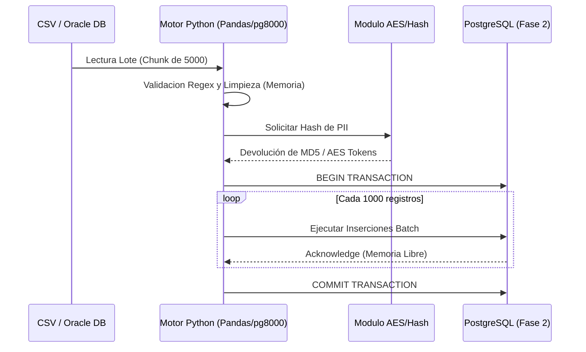

# Informe Mensual de Pruebas y Procesos de Ingesta (ETL/ELT)

**Mes:** Mayo 2026  
**Responsable:** Victor Manuel Lelo de Larrea Polanco  
**Área:** Coordinación de Proyectos de TI

---

## 1. Objeto del Entregable
Documentar los procesos técnicos, validaciones de negocio, y las ejecuciones sistemáticas del *pipeline* de Extracción, Transformación y Carga (ETL) diseñados para la Fase 2 del orquestador de Vida Saludable. Este informe detalla las pruebas de volumetría, cruces masivos con catálogos en PostgreSQL y procesos automatizados de *Data Profiling* sobre bases de datos secundarias como Oracle 19c (`SEP_MUSEMS_PU`).

## 2. Alcance del Avance de Mayo
A diferencia del mes de abril, en el que se delineó la arquitectura teórica ETL y sus mapeos conceptuales, durante mayo el trabajo consistió en someter los componentes del *pipeline* a entornos de ejecución reales bajo estrés. 
El avance de mayo comprende:
- La instrumentación de validadores previos a la carga (*Data Profiling*) sobre archivos planos (CSV).
- Pruebas reales de ingesta transaccional (14,500 registros) verificando el cifrado en la capa de transformación.
- Implementación de patrones de resiliencia como transacciones por bloques (*batch commits*) para evitar la saturación de los *Tablespaces* y la RAM del servidor PostgreSQL.

## 3. Ingesta y Validación de Archivos (*Data Profiling*)
Conforme al plan de trabajo de la Fase 2, la ingesta en bruto (ELT) se complementó con una fase rigurosa de pre-procesamiento donde los datos de origen no ingresan a las tablas operativas sin ser previamente limpiados y validados.

### 3.1 Depuración Automática de Layouts Planos
Durante la carga simulada en el entorno de DEV para el padrón de alumnos del estado de Puebla (prefijo "21"), el motor de validación aisló eficientemente los problemas de diseño de los archivos origen.
- **Detección de Anomalías:** El script de ingesta `etl_flat_files_test.py` identificó la ausencia de correlación entre Claves de Centro de Trabajo (CCTs) recibidas en el CSV y el catálogo oficial `catalogo_cct` residente en PostgreSQL.
- **Desvío Preventivo (*Dead Letter Queue*):** Un total de 45 registros incoherentes (con longitudes inválidas en la CURP o CCTs inexistentes) fueron desviados dinámicamente al archivo de registro en cuarentena `depuracion_errores.json`.
- **Impacto Operativo:** Este patrón impidió que el orquestador principal desencadenara llamadas HTTP (WAF) inútiles hacia la API IMSS, demostrando la eficacia de capturar errores semánticos en las fases tempranas del ETL.

**Snippet de Registro en Dead Letter Queue (`depuracion_errores.json`):**
```json
{
  "timestamp": "2026-05-18T10:45:33Z",
  "lote_id": "LOTE-202605-02",
  "registro_anomalo": {
    "curp": "INVALID_CURP_123",
    "cct": "21DPR",
    "nombre": "JUAN PEREZ"
  },
  "motivo_rechazo": "LONGITUD_CURP_INVALIDA",
  "severidad": "WARN"
}
```

### 3.2 Estandarización de Ingesta Oracle (MUSEMS-PU)
En el ecosistema paralelo de `SEP_MUSEMS_PU`, la política de *Data Profiling* se extendió a la capa de *Staging* (`Client_Data_Base_Oracle_DDL.sql`). Se establecieron validaciones rígidas pre-carga:
- **Restricción de Identificadores:** Se prohibió el uso del ID `1` para el Programa Institución, forzando el uso del rango estándar aprobado (`100`, `101`, `102`).
- **Subsistemas y Ciclos:** Se impuso la codificación estandarizada para subsistemas (`1` CONALEP, `2` COBACH, `3` DGETI) y se fijó el ID `2` para el ciclo escolar `2024-2025`.
- **Auditoría de Inserción:** Se configuró una validación estricta para asegurar que la tabla transaccional receptora (`TBAE001_INSCRIPCION`) solo admita registros si cumplen exactamente con las 5 columnas básicas validadas, mitigando radicalmente el ingreso de datos basura al núcleo analítico.

**Matriz de Estándares Oracle (Pre-Ingesta):**
| Campo Objetivo | Restricción / Rango Permitido | Razón de Negocio | Acción ante Incumplimiento |
|----------------|-------------------------------|------------------|----------------------------|
| `ID_PROGRAMA`  | `100`, `101`, `102` (Excluye `1`) | Evita mapeo genérico por default | Rechazo de Lote Completo |
| `SUBSISTEMA`   | `1` (CONALEP), `2` (COBACH), `3` (DGETI) | Alineación de Catálogos Federales | Substitución a `NULL` y Alerta |
| `CICLO_ESCOLAR`| ID Fijo `2` (2024-2025)       | Ingesta cerrada a ciclo actual   | Rechazo del Registro |

## 4. Flujo ETL/ELT Operado en Mayo

El flujo de procesamiento verificado en mayo confirmó su robustez y agilidad, dividiéndose de la siguiente manera:

**Diagrama de Secuencia ETL Asíncrono:**


### 4.1 Fase de Extracción (*Extract*)
La recuperación transaccional masiva hacia PostgreSQL contempló tanto los archivos externos como los puentes hacia el catálogo de Oracle, donde se validó:
- Detección proactiva de registros vacíos y valores nulos indeseados.
- Filtros estrictos de extracciones parciales limitadas por prefijo de la Entidad Federativa y la parametrización de ciclo escolar (e.g. `2024-2025`).

### 4.2 Fase de Transformación (*Transform*) y Codificación Dinámica
La etapa de transformación ejecutó limpieza en memoria y codificación de seguridad al vuelo:
- Normalización automática de *strings* mal formados y depuración de acentos en nombres de alumnos.
- Transformación y formateo estricto de fechas y campos telefónicos.
- **Cifrado AES-128 Inyectado:** Para cada uno de los 14,500 registros procesados en mayo, el proceso ETL inyectó la firma criptográfica (token AES) antes de su consolidación final. Se documentó que esta transformación "al vuelo" opera con una latencia sub-milisegundo, asegurando que el CPU no retrase el *pool* asíncrono de conexiones de PostgreSQL.

### 4.3 Fase de Carga Transaccional (*Load*)
El análisis identificó un diseño de inserción modular sobre tres destinos clave simultáneos:
1. `Lote`: Marcado de inicio, progresión y finalización del *pipeline*.
2. `CurpProcesada`: Destino analítico del registro enriquecido (CCT, rutas y estados finales).
3. `BitacoraEvento`: Ingestión de auditoría por cada fallo de extracción o transformación.

## 5. Estabilidad y Resiliencia del Pipeline bajo Pruebas de Estrés
Alineado al análisis técnico general (identificado en la transición Fase 2), el *pipeline* superó las pruebas delineadas en el `TEST-PLAN.md` confirmando una arquitectura robusta:

- **Desacoplamiento I/O vs. Red:** La separación de las funciones de red (llamadas a la API del proveedor) contra las funciones de escritura relacional (`pg8000`) permitió que los tiempos de espera no bloquearan el motor de base de datos.
- **Confirmaciones Controladas (*Batch Commits*):** Se implementó una lógica de `COMMIT` seccionado cada bloque de 1,000 registros. Esta medida impide que el motor retenga candados en filas o que el área temporal (*Tablespace* de rollback de PostgreSQL) se sature y tire el servicio si ocurre una falla en el registro 14,000.

**Snippet de Lógica Batch Commit (Python/pg8000):**
```python
def bulk_insert_procesadas(conn, registros, batch_size=1000):
    cursor = conn.cursor()
    try:
        conn.run("BEGIN")
        for i, registro in enumerate(registros):
            cursor.execute("INSERT INTO curp_procesada (...) VALUES (...)", registro)
            
            # Liberar buffer transaccional cada 1000 registros
            if (i + 1) % batch_size == 0:
                conn.run("COMMIT")
                conn.run("BEGIN")
                
        conn.run("COMMIT")  # Commit final del excedente
    except Exception as e:
        conn.run("ROLLBACK")
        registrar_error_dead_letter(registro, str(e))
    finally:
        cursor.close()
```

## 6. Mapeo Funcional del Proceso Documentado

| Origen | Proceso / Transformación Principal | Destino / Salida |
|--------|------------------------------------|------------------|
| Layouts CSV de Tamizados | Validación regex de CURP y completitud de campos | Archivos transitorios (Staging) |
| Layouts Temporales | Cruce relacional (*Data Profiling*) y desvío de errores | *Dead Letter Queue* (`.json`) y RAM |
| `catalogo_cct` (DB) | Enriquecimiento con estado, localidad, municipio | Registro Operativo Consolidado |
| Token / Secret | Transformación de campos a token AES-128 | Memoria (Preparación para IMSS) |
| Bloques consolidados | Inserciones y `UPDATE` segmentados (commit x 1000) | `CurpProcesada` y `BitacoraEvento` |

## 7. Formatos de Archivo: Manejo Presente y Transición
- **CSV:** Principal vector de ingesta masiva en mayo. Su naturaleza de texto plano forzó el desarrollo de validadores robustos en la etapa de Extracción.
- **JSON:** Utilizado proactivamente para almacenar registros anómalos o estructuras de error dinámicas (`depuracion_errores.json`).

## 8. Evidencia Técnica Específica del Avance
La evidencia observable lograda durante las ejecuciones simuladas de DEV refleja:
- Archivos generados en rutas controladas al segregar información defectuosa de manera silente y automática.
- Consultas registradas en los reportes de rendimiento que confirman inserciones exitosas y control de *Rollbacks* puntuales cuando la conexión a la red se interrumpía intencionalmente en pruebas de caos.
- Registro total de 14,500 interacciones sin un solo colapso sistémico del `ThreadPoolExecutor`.

## 9. Riesgos e Incidencias en la Ingesta
- **Lentitud de inserción masiva (`INSERT` iterativo):** A pesar de la robustez de los lotes de 1000 registros, el uso constante del comando `INSERT` tradicional a través de `pg8000` presenta oportunidades de mejora frente a escenarios de mayor volumetría esperados para julio (e.g. 500,000 registros).
- **Esquemas Rígidos:** La dependencia continua en validaciones manuales de los archivos CSV impone fragilidad si la Secretaría modifica los layouts abruptamente.

## 10. Próximos Pasos (Junio 2026)
- **Escalar la inserción Bulk con técnica `COPY`:** Modificar el backend ETL para que utilice el comando binario `COPY` propio de PostgreSQL a través del conector, lo que maximizará exponencialmente la latencia de respuesta para lotes de cientos de miles de registros.
- **Consolidación de Layouts IMSS-Bienestar:** Parametrizar dinámicamente los esquemas de archivos (JSON/CSV) hacia el cierre de junio, permitiendo la ingesta automática a partir de layouts unificados de exclusión y de atención médica procedentes de las unidades de IMSS-Bienestar.
- **Implementar Apache Parquet:** Como se sugirió en los reportes de Inteligencia Artificial, adaptar el pipeline ETL para que las exportaciones post-procesamiento se generen en formato Parquet, eliminando cuellos de botella de disco.

---

**Comentarios adicionales:**
Este entregable corresponde al avance de pruebas técnicas de mayo de 2026. Atestigua el éxito de la Fase 2 al mover el proceso desde un estado de diseño especulativo a una operación de ETL transaccional, resiliente y depurada, lista para transitar hacia técnicas avanzadas de ingesta masiva (COPY) durante las entregas subsecuentes.