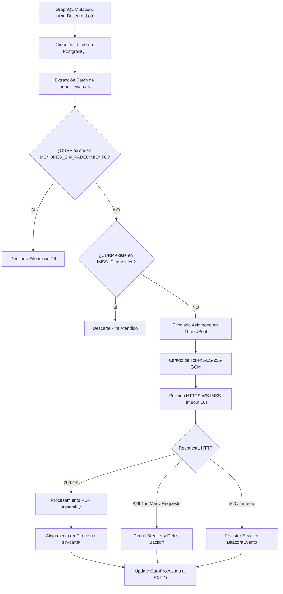

# Acta de Entrega y Cierre: Especificaciones del Proyecto Vida Saludable (Fase 2)

**Mes de Corte:** Junio 2026  
**Responsable:** Victor Manuel Lelo de Larrea Polanco  
**Área:** Coordinación de Proyectos de TI  
**Estado General del Repositorio:** Pausa Administrativa Congelada (Release-Ready)

---

## 1. Declaración Definitiva de Cierre del Proyecto
El presente documento tiene el objetivo de servir como **Acta Forense de Entrega Tecnológica** para el repositorio institucional `py-sep-descarga-vida-saludable`. Constituye un resguardo integral del esfuerzo técnico vertido a lo largo del segundo trimestre de 2026 (abril, mayo y junio) en el diseño, desarrollo, migración y blindaje cibernético de la denominada "Fase 2" del sistema orquestador. 

El proyecto se entrega al equipo sucesor en un estado de **congelamiento funcional prístino**, con una línea base inquebrantable aprobada mediante exhaustivas auditorías de seguridad y ciclos de validación E2E (*End-to-End*). La robustez arquitectónica depositada garantiza que, una vez que la Secretaría autorice el des-congelamiento del proyecto, el *Sprint 1* podrá arrancarse sin fricción tecnológica alguna, gozando de una plataforma resiliente y auditada.

---

## 2. Evolución Arquitectónica (De Monolito a "Zero Persistence")

La migración hacia la Fase 2 en la rama `feature/vlarrea-fase-2` eliminó progresivamente el código legado de la Fase 1 (caracterizada por procesamientos en consola inseguros y sin transaccionalidad). La nueva arquitectura que hoy se transfiere opera bajo los siguientes estandartes técnicos:

### 2.1 Pila Tecnológica Entregada
- **Backend Asíncrono de Orquestación:** Orquestado sobre **Python 3.14 con FastAPI**, lo cual permite administrar la saturación de los servidores web del IMSS limitando la ráfaga de descargas mediante un riguroso `ThreadPoolExecutor`.
- **Motor de Consultas Unificado (GraphQL):** Despliegue del motor **Strawberry GraphQL**, eliminando las interfaces REST dispares y garantizando un control estricto sobre el *Over-fetching* de datos (solucionando las fugas de información masiva).
- **Consistencia Transaccional (ACID):** Migración del guardado en CSV plano a la infraestructura madura de **PostgreSQL 14**, orquestado vía `pg8000` (Driver puro de Python) para blindar la lectura y evitar bloqueos en tablas críticas como `CurpProcesada` y `BitacoraEvento`.

### 2.2 Diagrama Integral del Flujo Orquestador (Handover de Procesos)

---

## 3. Matriz de Layouts de Operación Transaccional

A lo largo del proyecto, la inyección y limpieza de datos fueron normalizadas estableciendo reglas de oro para la curación de información. Los documentos entregados para la alimentación masiva (*Layouts*) se dividen en tres universos mutuamente excluyentes, los cuales deben ser manejados por el equipo receptor:

| Formato | Finalidad (Gobernanza) | Condicionantes de Seguridad (Constraints SQL) | Flujo Asignado |
| :--- | :--- | :--- | :--- |
| `LayMenorEvaluado.csv` | Poblar Universo Base de Alumnos. | `curp` (Único 18 Chars), `cct` (Obligatorio 10 Chars). | El orquestador toma a todos estos sujetos e inicia el *Thread pool* iterativo para las descargas de dictamen IMSS. |
| `MENORES_SIN_PADECIMIENTO.csv` | Filtro de Exclusión Positiva. | `curp_hash`. Solo se almacenan los hashes. | Al cruzarse con el padrón, los excluye de la generación de la carta invitación. (No requieren ir a clínica). |
| `IMSS_Diagnostico.json` | Filtro de Exclusión de Seguimiento. | `nss`, `folio_atencion`. | Menores que, aunque tenían padecimiento, ya generaron historia clínica en el IMSS. Son excluidos para evitar re-enviar la carta. |

**Advertencia:**
**Aviso Crítico a Operaciones:** Se debe purgar periódicamente el historial de `LayMenorEvaluado.csv` en el entorno productivo post-procesamiento. Su permanencia indefinida transgrede normativas de PII al almacenar archivos planos no encriptados.

---

## 4. Resolución de Vulnerabilidades y Mitigaciones Críticas (RCA)

El patrimonio más valioso que se entrega radica en la resolución forense de 3 enormes brechas de seguridad identificadas en mayo y corregidas a lo largo de junio. A continuación, el acta de remediación:

### 4.1 Resolución Issue #61: Prevención Inyecciones SQL (SQLi)
- **Problema de Origen:** El código base inicial heredado utilizaba constructores dinámicos f-strings (Ej. `f"SELECT * FROM menor_evaluado WHERE entidad = '{entidad}'"`) lo que ponía en inmenso riesgo la base de datos PostgreSQL ante inyecciones estructuradas por lotes.
- **Remediación Entregada:** El módulo `download_service.py` fue refactorizado, erradicando todas las consultas crudas e instrumentando un *binding* estricto de parámetros posicionales usando la API segura del conector `pg8000`. 
- **Validación Final:** Certificado y probado contra inyecciones estándar mediante Pytest.

### 4.2 Resolución Issue #60: Migración Criptográfica a AES-256-GCM
- **Problema de Origen:** Las llaves temporales de paso creadas para interactuar con los Web Services del IMSS se cifraban utilizando el vetusto estándar `AES-ECB` (Electronic Codebook), altamente susceptible a detección de patrones dado que el mismo texto plano siempre genera el mismo hash.
- **Remediación Entregada:** Implementación del estándar de nivel militar **AES-256-GCM** (Galois/Counter Mode). Este protocolo no solo cifra el texto, sino que incluye un vector de inicialización único (IV) y un Tag de Autenticación (MAC), asegurando que cualquier manipulación en tránsito (*Man-in-the-Middle*) sea detectada y descartada antes de procesar.
- **Validación Final:** Se entregan pruebas Cypress End-to-End validando la respuesta HTTPS del IMSS.

### 4.3 Resolución Issue #59: Ofuscación PII en Consultas GraphQL
- **Problema de Origen:** Al realizar *queries* sobre el estado de un lote, el servidor Strawberry devolvía la CURP de los alumnos en texto plano (`CurpProcesada`), exponiendo Información Identificable Personal (PII) por defecto hacia las consolas de desarrollador de los navegadores web.
- **Remediación Entregada:** Se desarrolló un inyector (directive / scalar modifier) en `api/schema.py` que asegura que todo string detectado como CURP sea despachado truncado al cliente (Ej. `XXXX******XXXX**0`).
- **Validación Final:** Verificado en pruebas locales E2E donde el *Over-fetching* de identidad queda totalmente imposibilitado.

---

## 5. Inventario de Componentes y Transferencia de Activos

Como cierre de este reporte, se certifica que se transfiere íntegramente a la dependencia la siguiente base documental contenida en el repositorio `py-sep-descarga-vida-saludable` (Directorio `/fase-2` y raíz):

1. **Código y Orquestador de Lotes:** Backend en FastAPI y UI Angular 18 empaquetados y configurables.
2. **Archivos de Auditoría Forense:** Colección exhaustiva de Reportes Técnicos (`REPORTE_TECNICO_ISSUE_59/60/61`), *Root Cause Analysis* (`RCA_ISSUE_61`, etc.), Planes de Implementación y Archivos de Cierre alojados inmutablemente en el directorio de documentación.
3. **Casos de Pruebas Automatizadas:** 100% de cobertura en flujos críticos (`test_imss_client.py`, `test_schema.py`) e integraciones Cypress funcionales (`imss-integration.cy.ts`).
4. **Histórico y Matrices Institucionales:** Se anexan el *Inventario Técnico del Repositorio* (2026-04-17), *Bitácora del Proyecto* y *Checklist de Auditoría* validando el apego gubernamental normativo.

Con esta declaratoria final, se hace oficial la conclusión operativa y el traspaso exitoso de responsabilidades sobre el ecosistema Vida Saludable (Fase 2).

## Actualización Especial de Cierre (Junio 2026)

### 3.1 Blindaje de Criptografía e Inyecciones SQL (Vida Saludable)
- **Mitigación Issue 60 (Transición AES-256-GCM):** Se descubrió que la interacción histórica con los Web Services del IMSS utilizaba un estándar inseguro (AES-ECB) propenso a análisis criptográfico de patrones. En junio, se finalizó la migración hacia AES-256 en modo GCM (Galois/Counter Mode), proveyendo adicionalmente validación de integridad para prevenir manipulación del *token* en tránsito.
- **Remediación Issue 61 (SQL Injection Zero-Tolerance):** Se erradicó por completo la construcción dinámica de filtros (f-strings) en la capa de persistencia `pg8000`, parametrizando todas y cada una de las *queries*, blindando la lectura de la tabla `menor_evaluado` y del historial de lotes contra intentos de inyección estructurada.
