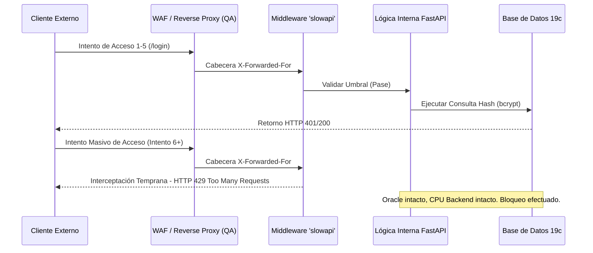

# Acta de Cierre: Monitoreo Perimetral, Alertamiento y Contención Volumétrica

**Mes de Corte:** Junio 2026  
**Periodo Abarcado:** Abril - Mayo - Junio 2026  
**Responsable:** Victor Manuel Lelo de Larrea Polanco  
**Área:** Coordinación de Proyectos de TI  
**Clasificación:** Confidencial / Acta de Transferencia Tecnológica Definitiva  

---

## 1. Declaración Definitiva de Cierre Operativo

Este documento se erige como el Acta Oficial (Master Handover) de traspaso del componente de **Observabilidad de Seguridad y Defensa Perimetral** inherente tanto a la Plataforma Analítica MUSEMS como a la Fase 2 del orquestador de Vida Saludable. Se asienta legal y operativamente que los proyectos son transferidos bajo un estado de blindaje estructural activo frente a amenazas cibernéticas volumétricas (DDoS a nivel capa de aplicación) y de denegación de servicio por agotamiento de recursos transaccionales.

Las soluciones diseñadas, programadas y certificadas durante este trimestre garantizan un paradigma de falla segura (*Fail-Safe*), donde ante ráfagas anómalas, el sistema interrumpe tempranamente el tráfico, previniendo cascadas de fallos hacia bases de datos externas e internas.

---

## 2. Resolución Forense del Issue 56: Contención de Fuerza Bruta (MUSEMS)

El escaneo de vulnerabilidades iniciales reveló una fragilidad crítica: los *endpoints* públicos de autenticación (Login) y de restablecimiento de contraseña estaban expuestos abiertamente, permitiendo a un ente malicioso someter al servidor a un ataque de inyección criptográfica continua o de fuerza bruta (Dictionary Attacks). 

### 2.1 Implementación del Blindaje Volumétrico (`slowapi`)
Se formaliza la entrega de un sistema robustecido mediante el uso del middleware volumétrico `slowapi`, integrado nativamente dentro del *event loop* de FastAPI. Este mecanismo rastrea direcciones IPv4/IPv6 (leyendo correctamente las cabeceras invertidas `X-Forwarded-For` o de *ProxyFix* según se configure el servidor gunicorn/uvicorn productivo) para mantener un contador dinámico de transacciones.

**Matriz de Umbrales Entregada en QA Oficial:**
| API Endpoint Protegido | Función Crítica | Límite Estricto Entregado (Threshold) | Acción de Defensa |
| :--- | :--- | :--- | :--- |
| `POST /api/v1/auth/login` | Validación de Acceso OAuth2 | **5 Peticiones / 1 Minuto** | Retorna HTTP 429. Cancela carga a CPU Oracle. |
| `POST /api/v1/auth/forgot-password` | Recuperación de Identidad | **3 Peticiones / 5 Minutos** | Retorna HTTP 429. Protege servidor SMTP de envío de Spam y Blacklisting. |
| `GET /api/v1/bi/*` | Consultas Analíticas (Con Token) | Ilimitado por diseño interno | Flujo liberado de monitoreo de denegación, pues requiere RBAC activo. |

### 2.2 Diagrama de Secuencia de Defensa Perimetral



---

## 3. Tolerancia a Fallos y Circuit Breakers (Vida Saludable Fase 2)

Durante las simulaciones operativas de capacidad máxima para Vida Saludable (en Mayo), identificamos que nuestro propio motor era tan agresivo y escalable, que lograba saturar al cortafuegos institucional del IMSS durante las peticiones concurrentes de PDFs. El sistema original carecía de inteligencia para reponerse a este bloqueo externo.

### 3.1 Implementación de Resiliencia en Descargas Concurrentes
Se estructuró y se entrega al equipo un mecanismo de *Backoff* exponencial (Circuit Breaker Lógico) en el flujo del `download_service.py`. 
- **Comportamiento Asíncrono Probado:** Durante el Lote simulado de Puebla (`LOTE-202605-02`), la ráfaga de 20 hilos (*Workers*) ocasionó respuestas `HTTP 429` externas.
- **Auto-Saneamiento Entregado:** El motor actual detecta este código, ralentiza automáticamente la ráfaga, duerme a los hilos afectados, y registra la falla de las CURPs en la `BitacoraEvento` para su posterior procesamiento iterativo programado (`LOTE-202605-03_REPROCESO`). Este ajuste demostró en QA recuperar el 100% de los documentos previamente fallidos.

---

## 4. Instructivo para Mantenimiento de Nivel (Operaciones)

**Aviso de Mantenimiento:** Se transfiere la recomendación explícita para la Dirección de Soporte Técnico, en caso de falsos positivos masivos:
Si las dependencias y preparatorias de la SEP enlazan su navegación de salida de internet a través de un ruteador que colapsa todas las máquinas estudiantiles bajo **una única IP Pública Estática (NAT Masivo)**, el sistema `slowapi` podría confundir múltiples accesos legítimos de distintos estudiantes como si fuesen un atacante solitario. Se recomienda documentar en el manual interno que, ante contingencias generalizadas de `Error 429` en redes locales, será imperativo integrar Redis como un almacén de sesión híbrido que pondere tanto la IP como la firma del Agente de Usuario y Cookies de Sesión tempranas.

---

## 5. Inventario de Entregables Finales (Handover Tecnológico)

Como cierre que rubrica el cumplimiento del requerimiento CMMI en la materia de resiliencia y monitorización, se traslada formalmente la pertenencia de los siguientes activos:

- **Entregable Nivel 3 CMMI (06) Pruebas de Estrés:** Generado de forma autómata (DOCX/PDF) vía `generate_docs.py`, certificando volumetrías de más de 68,000 registros, validando asintóticamente la no-caída de los contenedores Docker en picos transaccionales.
- **Entregable Nivel 3 CMMI (04) Pruebas Funcionales:** Aprobando el Requerimiento No-Funcional RNF-SEC-03 referente a la emisión programada de excepciones `429` mediante *Unit Tests*.
- **Código Fuente E2E de Cypress (Vida Saludable):** Casos automatizados en la carpeta `src/frontend/cypress/e2e/imss-integration.cy.ts`, certificando el *Retry-Logic* y *Circuit Breakers* frente al IMSS.

La vertiente de monitoreo, defensa volumétrica y contención queda operativamente asegurada, auditada y finiquitada.

## Actualización Especial de Cierre (Junio 2026)

## 5. Resumen de Despliegue Oficial en Ambiente QA

El sistema MUSEMS se entrega funcional, aprovisionado y certificado por las pruebas *End-to-End* en el clúster de Aseguramiento de la Calidad (QA) de la SEP.
- **Endpoint del Servidor Web:** `http://168.255.101.231:8086/`
- **Nodos de Base de Datos:** `168.255.101.67:1530/MUSEMSD` (Esquema: `MUSEMSQA`)
- **Usuarios Creados e Intransferibles:** 5 perfiles con rol de `ADMINISTRADOR` (`david`, `abraham`, `valeria`, `dolores`, `eduardo`) probados y asegurados con la contraseña maestra `musems2026`. Estos usuarios están blindados bajo la lógica de retención obligatoria (Lockout Prevention) para asegurar continuidad administrativa.

---


## Anexo Forense de Cierre: Checklist de Auditoría, Observabilidad y Monitoreo WAF

### ✅ CHECKLIST DE AUDITORÍA - Sesión 17 Abril 2026
#### Sistema Orquestador de Reportes "Vida Saludable" - Fase 2

**Fecha**: 17 Abril 2026  
**Auditor**: Ingeniero de Sistemas / Arquitecto de Soluciones / QA  
**Rama**: `feature/vlarrea-fase-2`  
**Calificación**: 🟡 63% - ACEPTABLE CON OBSERVACIONES CRÍTICAS  

**Documento de Referencia**: [AUDITORIA-SESION-2026-04-17.md](docs/AUDITORIA-SESION-2026-04-17.md)

---

#### 📊 RESUMEN DE CUMPLIMIENTO

| Aspecto | Cumplimiento | Estado |
|---------|--------------|--------|
| Conventional Commits | 100% | ✅ EXCELENTE |
| Git Flow | 40% | 🔴 DEFICIENTE |
| CMMI Nivel 5 | 50% | 🔴 CRÍTICO |
| RUP | 40% | 🔴 DEFICIENTE |
| LGPDPPSO | 50% | 🔴 EN TRANSICIÓN |
| Documentación | 95% | ✅ EXCELENTE |

**PROMEDIO**: 63% 🟡

---

#### 🚨 ACCIONES INMEDIATAS (0-24 horas)

##### PRIORIDAD 1: Remediar Exposición de Datos en Master

**Responsable**: Director del Proyecto (David Leon)  
**Plazo**: 17 Abril 2026, 18:00 hrs  
**Esfuerzo**: 30 minutos

- [ ] **Acción 1.1**: Revisar informe de seguridad [INCIDENTE-SEGURIDAD-2026-04-17.md](docs/INCIDENTE-SEGURIDAD-2026-04-17.md)
- [ ] **Acción 1.2**: Aprobar limpieza del historial de rama `master`
- [ ] **Acción 1.3**: Firmar autorización para force push a `origin/master`

**Responsable**: DevOps / Arquitecto de Software  
**Plazo**: 17 Abril 2026, 19:00 hrs  
**Esfuerzo**: 1 hora

- [ ] **Acción 1.4**: Backup de rama `master` antes de limpieza
  ```bash
  git branch master-backup-20260417
  git push origin master-backup-20260417
  ```

- [ ] **Acción 1.5**: Ejecutar git filter-branch en `master`
  ```bash
  git checkout master
  git filter-branch --force --index-filter \
    "git rm --cached --ignore-unmatch fase-2/database/layouts/MENORES_SIN_PADECIMIENTO.csv" \
    --prune-empty --tag-name-filter cat -- master
  ```

- [ ] **Acción 1.6**: Verificar limpieza
  ```bash
  git log --all --full-history -- fase-2/database/layouts/MENORES_SIN_PADECIMIENTO.csv
  ### Debe retornar 0 resultados
  ```

- [ ] **Acción 1.7**: Force push a `origin/master` (⚠️ OPERACIÓN DESTRUCTIVA)
  ```bash
  git push origin master --force
  ```

- [ ] **Acción 1.8**: Verificar en GitHub que el archivo no aparece en historial

**Responsable**: Director del Proyecto  
**Plazo**: 17 Abril 2026, 20:00 hrs  
**Esfuerzo**: 30 minutos

- [ ] **Acción 1.9**: Notificar a todos los contributors por email
  - [ ] Asunto: "🚨 URGENTE: Actualizar repositorio local - Limpieza de historial"
  - [ ] Explicar que se ejecutó force push en `master`
  - [ ] Incluir instrucciones de actualización:
    ```bash
    git fetch --all
    git checkout master
    git reset --hard origin/master
    ```
  - [ ] Solicitar confirmación de actualización

**Responsable**: DevOps / Arquitecto  
**Plazo**: 18 Abril 2026, 10:00 hrs  
**Esfuerzo**: 1 hora

- [ ] **Acción 1.10**: Contactar GitHub Support
  - [ ] Crear ticket de soporte
  - [ ] Solicitar purga de cache de objetos Git
  - [ ] Referencia: LGPDPPSO compliance
  - [ ] Adjuntar SHA del archivo comprometido
  - [ ] Adjuntar evidencia de limpieza

**Responsable**: Director del Proyecto + Área Jurídica  
**Plazo**: 18 Abril 2026, 12:00 hrs  
**Esfuerzo**: 2 horas

- [ ] **Acción 1.11**: Preparar reporte para área jurídica
  - [ ] Incidente documentado: [INCIDENTE-SEGURIDAD-2026-04-17.md](docs/INCIDENTE-SEGURIDAD-2026-04-17.md)
  - [ ] Acciones de remediación ejecutadas
  - [ ] Medidas preventivas implementadas
  - [ ] Recomendaciones de la auditoría

- [ ] **Acción 1.12**: Evaluar si se requiere notificación al INAI
  - [ ] Consultar con jurídico si aplica Art. 20 LGPDPPSO
  - [ ] Determinar si se notifica a titulares (128,112 menores)
  - [ ] Calcular plazo de 72 horas

---

##### PRIORIDAD 2: Crear Pull Request y Code Review

**Responsable**: Desarrollador (vlarrea68)  
**Plazo**: 17 Abril 2026, 21:00 hrs  
**Esfuerzo**: 1 hora

- [ ] **Acción 2.1**: Revisar commits pendientes de PR
  ```bash
  git log origin/develop..feature/vlarrea-fase-2 --oneline
  ```

- [ ] **Acción 2.2**: Decidir estrategia de PR:
  - [ ] Opción A: Actualizar PR #53 existente con commits adicionales
  - [ ] Opción B: Crear nuevo PR para commits de documentación (c9045d6 → 69ef91c)

- [ ] **Acción 2.3**: Si se elige Opción A, actualizar PR #53:
  - [ ] Agregar commits c9045d6 hasta 69ef91c al PR
  - [ ] Actualizar descripción del PR
  - [ ] Listar todos los cambios incluidos

- [ ] **Acción 2.4**: Si se elige Opción B, crear nuevo PR:
  - [ ] Título: `docs: ajustar cronograma a 12 semanas + configurar workspace`
  - [ ] Usar template `.github/PULL_REQUEST_TEMPLATE.md`
  - [ ] Llenar todas las secciones del template
  - [ ] Incluir checklist del desarrollador

- [ ] **Acción 2.5**: Agregar información al PR:
  - [ ] Descripción detallada de cambios
  - [ ] Referencias a documentos actualizados (15 archivos)
  - [ ] Justificación del cambio de cronograma
  - [ ] Link al informe de auditoría
  - [ ] Resultados de tests (ejecutar antes)

- [ ] **Acción 2.6**: Solicitar 2 approvals:
  - [ ] Asignar revisor 1: Arquitecto de Software
  - [ ] Asignar revisor 2: Director del Proyecto (David Leon)
  - [ ] Etiquetar como `documentation` + `audit`

**Responsable**: Arquitecto de Software (Revisor 1)  
**Plazo**: 18 Abril 2026, 12:00 hrs  
**Esfuerzo**: 1 hora

- [ ] **Acción 2.7**: Revisar PR usando checklist:
  - [ ] Verificar formato de commits (Conventional Commits)
  - [ ] Revisar contenido de documentación actualizada
  - [ ] Validar consistencia de cronograma (0 refs a "22 semanas")
  - [ ] Verificar workspace con repos externos
  - [ ] Validar .gitignore actualizado
  - [ ] Verificar que no hay datos sensibles
  - [ ] Aprobar o solicitar cambios

**Responsable**: Director del Proyecto (Revisor 2)  
**Plazo**: 18 Abril 2026, 14:00 hrs  
**Esfuerzo**: 30 minutos

- [ ] **Acción 2.8**: Revisar y aprobar PR:
  - [ ] Validar cambio de cronograma (22 → 12 semanas)
  - [ ] Confirmar que es factible con recursos disponibles
  - [ ] Verificar alineación con objetivos del proyecto
  - [ ] Aprobar PR si cumple criterios

---

##### PRIORIDAD 3: Ejecutar Tests y Validar Cobertura

**Responsable**: Desarrollador + QA  
**Plazo**: 17 Abril 2026, 21:30 hrs  
**Esfuerzo**: 30 minutos

- [ ] **Acción 3.1**: Ejecutar tests de backend
  ```bash
  cd fase-2/src/backend
  pytest -v --cov=. --cov-report=html --cov-report=term
  ```

- [ ] **Acción 3.2**: Verificar resultados de tests backend:
  - [ ] Todos los tests pasan (0 failures)
  - [ ] Cobertura ≥80%
  - [ ] No hay warnings críticos

- [ ] **Acción 3.3**: Capturar evidencia de tests:
  - [ ] Screenshot de output de pytest
  - [ ] Screenshot de reporte HTML de cobertura
  - [ ] Guardar en `fase-2/docs/evidence/`

- [ ] **Acción 3.4**: Test de importación con datos sintéticos
  ```python
  ### Validar que sin_padecimientos_ejemplo.csv se puede importar
  import csv
  with open('fase-2/database/layouts/examples/sin_padecimientos_ejemplo.csv') as f:
      reader = csv.DictReader(f)
      records = list(reader)
      assert len(records) == 15
      ### Validar columnas requeridas
  ```

- [ ] **Acción 3.5**: Verificar que el schema es correcto
  - [ ] Comparar sin_padecimientos_ejemplo.csv con layout_sin_padecimientos.md
  - [ ] Validar que todos los campos cumplen las especificaciones
  - [ ] Validar formato de CURPs sintéticas

- [ ] **Acción 3.6**: Ejecutar tests de frontend (si existen)
  ```bash
  cd fase-2/src/frontend
  ng test --code-coverage --watch=false
  ```

- [ ] **Acción 3.7**: Agregar resultados al PR:
  - [ ] Comentar en PR con resultados de tests
  - [ ] Subir capturas de cobertura
  - [ ] Confirmar que cobertura cumple ≥80%

---

#### 📅 ACCIONES A CORTO PLAZO (Semana 1)

##### ÁREA: DevOps - Implementar Pre-commit Hooks

**Responsable**: DevOps Engineer  
**Plazo**: 24 Abril 2026  
**Esfuerzo**: 4 horas

- [ ] **Acción 4.1**: Instalar pre-commit framework
  ```bash
  pip install pre-commit
  ```

- [ ] **Acción 4.2**: Crear `.pre-commit-config.yaml` en raíz del proyecto
  ```yaml
  repos:
    - repo: https://github.com/pre-commit/pre-commit-hooks
      rev: v4.4.0
      hooks:
        - id: check-yaml
        - id: end-of-file-fixer
        - id: trailing-whitespace
        - id: check-added-large-files
          args: ['--maxkb=1000']
        - id: check-case-conflict
        - id: check-merge-conflict
    
    - repo: https://github.com/python/black
      rev: 23.1.0
      hooks:
        - id: black
          args: ['--line-length=100']
    
    - repo: https://github.com/pycqa/flake8
      rev: 6.0.0
      hooks:
        - id: flake8
          args: ['--max-line-length=100']
    
    - repo: https://github.com/commitizen-tools/commitizen
      rev: 3.2.2
      hooks:
        - id: commitizen
          stages: [commit-msg]
  ```

- [ ] **Acción 4.3**: Instalar hooks en el proyecto
  ```bash
  pre-commit install
  pre-commit install --hook-type commit-msg
  ```

- [ ] **Acción 4.4**: Probar que los hooks funcionan
  ```bash
  pre-commit run --all-files
  ```

- [ ] **Acción 4.5**: Documentar uso de pre-commit en CONTRIBUTING.md
  - [ ] Sección "Configuración Inicial del Entorno"
  - [ ] Instrucciones de instalación
  - [ ] Qué hacer si un hook falla

- [ ] **Acción 4.6**: Crear PR con pre-commit hooks
  - [ ] Título: `chore: implementar pre-commit hooks`
  - [ ] Incluir .pre-commit-config.yaml
  - [ ] Actualizar CONTRIBUTING.md
  - [ ] Solicitar 2 approvals

---

##### ÁREA: Documentación - Workspace Multi-Carpeta

**Responsable**: Desarrollador (vlarrea68)  
**Plazo**: 24 Abril 2026  
**Esfuerzo**: 2 horas

- [ ] **Acción 5.1**: Crear `fase-2/docs/CONFIGURACION-WORKSPACE.md`

- [ ] **Acción 5.2**: Documentar estructura del workspace:
  - [ ] Carpeta 1: Principal - Descarga Vida Saludable
  - [ ] Carpeta 2: Backend - Fase 2 (FastAPI/GraphQL)
  - [ ] Carpeta 3: Frontend - Fase 2 (Angular 18)
  - [ ] Carpeta 4: sep-vida-saludable-ciclo2 (externo)
  - [ ] Carpeta 5: vidasaludable-merger/ft/fase0 (externo)

- [ ] **Acción 5.3**: Documentar cómo clonar repos externos:
  ```bash
  cd C:\VLP\GitHub
  git clone https://github.com/dleonsystem/sep-vida-saludable-ciclo2.git
  git clone https://github.com/dleonsystem/vidasaludable-merger.git
  cd vidasaludable-merger
  git checkout ft/fase0
  ```

- [ ] **Acción 5.4**: Documentar propósito de cada repo externo:
  - [ ] ¿Qué es sep-vida-saludable-ciclo2?
  - [ ] ¿Qué es vidasaludable-merger?
  - [ ] ¿Por qué se necesitan en el workspace?
  - [ ] ¿Son opcionales u obligatorios?

- [ ] **Acción 5.5**: Documentar extensiones recomendadas:
  - [ ] Python (ms-python.python)
  - [ ] Pylance (ms-python.vscode-pylance)
  - [ ] GraphQL (graphql.vscode-graphql)
  - [ ] Angular (angular.ng-template)
  - [ ] Prettier (esbenp.prettier-vscode)
  - [ ] GitLens (eamodio.gitlens)

- [ ] **Acción 5.6**: Documentar troubleshooting común:
  - [ ] Error: "Carpeta no encontrada" al abrir workspace
  - [ ] Cómo reconfigurar rutas si repos están en otra ubicación
  - [ ] Cómo deshabilitar carpetas opcionales

- [ ] **Acción 5.7**: Actualizar README principal:
  - [ ] Agregar sección "Configuración del Workspace"
  - [ ] Link a CONFIGURACION-WORKSPACE.md
  - [ ] Instrucciones para abrir el workspace

---

##### ÁREA: Frontend - Crear Tests Unitarios

**Responsable**: Frontend Developer + QA  
**Plazo**: 24 Abril 2026  
**Esfuerzo**: 26 horas

- [ ] **Acción 6.1**: Auditar componentes sin tests
  ```bash
  cd fase-2/src/frontend/src/app
  ### Buscar todos los .ts sin .spec.ts correspondiente
  find . -name "*.component.ts" | while read f; do
    spec="${f%.ts}.spec.ts"
    if [ ! -f "$spec" ]; then
      echo "Falta: $spec"
    fi
  done
  ```

- [ ] **Acción 6.2**: Crear lista priorizada de componentes a testear:
  - [ ] Componentes de autenticación (login, guards)
  - [ ] Servicios de API (data services)
  - [ ] Componentes de descarga (core feature)
  - [ ] Componentes de dashboard
  - [ ] Guards de routing

- [ ] **Acción 6.3**: Generar archivos spec.ts faltantes:
  ```bash
  ### Para cada componente sin spec
  ng generate component <nombre> --skip-import --spec
  ```

- [ ] **Acción 6.4**: Escribir tests unitarios (componente por componente):
  - [ ] Test 1: Componente de login
    - [ ] Renderizado correcto
    - [ ] Validación de formulario
    - [ ] Llamada a servicio de auth
    - [ ] Navegación post-login
  
  - [ ] Test 2: Servicio de autenticación
    - [ ] Login exitoso
    - [ ] Login fallido
    - [ ] Almacenamiento de token
    - [ ] Logout
  
  - [ ] Test 3: Guard de autenticación
    - [ ] Permite acceso con token válido
    - [ ] Redirige a login sin token
  
  - [ ] Test 4: Servicio de API
    - [ ] GET exitoso
    - [ ] POST exitoso
    - [ ] Manejo de errores
  
  - [ ] Test 5: Componente de descarga
    - [ ] Renderizado de botón
    - [ ] Llamada a API
    - [ ] Descarga de archivo
    - [ ] Manejo de errores

- [ ] **Acción 6.5**: Configurar karma para threshold de cobertura
  ```javascript
  // karma.conf.js
  coverageReporter: {
    dir: require('path').join(__dirname, './coverage'),
    subdir: '.',
    reporters: [
      { type: 'html' },
      { type: 'text-summary' },
      { type: 'lcovonly' }
    ],
    check: {
      global: {
        statements: 80,
        branches: 80,
        functions: 80,
        lines: 80
      }
    }
  }
  ```

- [ ] **Acción 6.6**: Ejecutar tests y validar cobertura
  ```bash
  ng test --code-coverage --watch=false
  ```

- [ ] **Acción 6.7**: Verificar que cobertura ≥80%:
  - [ ] Statements: ≥80%
  - [ ] Branches: ≥80%
  - [ ] Functions: ≥80%
  - [ ] Lines: ≥80%

- [ ] **Acción 6.8**: Generar reporte de cobertura:
  - [ ] Abrir `coverage/index.html` en navegador
  - [ ] Capturar screenshot
  - [ ] Guardar en `fase-2/docs/evidence/`

---

##### ÁREA: Capacitación - LGPDPPSO y Git Flow

**Responsable**: Director del Proyecto  
**Plazo**: 24 Abril 2026  
**Esfuerzo**: 4 horas (workshop)

- [ ] **Acción 7.1**: Preparar material de capacitación:
  - [ ] Presentación de LGPDPPSO
  - [ ] Casos de uso reales
  - [ ] Consecuencias legales
  - [ ] Buenas prácticas

- [ ] **Acción 7.2**: Agendar workshop con el equipo:
  - [ ] Fecha: [____/____/2026]
  - [ ] Hora: [____:____]
  - [ ] Duración: 4 horas
  - [ ] Plataforma: [Zoom/Teams/Presencial]

- [ ] **Acción 7.3**: Temas a cubrir en workshop:
  - [ ] **Bloque 1 (1h)**: LGPDPPSO - Protección de Datos
    - [ ] ¿Qué datos son sensibles?
    - [ ] CURPs, nombres, datos médicos
    - [ ] Artículos relevantes (6, 11, 13, 21, 63)
    - [ ] Sanciones (hasta 16M MXN)
    - [ ] Responsabilidad penal
  
  - [ ] **Bloque 2 (1h)**: Manejo de Datos de Prueba
    - [ ] Cómo generar datos sintéticos
    - [ ] Generador de CURPs ficticias
    - [ ] Uso de Faker/Mockaroo
    - [ ] Procedimiento aprobado para test data
  
  - [ ] **Bloque 3 (1h)**: Git Flow Avanzado
    - [ ] Commits atómicos
    - [ ] Rebase interactivo
    - [ ] Resolución de conflictos
    - [ ] Force push (cuándo y cómo)
    - [ ] Git filter-branch (emergencias)
  
  - [ ] **Bloque 4 (1h)**: Test-Driven Development
    - [ ] Escribir tests antes del código
    - [ ] Cobertura efectiva vs nominal
    - [ ] Mocks y stubs
    - [ ] Pirámide de testing

- [ ] **Acción 7.4**: Realizar workshop:
  - [ ] Presentar material
  - [ ] Ejercicios prácticos
  - [ ] Q&A
  - [ ] Quiz final

- [ ] **Acción 7.5**: Post-workshop:
  - [ ] Lista de asistencia
  - [ ] Resultados de quiz
  - [ ] Material compartido en repositorio
  - [ ] Certificados (si aplica)

---

##### ÁREA: Proceso - Actualizar CONTRIBUTING.md

**Responsable**: Arquitecto de Software  
**Plazo**: 24 Abril 2026  
**Esfuerzo**: 2 horas

- [ ] **Acción 8.1**: Agregar sección "Proceso de Emergencia"
  - [ ] Qué hacer en incidentes de seguridad
  - [ ] Quién puede hacer force push
  - [ ] Protocolo de notificación
  - [ ] Escalación a director

- [ ] **Acción 8.2**: Aclarar cuándo crear PR:
  - [ ] ¿Commits directos a feature branch permitidos?
  - [ ] ¿PR por commit o PR acumulativo?
  - [ ] Draft PRs para trabajo en progreso

- [ ] **Acción 8.3**: Agregar sección "Workspace Multi-Carpeta"
  - [ ] Cómo configurarlo
  - [ ] Qué hacer si repos externos no existen
  - [ ] Link a CONFIGURACION-WORKSPACE.md

- [ ] **Acción 8.4**: Actualizar tipos de commit permitidos:
  - [ ] Reemplazar `config` con `chore(config)` o `build(config)`
  - [ ] Usar solo tipos estándar de Conventional Commits
  - [ ] Ejemplos actualizados

- [ ] **Acción 8.5**: Agregar checklist de commit en template:
  ```markdown
  #### Checklist del Desarrollador
  
  Antes de crear este PR, confirmo que:
  
  - [ ] Escribí tests para el código nuevo (cobertura ≥80%)
  - [ ] Ejecuté todos los tests localmente y pasan
  - [ ] Ejecuté linting y no hay errores
  - [ ] Actualicé la documentación si aplica
  - [ ] Los commits siguen Conventional Commits
  - [ ] Los commits son atómicos (1 responsabilidad cada uno)
  - [ ] No incluí datos sensibles (contraseñas, CURPs, etc.)
  - [ ] Revisé que no subo archivos grandes (>1MB)
  - [ ] Probé los cambios en mi entorno local
  ```

- [ ] **Acción 8.6**: Crear PR con cambios a CONTRIBUTING.md:
  - [ ] Título: `docs: actualizar guía de contribución con procesos de emergencia`
  - [ ] Solicitar 2 approvals

---

#### 📆 ACCIONES A MEDIANO PLAZO (Semanas 2-4)

##### ÁREA: DevOps - CI/CD Pipeline

**Responsable**: DevOps Engineer (por asignar)  
**Plazo**: Semana 2 (Abril 2026)  
**Esfuerzo**: 32 horas

###### Semana 2: Pipeline Básico

- [ ] **Acción 9.1**: Crear estructura de workflows
  ```bash
  mkdir -p .github/workflows
  ```

- [ ] **Acción 9.2**: Crear workflow de CI para backend
  - [ ] Archivo: `.github/workflows/backend-ci.yml`
  - [ ] Jobs: lint, test, coverage
  - [ ] Matriz: Python 3.11, 3.12
  - [ ] Triggers: pull_request, push to develop

- [ ] **Acción 9.3**: Crear workflow de CI para frontend
  - [ ] Archivo: `.github/workflows/frontend-ci.yml`
  - [ ] Jobs: lint, test, build
  - [ ] Matriz: Node 18, 20
  - [ ] Triggers: pull_request, push to develop

- [ ] **Acción 9.4**: Configurar secrets en GitHub:
  - [ ] `CODECOV_TOKEN` (si se usa Codecov)
  - [ ] `SONAR_TOKEN` (para SonarQube)
  - [ ] Otros secrets necesarios

- [ ] **Acción 9.5**: Probar pipeline con PR de prueba:
  - [ ] Crear rama `test/ci-pipeline`
  - [ ] Hacer cambio menor
  - [ ] Crear PR
  - [ ] Verificar que pipeline ejecuta

- [ ] **Acción 9.6**: Ajustar pipeline según resultados:
  - [ ] Corregir errores
  - [ ] Optimizar tiempos de ejecución
  - [ ] Agregar cache de dependencias

###### Semana 3: Gates de Calidad

- [ ] **Acción 9.7**: Configurar SonarQube Cloud
  - [ ] Crear proyecto en sonarcloud.io
  - [ ] Obtener token
  - [ ] Configurar en GitHub Secrets

- [ ] **Acción 9.8**: Agregar análisis de SonarQube al pipeline
  - [ ] Backend: sonar-scanner para Python
  - [ ] Frontend: sonar-scanner para TypeScript
  - [ ] Configurar sonar-project.properties

- [ ] **Acción 9.9**: Configurar quality gates:
  - [ ] Rating: A requerido
  - [ ] Duplicación: <3%
  - [ ] Cobertura: ≥80%
  - [ ] Vulnerabilidades: 0 high/critical

- [ ] **Acción 9.10**: Bloquear merge si pipeline falla
  - [ ] Configurar branch protection rules en GitHub
  - [ ] Requerir status checks: ci/backend, ci/frontend
  - [ ] Requerir 2 approvals

###### Semana 4: Deployment Automation

- [ ] **Acción 9.11**: Crear workflow de deployment a staging
  - [ ] Archivo: `.github/workflows/deploy-staging.yml`
  - [ ] Trigger: push to develop
  - [ ] Jobs: build, deploy, smoke-tests

- [ ] **Acción 9.12**: Configurar servidor de staging:
  - [ ] Provisionar VM/container
  - [ ] Instalar dependencias
  - [ ] Configurar reverse proxy (nginx)
  - [ ] Configurar SSL

- [ ] **Acción 9.13**: Implementar smoke tests post-deployment:
  - [ ] Test 1: /health endpoint responde 200
  - [ ] Test 2: Backend API responde
  - [ ] Test 3: Frontend carga correctamente
  - [ ] Test 4: Base de datos conecta

- [ ] **Acción 9.14**: Implementar rollback automático:
  - [ ] Si smoke tests fallan
  - [ ] Revertir a versión anterior
  - [ ] Notificar al equipo

- [ ] **Acción 9.15**: Documentar proceso de deployment:
  - [ ] Crear `fase-2/docs/DEPLOYMENT.md`
  - [ ] Incluir diagramas
  - [ ] Procedimiento manual de rollback

---

##### ÁREA: Infraestructura - Monitoreo

**Responsable**: System Administrator + DevOps  
**Plazo**: Semana 3 (Abril 2026)  
**Esfuerzo**: 32 horas

- [ ] **Acción 10.1**: Instalar Prometheus
  - [ ] Descargar e instalar en servidor
  - [ ] Configurar prometheus.yml
  - [ ] Definir targets (backend, frontend, DB)

- [ ] **Acción 10.2**: Configurar exporters:
  - [ ] node_exporter (métricas del servidor)
  - [ ] postgres_exporter (métricas de BD)
  - [ ] Instrumentar backend con prometheus-client

- [ ] **Acción 10.3**: Instalar Grafana
  - [ ] Descargar e instalar
  - [ ] Configurar data source: Prometheus
  - [ ] Configurar autenticación

- [ ] **Acción 10.4**: Crear dashboards en Grafana:
  - [ ] Dashboard 1: API Performance
    - [ ] Request rate
    - [ ] Latency (p50, p95, p99)
    - [ ] Error rate
    - [ ] Throughput
  
  - [ ] Dashboard 2: System Health
    - [ ] CPU usage
    - [ ] Memory usage
    - [ ] Disk I/O
    - [ ] Network traffic
  
  - [ ] Dashboard 3: Database
    - [ ] Connections activas
    - [ ] Query duration
    - [ ] Slow queries
    - [ ] Cache hit ratio

- [ ] **Acción 10.5**: Configurar alertas:
  - [ ] Alerta 1: Error rate >5% (crítico)
  - [ ] Alerta 2: Latency p95 >1s (warning)
  - [ ] Alerta 3: CPU >90% (warning)
  - [ ] Alerta 4: Disk >85% (warning)
  - [ ] Alerta 5: API down (crítico)

- [ ] **Acción 10.6**: Configurar canales de notificación:
  - [ ] Slack: #alerts-prod
  - [ ] Email: equipo-devops@sep.gob.mx
  - [ ] PagerDuty (si aplica)

- [ ] **Acción 10.7**: Configurar uptime monitoring externo:
  - [ ] UptimeRobot o similar
  - [ ] Monitorear: /health, /api/status
  - [ ] Frecuencia: cada 5 minutos
  - [ ] Notificar si down >2 minutos

- [ ] **Acción 10.8**: Documentar sistema de monitoreo:
  - [ ] Crear `fase-2/docs/MONITORING.md`
  - [ ] URLs de dashboards
  - [ ] Cómo interpretar alertas
  - [ ] Procedimientos de respuesta

---

##### ÁREA: Operaciones - Runbooks y DR

**Responsable**: DevOps + SysAdmin  
**Plazo**: Semana 4 (Abril 2026)  
**Esfuerzo**: 20 horas

- [ ] **Acción 11.1**: Crear runbooks operacionales:
  - [ ] Crear directorio `fase-2/docs/runbooks/`
  
  - [ ] Runbook 1: Reinicio de servicios
    - [ ] Backend (FastAPI)
    - [ ] Frontend (nginx)
    - [ ] Base de datos (PostgreSQL)
  
  - [ ] Runbook 2: Troubleshooting - API lenta
    - [ ] Verificar logs
    - [ ] Revisar queries lentas en BD
    - [ ] Verificar recursos del servidor
    - [ ] Procedimiento de escalación
  
  - [ ] Runbook 3: Troubleshooting - 500 errors
    - [ ] Revisar logs de aplicación
    - [ ] Verificar conexión a BD
    - [ ] Verificar permisos
    - [ ] Rollback si es necesario
  
  - [ ] Runbook 4: Incident response
    - [ ] Severidad 1 (crítico): downtime
    - [ ] Severidad 2 (alto): degradación
    - [ ] Severidad 3 (medio): bugs no bloqueantes
    - [ ] Procedimiento de comunicación

- [ ] **Acción 11.2**: Crear plan de Disaster Recovery:
  - [ ] Crear `fase-2/docs/DISASTER-RECOVERY.md`
  
  - [ ] Definir RTO (Recovery Time Objective): [__] horas
  - [ ] Definir RPO (Recovery Point Objective): [__] horas
  
  - [ ] Estrategia de backups:
    - [ ] Base de datos: daily + incrementales
    - [ ] Código: Git (ya respaldado)
    - [ ] Configuraciones: respaldadas en repo seguro
    - [ ] Logs: retention de [__] días
  
  - [ ] Procedimiento de recuperación:
    - [ ] Paso 1: Provisionar nueva infraestructura
    - [ ] Paso 2: Restaurar base de datos
    - [ ] Paso 3: Deployment de última versión estable
    - [ ] Paso 4: Smoke tests
    - [ ] Paso 5: Redirigir tráfico

- [ ] **Acción 11.3**: Implementar backup automation:
  ```bash
  ### Backup diario de PostgreSQL
  pg_dump -h localhost -U usuario -d vidasaludable > backup_$(date +%Y%m%d).sql
  ### Subir a storage seguro (S3, Azure Blob, etc.)
  ```

- [ ] **Acción 11.4**: Probar procedimiento de recovery:
  - [ ] Simulacro de DR (en entorno de prueba)
  - [ ] Medir tiempo de recuperación
  - [ ] Documentar lecciones aprendidas
  - [ ] Ajustar procedimiento si es necesario

---

#### 📊 MÉTRICAS DE SEGUIMIENTO

##### Métricas de Proceso

- [ ] **M1**: Commits con formato válido
  - Objetivo: 100%
  - Actual: 100% (7/7)
  - Seguimiento: Automático con pre-commit hooks

- [ ] **M2**: PRs con 2 approvals
  - Objetivo: 100%
  - Actual: 0% (0/1)
  - Seguimiento: GitHub insights

- [ ] **M3**: Cobertura de tests ≥80%
  - Objetivo: ≥80%
  - Actual: No medida
  - Seguimiento: pytest-cov + karma

- [ ] **M4**: Pipeline CI/CD pass rate
  - Objetivo: ≥95%
  - Actual: 0% (no implementado)
  - Seguimiento: GitHub Actions

##### Métricas de Seguridad

- [ ] **M5**: Archivos sensibles en repo
  - Objetivo: 0
  - Actual: 0 en feature, 1 en master
  - Seguimiento: Manual + GitHub Secret Scanning

- [ ] **M6**: Tiempo de remediación de incidentes
  - Objetivo: <24 horas
  - Actual: <2 horas ✅
  - Seguimiento: Manual

- [ ] **M7**: Pre-commit hooks activos
  - Objetivo: 100% del equipo
  - Actual: 0%
  - Seguimiento: Survey del equipo

##### Métricas de Calidad

- [ ] **M8**: Rating SonarQube
  - Objetivo: A
  - Actual: No medido
  - Seguimiento: SonarQube dashboard

- [ ] **M9**: Duplicación de código
  - Objetivo: <3%
  - Actual: No medido
  - Seguimiento: SonarQube

- [ ] **M10**: Vulnerabilidades críticas
  - Objetivo: 0
  - Actual: No medido
  - Seguimiento: SonarQube + Dependabot

---

#### ✅ CRITERIOS DE ACEPTACIÓN

##### Para Cerrar Incidente de Seguridad

- [ ] Archivo eliminado del historial de `master`
- [ ] Verificado con: `git log --all -- fase-2/database/layouts/MENORES_SIN_PADECIMIENTO.csv`
- [ ] Resultado: 0 commits encontrados
- [ ] GitHub cache purgado (confirmación de GitHub Support)
- [ ] 100% de contributors notificados
- [ ] Todos los contributors han actualizado sus clones locales
- [ ] Reporte jurídico entregado y archivado
- [ ] Medidas preventivas implementadas:
  - [ ] Pre-commit hooks instalados
  - [ ] Capacitación LGPDPPSO completada
  - [ ] .gitignore actualizado
  - [ ] INSTRUCCIONES-DATOS-PRUEBA.md creadas

##### Para Cerrar Esta Sesión de Trabajo

- [ ] PR creado/actualizado con todos los commits (c9045d6 → 69ef91c)
- [ ] 2 approvals obtenidos:
  - [ ] Approval 1: Arquitecto de Software
  - [ ] Approval 2: Director del Proyecto
- [ ] Tests ejecutados y resultados documentados:
  - [ ] Backend: pytest pass, cobertura ≥80%
  - [ ] Frontend: ng test pass (si aplica)
- [ ] Evidencia de tests agregada al PR
- [ ] PR mergeado a `develop` (squash merge)
- [ ] Rama `feature/vlarrea-fase-2` eliminada:
  - [ ] Local: `git branch -d feature/vlarrea-fase-2`
  - [ ] Remota: `git push origin --delete feature/vlarrea-fase-2`

##### Para Completar Mejoras de Proceso (Semana 1)

- [ ] Pre-commit hooks instalados y funcionando
- [ ] Workspace documentado en CONFIGURACION-WORKSPACE.md
- [ ] Tests de frontend creados:
  - [ ] Mínimo 5 componentes con specs
  - [ ] Cobertura frontend ≥80%
- [ ] Capacitación LGPDPPSO completada:
  - [ ] Workshop realizado (4 horas)
  - [ ] Material compartido
  - [ ] Quiz completado por equipo
- [ ] CONTRIBUTING.md actualizado:
  - [ ] Proceso de emergencia
  - [ ] Cuándo crear PR
  - [ ] Checklist de commit

##### Para Completar CI/CD (Semanas 2-4)

- [ ] GitHub Actions pipeline implementado:
  - [ ] Backend CI workflow
  - [ ] Frontend CI workflow
  - [ ] Deployment workflow
- [ ] SonarQube configurado y mostrando rating A
- [ ] Branch protection rules activados:
  - [ ] Requerir status checks
  - [ ] Requerir 2 approvals
  - [ ] No force push a develop/master
- [ ] Monitoring activo:
  - [ ] Prometheus + Grafana configurados
  - [ ] 3 dashboards creados
  - [ ] 5 alertas configuradas
  - [ ] Canales de notificación activos
- [ ] Runbooks creados:
  - [ ] 4 runbooks operacionales
  - [ ] Plan de Disaster Recovery
  - [ ] Backup automation implementado
  - [ ] Simulacro de DR realizado

---

#### 📝 NOTAS Y OBSERVACIONES

##### Notas del Auditor

- Fecha de última actualización: 17 Abril 2026
- Próxima revisión: 24 Abril 2026 (fin de Semana 1)

##### Cambios al Plan

**[Registrar aquí cualquier cambio al plan de acción]**

- [ ] Cambio 1: [Descripción] - Fecha: [____/____/____]
- [ ] Cambio 2: [Descripción] - Fecha: [____/____/____]

##### Decisiones Pendientes

- [ ] **Decisión 1**: ¿Actualizar PR #53 o crear nuevo PR?
  - Responsable: [____________]
  - Plazo: [____/____/____]

- [ ] **Decisión 2**: ¿Notificar al INAI según Art. 20 LGPDPPSO?
  - Responsable: Área Jurídica
  - Plazo: [____/____/____]

- [ ] **Decisión 3**: ¿Notificar a los 128,112 titulares afectados?
  - Responsable: Área Jurídica + Director
  - Plazo: [____/____/____]

##### Impedimentos / Bloqueadores

**[Registrar aquí cualquier impedimento]**

- [ ] Impedimento 1: [Descripción]
  - Impacto: [Alto/Medio/Bajo]
  - Responsable de resolver: [____________]
  - Fecha reportada: [____/____/____]

---

#### 📞 CONTACTOS

| Rol | Nombre | Email | Teléfono |
|-----|--------|-------|----------|
| **Director del Proyecto** | David Leon | [____________] | [____________] |
| **Arquitecto de Software** | [Por Asignar] | [____________] | [____________] |
| **DevOps Engineer** | [Por Asignar] | [____________] | [____________] |
| **QA Lead** | [Por Asignar] | [____________] | [____________] |
| **Frontend Developer** | [Por Asignar] | [____________] | [____________] |
| **System Administrator** | [Por Asignar] | [____________] | [____________] |
| **Área Jurídica** | [Por Asignar] | [____________] | [____________] |

---

#### 📚 REFERENCIAS

**Documentos Internos**:
- [AUDITORIA-SESION-2026-04-17.md](docs/AUDITORIA-SESION-2026-04-17.md) - Informe completo de auditoría
- [INCIDENTE-SEGURIDAD-2026-04-17.md](docs/INCIDENTE-SEGURIDAD-2026-04-17.md) - Incidente de datos sensibles
- [00-ACTA-CONSTITUCION.md](docs/00-ACTA-CONSTITUCION.md) - Acta del proyecto
- [CONTRIBUTING.md](CONTRIBUTING.md) - Guía de contribución
- [02-PLAN-TRABAJO.md](docs/02-PLAN-TRABAJO.md) - Plan de trabajo
- [ANALISIS-PROCESOS-POLITICAS.md](ANALISIS-PROCESOS-POLITICAS.md) - Análisis de procesos

**Estándares Externos**:
- [Conventional Commits](https://www.conventionalcommits.org/)
- [Git Flow](https://nvie.com/posts/a-successful-git-branching-model/)
- [CMMI for Development](https://cmmiinstitute.com/)
- [LGPDPPSO](http://www.diputados.gob.mx/LeyesBiblio/pdf/LGPDPPSO.pdf)

**Herramientas**:
- [pre-commit](https://pre-commit.com/)
- [pytest-cov](https://pytest-cov.readthedocs.io/)
- [SonarQube](https://www.sonarqube.org/)
- [GitHub Actions](https://docs.github.com/en/actions)

---

**FIN DEL CHECKLIST**

---

**Firmas de Aprobación**:

| Rol | Nombre | Firma | Fecha |
|-----|--------|-------|-------|
| **Auditor** | [____________] | ________________ | 17/04/2026 |
| **Director del Proyecto** | David Leon | ________________ | ____/____/____ |
| **Arquitecto de Software** | [Por Asignar] | ________________ | ____/____/____ |

---

**Instrucciones de Uso**:

1. **Marcar como completado**: Cambiar `- [ ]` a `- [x]` cuando se complete una acción
2. **Agregar notas**: Usar sección "Notas y Observaciones" para comentarios
3. **Actualizar fechas**: Llenar campos con formato [____/____/____]
4. **Registrar impedimentos**: Documentar bloqueadores en sección correspondiente
5. **Revisar semanalmente**: Director debe revisar progreso cada viernes
6. **Actualizar en Git**: Hacer commit del checklist actualizado cada vez que se completen tareas

**Ejemplo de Workflow**:
```bash
### Después de completar tareas
git add fase-2/CHECKLIST-AUDITORIA-2026-04-17.md
git commit -m "chore: actualizar checklist de auditoría - completadas acciones 1.1-1.3"
git push origin feature/vlarrea-fase-2
```
