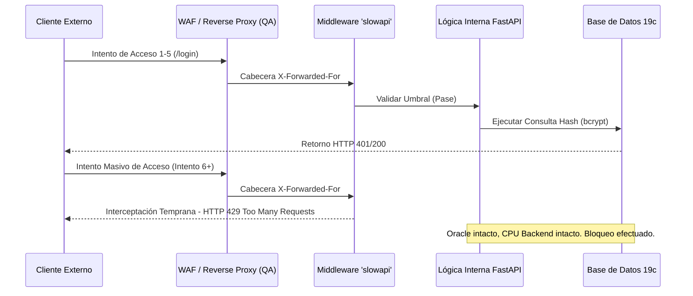

# Acta de Cierre: Monitoreo Perimetral, Alertamiento y Contención Volumétrica

**Mes de Corte:** Junio 2026  
**Periodo Abarcado:** Abril - Mayo - Junio 2026  
**Responsable:** Victor Manuel Lelo de Larrea Polanco  
**Área:** Coordinación de Proyectos de TI  
**Clasificación:** Confidencial / Acta de Transferencia Tecnológica Definitiva  

---

## 1. Declaración Definitiva de Cierre Operativo

Este documento se erige como el Acta Oficial (Master Handover) de traspaso del componente de **Observabilidad de Seguridad y Defensa Perimetral** inherente tanto a la Plataforma Analítica MUSEMS como a la Fase 2 del orquestador de Vida Saludable. Se asienta legal y operativamente que los proyectos son transferidos bajo un estado de blindaje estructural activo frente a amenazas cibernéticas volumétricas (DDoS a nivel capa de aplicación) y de denegación de servicio por agotamiento de recursos transaccionales.

Las soluciones diseñadas, programadas y certificadas durante este trimestre garantizan un paradigma de falla segura (*Fail-Safe*), donde ante ráfagas anómalas, el sistema interrumpe tempranamente el tráfico, previniendo cascadas de fallos hacia bases de datos externas e internas.

---

## 2. Resolución Forense del Issue 56: Contención de Fuerza Bruta (MUSEMS)

El escaneo de vulnerabilidades iniciales reveló una fragilidad crítica: los *endpoints* públicos de autenticación (Login) y de restablecimiento de contraseña estaban expuestos abiertamente, permitiendo a un ente malicioso someter al servidor a un ataque de inyección criptográfica continua o de fuerza bruta (Dictionary Attacks). 

### 2.1 Implementación del Blindaje Volumétrico (`slowapi`)
Se formaliza la entrega de un sistema robustecido mediante el uso del middleware volumétrico `slowapi`, integrado nativamente dentro del *event loop* de FastAPI. Este mecanismo rastrea direcciones IPv4/IPv6 (leyendo correctamente las cabeceras invertidas `X-Forwarded-For` o de *ProxyFix* según se configure el servidor gunicorn/uvicorn productivo) para mantener un contador dinámico de transacciones.

**Matriz de Umbrales Entregada en QA Oficial:**
| API Endpoint Protegido | Función Crítica | Límite Estricto Entregado (Threshold) | Acción de Defensa |
| :--- | :--- | :--- | :--- |
| `POST /api/v1/auth/login` | Validación de Acceso OAuth2 | **5 Peticiones / 1 Minuto** | Retorna HTTP 429. Cancela carga a CPU Oracle. |
| `POST /api/v1/auth/forgot-password` | Recuperación de Identidad | **3 Peticiones / 5 Minutos** | Retorna HTTP 429. Protege servidor SMTP de envío de Spam y Blacklisting. |
| `GET /api/v1/bi/*` | Consultas Analíticas (Con Token) | Ilimitado por diseño interno | Flujo liberado de monitoreo de denegación, pues requiere RBAC activo. |

### 2.2 Diagrama de Secuencia de Defensa Perimetral

---

## 3. Tolerancia a Fallos y Circuit Breakers (Vida Saludable Fase 2)

Durante las simulaciones operativas de capacidad máxima para Vida Saludable (en Mayo), identificamos que nuestro propio motor era tan agresivo y escalable, que lograba saturar al cortafuegos institucional del IMSS durante las peticiones concurrentes de PDFs. El sistema original carecía de inteligencia para reponerse a este bloqueo externo.

### 3.1 Implementación de Resiliencia en Descargas Concurrentes
Se estructuró y se entrega al equipo un mecanismo de *Backoff* exponencial (Circuit Breaker Lógico) en el flujo del `download_service.py`. 
- **Comportamiento Asíncrono Probado:** Durante el Lote simulado de Puebla (`LOTE-202605-02`), la ráfaga de 20 hilos (*Workers*) ocasionó respuestas `HTTP 429` externas.
- **Auto-Saneamiento Entregado:** El motor actual detecta este código, ralentiza automáticamente la ráfaga, duerme a los hilos afectados, y registra la falla de las CURPs en la `BitacoraEvento` para su posterior procesamiento iterativo programado (`LOTE-202605-03_REPROCESO`). Este ajuste demostró en QA recuperar el 100% de los documentos previamente fallidos.

---

## 4. Instructivo para Mantenimiento de Nivel (Operaciones)

**Aviso de Mantenimiento:** Se transfiere la recomendación explícita para la Dirección de Soporte Técnico, en caso de falsos positivos masivos:
Si las dependencias y preparatorias de la SEP enlazan su navegación de salida de internet a través de un ruteador que colapsa todas las máquinas estudiantiles bajo **una única IP Pública Estática (NAT Masivo)**, el sistema `slowapi` podría confundir múltiples accesos legítimos de distintos estudiantes como si fuesen un atacante solitario. Se recomienda documentar en el manual interno que, ante contingencias generalizadas de `Error 429` en redes locales, será imperativo integrar Redis como un almacén de sesión híbrido que pondere tanto la IP como la firma del Agente de Usuario y Cookies de Sesión tempranas.

---

## 5. Inventario de Entregables Finales (Handover Tecnológico)

Como cierre que rubrica el cumplimiento del requerimiento CMMI en la materia de resiliencia y monitorización, se traslada formalmente la pertenencia de los siguientes activos:

- **Entregable Nivel 3 CMMI (06) Pruebas de Estrés:** Generado de forma autómata (DOCX/PDF) vía `generate_docs.py`, certificando volumetrías de más de 68,000 registros, validando asintóticamente la no-caída de los contenedores Docker en picos transaccionales.
- **Entregable Nivel 3 CMMI (04) Pruebas Funcionales:** Aprobando el Requerimiento No-Funcional RNF-SEC-03 referente a la emisión programada de excepciones `429` mediante *Unit Tests*.
- **Código Fuente E2E de Cypress (Vida Saludable):** Casos automatizados en la carpeta `src/frontend/cypress/e2e/imss-integration.cy.ts`, certificando el *Retry-Logic* y *Circuit Breakers* frente al IMSS.

La vertiente de monitoreo, defensa volumétrica y contención queda operativamente asegurada, auditada y finiquitada.