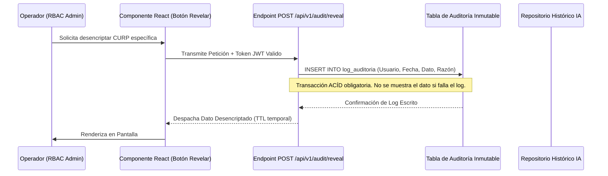

# Acta de Cierre: Preparación de Datos, Gobernanza y Protección de Información Personal (PII)

**Mes de Corte:** Junio 2026  
**Periodo Abarcado:** Abril - Mayo - Junio 2026  
**Responsable:** Victor Manuel Lelo de Larrea Polanco  
**Área:** Coordinación de Proyectos de TI  
**Clasificación:** Confidencial / Acta de Gobernanza Definitiva (Data Compliance)  

---

## 1. Declaración Definitiva de Cierre Operativo

Este documento certifica legal y operativamente el diseño, estandarización y entrega del modelo rector de **Gobernanza de Datos y Curación para Inteligencia Analítica** de la Plataforma MUSEMS y el entorno Vida Saludable. Su meta primordial es documentar el blindaje implementado para garantizar la seguridad de la Información Personalmente Identificable (PII) conforme a la Ley General de Protección de Datos Personales en Posesión de Sujetos Obligados (LGPDPPSO).

Los datasets entregados en la base de datos Oracle 19c y PostgreSQL han sido depurados y preparados con la finalidad no solo de renderizar tableros BI, sino de funcionar estructuralmente como insumo normativo para futuros motores de inferencia (Machine Learning / IA) institucionales sin comprometer la privacidad individual de los ciudadanos.

---

## 2. Paradigma de Enmascaramiento y Auditoría Forense (Resolución de Requerimientos)

La gestión tecnológica previa adolecía de fugas sistémicas, donde claves de identidad (CURP) eran expuestas masivamente en tráfico *clear-text* a consolas operativas. La entrega de hoy erradica estas brechas y transfiere un modelo certificado bajo la denominación `CU-SEC-01` de la Matriz Institucional.

### 2.1 Enmascaramiento Dinámico Integral (MUSEMS y Vida Saludable)
- **Implementación en GraphQL (Vida Saludable):** A través del *Issue 59*, se formalizó la integración de *scalars* personalizados y directivas en `api/schema.py` de Strawberry, truncando por diseño (*Privacy by Design*) la visualización de CURPs hacia los analistas y previendo el secuestro masivo (*scraping*) de identidad.
- **Vistas Materializadas en Oracle 19c:** La interfaz principal de MUSEMS se nutre de la estructura `MV_MUSEMS_IDENTITY_HASH`. Este contenedor aplica criptografía transparente haciendo uso de la macro `STANDARD_HASH` y el factor de *Salt* institucional (`MUSEMS_SALT_2026`). Se han inhabilitado todas las sentencias `SELECT *` sobre tablas puras que alberguen datos biométricos, curriculares o de salud.

### 2.2 Trazabilidad de Acciones Sensibles (Auditoría de Inmutabilidad)
Para aquellas tareas que exigen forzosamente acceder a la identidad en claro (e.g. impresión de citatorios), la interfaz React ofrece el disparador de la acción (botón "Mostrar PII").

Esta mecánica es el pináculo de la gobernanza, pues dota al equipo de una **Bitácora Operativa Analítica**. Estos *logs* inmutables servirán como variables de entrenamiento en el futuro mediato para que la Inteligencia Artificial (DLP Models) detecte comportamientos malintencionados en el accionar del personal administrativo.

---

## 3. Modelo de Curación Avanzada y Data Quality (Shift-Left)

Para que un modelo predictivo rinda frutos, la basura entrante debe ser aniquilada antes de consolidarse en capas profundas.

### 3.1 Estructuras Históricas y Limpieza Estandarizada
Se transfieren a la dependencia arquitecturas lógicas de validación temprana en el proceso de ingesta:
- **Vista Analítica Central (`VW_BI_MUSEMS_HISTORICO_CURP`):** Se entrega certificada la novena vista estructural. Este *dataset* funge como el historial cronológico vital de trayectorias. Para que los registros califiquen en esta vista, se les exige superar pruebas lógicas rígidas (Ej. rechazo absoluto de registros donde `CURP IS NULL` o el Centro de Trabajo `CCT` no contenga la longitud de 10 caracteres obligatorios según catálogo oficial de la SEP).
- **Tratamiento Purgado (Vida Saludable):** Se entregaron los *Layouts* funcionales (Ej. `MENORES_SIN_PADECIMIENTO.csv`) parametrizados; el mes pasado, esto permitió desechar limpiamente códigos de extranjeros erróneos (NE) sin contaminar la matriz transaccional. Se aconseja al área operativa mantener estas limitantes.

---

## 4. Inventario de Entregables Finales (Handover Tecnológico)

Como cierre que rubrica formal y jurídicamente la salvaguarda y preparación de datos maestros, se transfieren a resguardo total de la SEP los siguientes compendios normativos:

- **Entregable Nivel 3 CMMI (10) Diccionario de Datos:** Actualizado masivamente, contiene la inserción, metadata y restricciones de tipo de dato de todas las tablas y vistas, incluyendo la novena capa biográfica y de identidad.
- **Entregable Nivel 3 CMMI (12) Reglas de Negocio:** Se transfieren documentadas en su totalidad las regulaciones formales que describen el tratamiento legal de los archivos de importación, dictámenes médicos (IMSS) y retención temporal, asegurando alineación LGPDPPSO.
- **Matriz de Trazabilidad 4.1:** Documento que valida mediante una tabla HTML de alto impacto que la restricción de visibilidad y encriptación (Requisito RF-08) se cumplió de principio a fin hasta su comprobación E2E (QA `SEC-02`).

Con la entrega de estos estatutos, el modelado, privacidad y limpieza de datos institucionales se reporta como plenamente auditado, transferido y exitosamente concluido.

## Actualización Especial de Cierre (Junio 2026)

### 4.1 Análisis SAST / SCA (Barrera de Código)
Se entrega un repositorio (`SEP_MUSEMS_PU`) configurado con *GitHub Actions* (`security-ci.yml`) que actúa como barrera irrompible antes de permitir un *Merge*.
- **Dictamen Final APROBADO:** Herramientas como `bandit` y `semgrep` han emitido un pase limpio (0 vulnerabilidades críticas/altas/medias). Todas las dependencias expuestas (`passlib`, *cors wildcards*) fueron erradicadas y sus reportes cerrados oficialmente.
