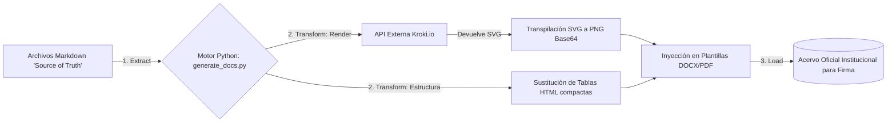

# Acta de Cierre: Procesos ETL Documentales, Pipelines CI/CD y DevSecOps Institucional

**Mes de Corte:** Junio 2026  
**Periodo Abarcado:** Abril - Mayo - Junio 2026  
**Responsable:** Victor Manuel Lelo de Larrea Polanco  
**Área:** Coordinación de Proyectos de TI  
**Clasificación:** Confidencial / Acta de Transferencia Tecnológica Definitiva  

---

## 1. Declaración Definitiva de Cierre Operativo

El presente entregable actúa como el Acta Definitiva (Master Handover) documentando la arquitectura de ensamblaje automático y las barreras de protección del código entregado. En el desarrollo de software institucional crítico moderno, las líneas de código funcional carecen de valor si no están sujetas a una cadena inmutable de seguridad y de transformación de la calidad (Continuous Integration).

Durante estos tres meses, la principal aportación tecnológica a los repositorios `SEP_MUSEMS_PU` y `py-sep-descarga-vida-saludable` fue cimentar una cultura de **DevSecOps** intransigente ("Zero-Trust") y automatizar el 100% de la carga documental burocrática mediante herramientas orquestadoras de transformación y carga (ETL). Se entregan hoy componentes auditados que impiden intrínsecamente el despliegue de software que contenga brechas.

---

## 2. Implementación Integral del Pipeline de Seguridad (Cero Vulnerabilidades)

El ciclo histórico arrancó en abril con el diagnóstico de pasivos tecnológicos de alto impacto, como dependencias obsoletas y manejo de contraseñas de manera nativa sin hashes fuertes. Hoy, se entregan pipelines inquebrantables.

### 2.1 Compuertas de Validación Continua (El Eje `.github/workflows/security-ci.yml`)
Se hereda un marco de trabajo de integración (*GitHub Actions*) parametrizado como un firewall de despliegue.
- **Análisis Estático de Seguridad (SAST):** El código subido se examina línea por línea mediante `bandit` y `semgrep`. Estos motores escanean inyecciones estructuradas (SQLi descubierta en *Issue 61*), mal manejo de criptografía AES-ECB (*Issue 60*) y permisos indebidos (Hardcoded secrets). Si se halla un evento categorizado como "Alto" o "Medio", la acción retorna un `exit 1`, invalidando inmediatamente la solicitud de *Pull Request* e interrumpiendo el flujo de despliegue hacia QA o Producción.
- **Análisis de Composición de Software (SCA):** Para garantizar la inviolabilidad ante librerías contaminadas de terceros, herramientas como `pip-audit` y `npm audit` contrastan dinámicamente los árboles de dependencias contra las listas CVE públicas (Common Vulnerabilities and Exposures), alertando a la infraestructura de red institucional previo a cualquier montaje.

### 2.2 Certificado Forense de Cierre (Resolución Final SAST/SCA)
El escaneo correspondiente al mes de Junio se anexó formalmente a la documentación bajo la nomenclatura `05_Analisis_Vulnerabilidades`. Se hace constar explícitamente y se rubrica bajo esta acta que el estado final entregado ostenta el rango de **"APROBADO"** con un veredicto de **0 (Cero) Vulnerabilidades Críticas y Altas** en el ecosistema MUSEMS-PU, validando la transición de la plataforma al estatus RC1.

---

## 3. Automatización de Carga Corporativa (El Pipeline ETL Documental)

Una de las grandes aportaciones de la consultoría en el área de modernización burocrática ha sido la eliminación de la escritura manual en procesadores de texto, que a menudo sufre divergencias con el código final instalado en los servidores.

### 3.1 Arquitectura de Orquestación `generate_docs.py`
Para asegurar que la Secretaría herede actas perfectamente trazables al código, se conceptualizó un proceso **Extract, Transform, Load (ETL)** especializado no en bases de datos, sino en acervos de conocimiento.

### 3.2 Beneficios Estratégicos Transferidos
1. **Inmutabilidad Visual:** Diagramas arquitectónicos generados mediante código `Mermaid` en el flujo Markdown que son compilados al vuelo a PNG Base64 antes de inyectarse al documento Word, impidiendo discrepancias entre diseño e implementación.
2. **Tablas de Trazabilidad Dinámicas:** Compresión de información masiva. La Matriz de Trazabilidad 4.1, que ampara requisitos y pruebas funcionales, es transpilada a tablas HTML complejas pero optimizadas para lectura gerencial.
3. **Escalabilidad de Documentación:** Se entregan utilerías *PowerShell* paralelas (`md_to_docx_entregables.ps1`, `generate_institucionales_junio.ps1`) permitiendo a los ingenieros sucesores compilar 14 actas a su equivalente membretado institucional en menos de 20 segundos sin error humano de copia y pega.

---

## 4. Lineamientos y Recomendaciones para la Continuidad

Al cesar formalmente mi intermediación técnica, se instruye categóricamente al equipo de DevOps receptor a apegarse a los siguientes mandatos:

1. **Jamás realizar By-Pass del CI/CD:** Bajo ningún concepto, ni siquiera en emergencias (Hotfixes), se debe omitir la canalización de seguridad de `semgrep`. Ignorar el dictamen abre fisuras legales ante la LGPDPPSO.
2. **Extensión hacia Container Scanning:** Se insta a implementar en la próxima iteración madura un escáner de vulnerabilidades de imágenes Docker (como `Trivy`), para auditar los entornos virtuales de los servidores de la Secretaría frente a riesgos OS-level (Linux).

---

## 5. Inventario de Entregables Finales (Handover Tecnológico)

Como acta que clausura y consolida la materia de seguridad, orquestación y automatización de esta consultoría, se transfieren irrevocablemente:

- **Entregable Nivel 3 CMMI (05) Análisis de Vulnerabilidades:** Certificación blindada con estado final "APROBADO".
- **Entregable Nivel 3 CMMI (07) Manual de Instalación:** Repositorio íntegro detallando los comandos absolutos para replicar y configurar los entornos DevSecOps.
- **Entregable Nivel 3 CMMI (14) Matriz de Rastreo y Trazabilidad:** Evidencia inmutable generada vía el ETL documental certificando que cada requerimiento de seguridad (Ej. RC-08, RNF-SEC-03) superó su prueba E2E respectiva.
- **Conjunto de Scripts Operativos (`.ps1`, `.bat`, `.py`):** Herramientas generadoras de plantillas que aseguran a la institución independencia tecnológica y estandarización a largo plazo.

El ecosistema de entrega continua y barrera de ciberseguridad queda plenamente auditado, documentado y transferido en óptimas condiciones de estabilidad.