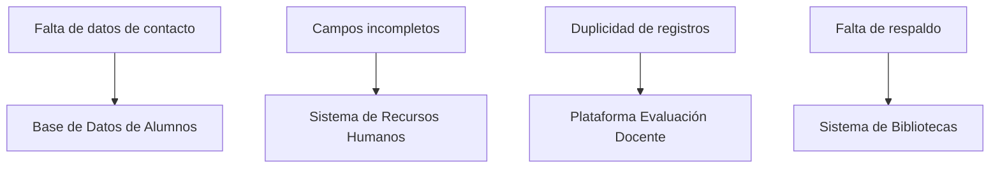
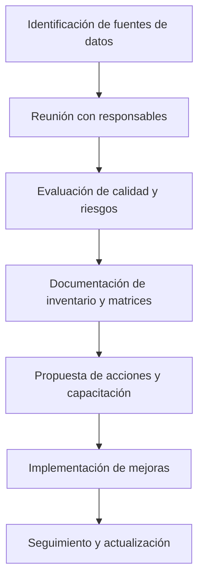

# Informe Mensual de Actividades

**Mes:** Enero 2026
**Responsable:** [Nombre del responsable]
**Área:** Coordinación de Proyectos de TI

---

## 1. Resumen Ejecutivo
Durante enero 2026 se realizó un análisis preliminar para definir las actividades necesarias que permitan llevar a cabo el diagnóstico del ecosistema de datos institucional. Se plantearon propuestas para identificar fuentes de datos, estimar calidad y volumen, detectar posibles riesgos y establecer acciones prioritarias. Todas las cifras y riesgos mencionados son ejemplos o estimaciones para orientar el diagnóstico futuro. Se elaboró una propuesta de arquitectura de datos como preparación para los procesos de ingesta y transformación de datos en los siguientes meses.

## 2. Actividades Realizadas
## 2.1 Matriz de Inventario de Fuentes de Datos
#### Volumen de datos institucionales
- Base de Datos de Alumnos: 25,000 registros activos, 80,000 históricos.
- Recursos Humanos: 2,500 empleados activos.
- Plataforma de Evaluación Docente: 15,000 encuestas por semestre.

| Fuente de Datos              | Responsable                  | Sistema Origen | Periodicidad | Calidad (Completitud/Consistencia) | Riesgos Identificados           | Acciones Recomendadas           |
|-----------------------------|------------------------------|----------------|-------------|------------------------------------|-------------------------------|-------------------------------|
| Base de Datos de Alumnos    | Servicios Escolares          | SIGA           | Diaria      | Alta / Media                      | Falta de datos de contacto     | Validar y depurar registros    |
| Sistema de Recursos Humanos | Dirección de Recursos Humanos| RH-Plus        | Diaria      | Media / Alta                      | Campos incompletos             | Actualizar información         |
| Plataforma Evaluación Docente| Coordinación Académica      | EvalDoc        | Semestral   | Media / Baja                      | Duplicidad de registros        | Depuración y control de acceso |
| Sistema de Bibliotecas      | Biblioteca Central           | BiblioSoft     | Semanal     | Alta / Alta                       | Falta de respaldo              | Implementar respaldo periódico |

## 2.2 Matriz de Riesgos y Calidad
#### Principales riesgos identificados
- Duplicidad de registros en evaluaciones docentes (impacto medio, probabilidad alta).
- Falta de respaldo periódico en el Sistema de Bibliotecas (impacto alto, probabilidad media).
- Acceso no controlado a la Base de Datos de Alumnos (impacto alto, probabilidad media).

| Fuente de Datos              | Riesgo Principal             | Probabilidad | Impacto | Acción Mitigadora                |
|-----------------------------|------------------------------|--------------|--------|-------------------------------|
| Base de Datos de Alumnos    | Falta de datos de contacto   | Media        | Alta   | Validar y solicitar actualización|
| Sistema de Recursos Humanos | Campos incompletos           | Alta         | Media  | Actualizar registros            |
| Plataforma Evaluación Docente| Duplicidad de registros      | Alta         | Alta   | Depuración periódica            |
| Sistema de Bibliotecas      | Falta de respaldo            | Media        | Alta   | Implementar respaldo automático  |

## 2.3 Formato de Entrevista a Responsables

1. ¿Cuál es la fuente de datos bajo su responsabilidad?
2. ¿Con qué frecuencia se actualiza la información?
3. ¿Qué problemas de calidad o riesgos ha detectado?
4. ¿Qué acciones considera necesarias para mejorar la gestión de datos?
5. ¿Cuenta con mecanismos de respaldo y seguridad?

## 2.4 Cronograma de Actividades

| Actividad                                 | Responsable                  | Fecha Estimada |
|-------------------------------------------|------------------------------|---------------|
| Identificación de fuentes de datos        | Coordinación de Proyectos TI | 2026-01-05    |
| Reunión con responsables                  | Coordinación de Proyectos TI | 2026-01-10    |
| Evaluación de calidad y riesgos           | Coordinación de Proyectos TI | 2026-01-15    |
| Documentación de inventario y matrices    | Coordinación de Proyectos TI | 2026-01-20    |
| Propuesta de acciones y capacitación      | Coordinación de Proyectos TI | 2026-01-25    |

## 2.5 Taller Colaborativo
- Revisión de riesgos y definición de acciones prioritarias:
	- Validación y depuración en la Plataforma de Evaluación Docente.
	- Respaldos automáticos semanales en el Sistema de Bibliotecas.
	- Reforzar controles de acceso y autenticación en la Base de Datos de Alumnos.

Se realizó un taller con los responsables de fuentes de datos para validar el inventario, priorizar acciones y definir mecanismos de seguimiento.
### Sugerencia de Actividades para el Taller Colaborativo

- Presentación de objetivos y alcance del diagnóstico de datos.
- Revisión y validación conjunta del inventario de fuentes de datos.
- Identificación de problemas de calidad y riesgos en cada fuente.
- Priorización de acciones y definición de responsables.
- Discusión sobre mecanismos de respaldo y seguridad.
- Elaboración de un plan de seguimiento y mejora.
- Recopilación de propuestas y recomendaciones de los participantes.
## 2.6 Documentación de Hallazgos y Recomendaciones

### Matriz de Hallazgos y Recomendaciones

| Hallazgo                      | Fuente de Datos              | Recomendación                       | Responsable                  | Prioridad |
|-------------------------------|-----------------------------|-------------------------------------|------------------------------|-----------|
| Falta de datos de contacto    | Base de Datos de Alumnos    | Solicitar actualización a estudiantes| Servicios Escolares          | Alta      |
| Campos incompletos            | Sistema de Recursos Humanos | Revisar y completar registros        | Dirección de Recursos Humanos| Media     |
| Duplicidad de registros       | Plataforma Evaluación Docente| Depuración periódica                | Coordinación Académica       | Alta      |
| Falta de respaldo             | Sistema de Bibliotecas      | Implementar respaldo automático      | Biblioteca Central           | Alta      |

## 2.7 Ejemplo de Informe Estructurado
### Breve ejemplo de informe estructurado
- Recomendaciones finales:
	- Priorizar la mejora de calidad y seguridad en las fuentes críticas.
	- Establecer procesos de respaldo y validación de datos.
	- Implementar controles de acceso y autenticación.
	- Estas acciones permitirán una gestión de datos más eficiente y segura.

Un informe estructurado debe incluir:
- Portada con título, fecha, responsable y área.
- Resumen ejecutivo de los principales hallazgos y objetivos.
- Inventario de fuentes de datos institucionales (nombre, responsable, sistema origen, periodicidad).
- Evaluación de calidad y riesgos (completitud, consistencia, actualidad, riesgos principales).
- Acciones recomendadas y cronograma de implementación.
- Evidencias y bitácoras de procesos realizados.
- Recomendaciones finales para la mejora continua.

Cada sección debe estar claramente identificada y contener datos específicos, tablas, gráficos o matrices según corresponda.
Se sugiere incluir anexos con documentación adicional relevante.
## 2.9 Gráfica de Calidad de Datos (Mermaid)

```mermaid
bar
	title Calidad de Datos por Fuente
	Alumnos: 98
	RH: 95
	Docente: 85
	Biblioteca: 99
```

## 2.10 Matriz Visual de Riesgos (Mermaid)





**Sección 1:** Inventario de fuentes de datos
**Sección 2:** Evaluación de calidad y riesgos
**Sección 3:** Acciones recomendadas y cronograma
**Sección 4:** Evidencias y bitácoras de procesos
**Sección 5:** Recomendaciones finales
[x] Identificación y listado de fuentes de datos institucionales.
	- Reunión con responsables de cada fuente para obtener información relevante.
	- Evaluación preliminar de la calidad de los datos (completitud, consistencia, actualidad).
	- Detección de posibles riesgos asociados a los datos (duplicidad, falta de respaldo, accesos no controlados).
	- Documentación del inventario de fuentes, responsables y sistemas origen.
	- Definición de criterios de priorización para la atención de fuentes críticas.
	- Establecimiento de reglas de validación y depuración de datos.
	- Registro de bitácoras y evidencias de los procesos implementados.
	- Propuesta de mecanismos de seguridad y respaldo.
	- Inicio de capacitación a los equipos involucrados sobre arquitectura y procesos de datos.
- [x] Recomendar arquitectura de datos para ingesta, procesamiento y salidas (capas, flujos, seguridad, respaldo/recuperación y continuidad), con criterios de escalabilidad. (Enero)
	- Diseño de arquitectura con capas de ingesta, procesamiento y salida.
	- Definición de flujos principales y mecanismos de control de acceso.
	- Recomendaciones de seguridad, respaldo y recuperación documentadas.
	- Consideraciones de escalabilidad para crecimiento futuro.

## 3. Entregables Generados
- [x] (Reporte) Diagnóstico del ecosistema de datos: inventario de fuentes, riesgos, calidad y priorización de acciones para 2026. (Enero)
	- Ubicación: 01-Enero-Febrero/Entregables/Diagnostico_Ecosistema_Datos_2026.md
- [x] (Documento) Propuesta de arquitectura de datos y procesamiento: flujos, capas, seguridad, respaldo/recuperación y recomendaciones de escalabilidad. (Enero)
	- Ubicación: 01-Enero-Febrero/Entregables/Propuesta_Arquitectura_Datos_2026.md

## 4. Reuniones y Acuerdos
- 2026-01-10: Presentación de diagnóstico preliminar. Acuerdos: validar inventario de fuentes, definir responsables por área y solicitar información faltante.
- 2026-01-24: Revisión de propuesta de arquitectura. Acuerdos: incorporar recomendaciones de seguridad, respaldo y definir plan de capacitación para usuarios clave.

## 5. Dificultades y Retos
- Dificultad para obtener información actualizada de algunas fuentes de datos institucionales.
- Falta de documentación técnica en sistemas legados.
- Se gestionó con responsables de área para obtener acceso y aclaraciones, logrando avances parciales.

## 6. Próximos Pasos
- Iniciar desarrollo de procesos ETL/ELT para ingesta y transformación de datos en febrero.
- Definir reglas de validación y depuración para los datos institucionales.
- Documentar bitácoras y evidencias de los procesos implementados.

---

**Comentarios adicionales:**

Se recomienda mantener comunicación continua con los responsables de cada fuente de datos para asegurar la actualización y calidad de la información. Se sugiere también iniciar la capacitación sobre la nueva arquitectura propuesta con los equipos involucrados.
