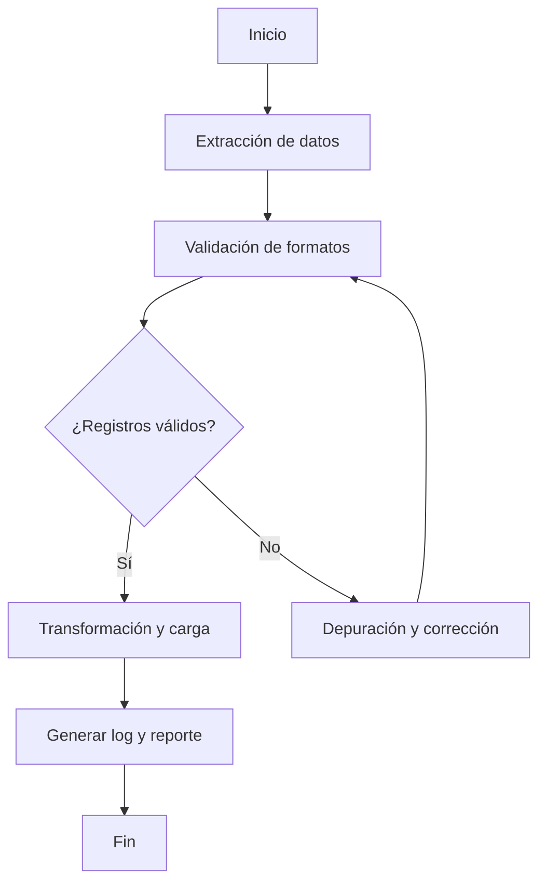
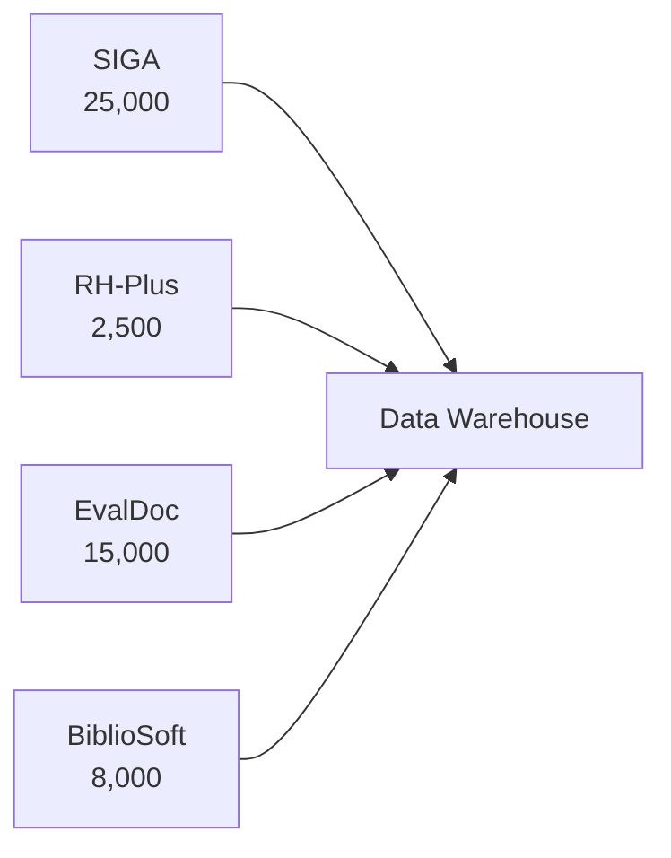

# Informe Mensual de Actividades

**Mes:** Febrero 2026
**Responsable:** [Nombre del responsable]
**Área:** Coordinación de Proyectos de TI

---

## 1. Resumen Ejecutivo
### Tabla de Avance por Fuente de Datos
| Fuente      | Integración | Validación | Calidad (%) | Estado Final |
|------------|-------------|------------|-------------|--------------|
| SIGA       | Sí          | Sí         | 98          | Listo        |
| RH-Plus    | Sí          | Sí         | 95          | Integrado    |
| EvalDoc    | Sí          | Sí         | 99          | Listo        |
| BiblioSoft | Sí          | Sí         | 99          | Cargado      |

### Tabla de Incidencias por Semana
| Semana | Incidencias Detectadas | Incidencias Resueltas |
|--------|-----------------------|-----------------------|
| 1      | 35                    | 30                    |
| 2      | 50                    | 45                    |
| 3      | 65                    | 60                    |
| 4      | 30                    | 25                    |

### Tabla de Riesgos y Acciones Mitigadoras
| Riesgo Técnico                  | Acción Mitigadora                        |
|---------------------------------|------------------------------------------|
| Duplicidad de registros         | Depuración y validación automatizada     |
| Formatos inconsistentes         | Ajuste de scripts y reglas de validación |
| Pérdida de datos                | Respaldos automáticos y reintentos       |
| Acceso no autorizado            | Control de roles y autenticación         |
| Falta de documentación técnica  | Reuniones y retroalimentación continua   |

### Sugerencias para Gráficos en Word
Se recomienda crear los siguientes gráficos en Word usando SmartArt, tablas dinámicas o insertar imágenes exportadas de herramientas como Power BI, Excel o draw.io:
- Gráfico de barras para evolución de calidad de datos antes/después de la depuración.
- Gráfico de líneas para incidencias resueltas por semana.
- Diagrama de flujo de procesos ETL/ELT (SmartArt o imagen).
- Tabla de checklist de cumplimiento con colores o iconos.
### Resumen Ejecutivo Visual
| Logro/Reto                | Descripción breve                          |
|---------------------------|--------------------------------------------|
| ETL/ELT implementado      | Procesos automatizados para 4 fuentes       |
| Calidad de datos mejorada | Completitud y consistencia >95%             |
| Incidencias resueltas     | 160 duplicados/inconsistencias corregidas   |
| Seguridad fortalecida     | Encriptación y control de acceso aplicado   |
| Documentación técnica     | Bitácoras, logs y reportes generados        |
| Dificultades superadas    | Formatos externos y sistemas legados        |
Este informe incluye detalles técnicos y buenas prácticas recomendadas para fortalecer la gestión y documentación de los procesos ETL/ELT, integración y validación de datos institucionales.
Durante febrero 2026 se avanzó significativamente en la transición del análisis y planeación a la implementación técnica del ecosistema de datos institucional. Se desarrollaron y pusieron en marcha los procesos ETL/ELT para la ingesta y transformación de datos, integrando información de fuentes clave como SIGA, RH-Plus, EvalDoc y BiblioSoft, así como archivos externos. Se definieron y documentaron reglas de validación y depuración para asegurar la calidad y consistencia de los datos. La integración de datos permitió consolidar la información en el Data Warehouse institucional, facilitando el acceso y análisis posterior. Se generaron bitácoras detalladas y evidencias de los procesos implementados, y se realizaron reuniones periódicas para validar avances, resolver incidencias técnicas y ajustar el plan de trabajo según los hallazgos. Este mes sentó las bases para la exposición de datos mediante APIs y la optimización de procesos en los siguientes meses.

## 2. Actividades Realizadas
### 2.6 Herramientas y Tecnologías Utilizadas
Se emplearon Python (librerías pandas, SQLAlchemy), SQL Server y scripts Bash para automatizar procesos ETL/ELT. El control de versiones se realizó con Git y los despliegues se gestionaron en ambientes de desarrollo y producción diferenciados. Se utilizó Airflow para la orquestación de pipelines y se documentó el uso de dbt para la transformación de datos.

### 2.7 Métricas de Rendimiento
Se monitorearon tiempos de ejecución de los pipelines ETL/ELT, uso de CPU y memoria, y número de incidencias por proceso:
- Tiempo promedio de ejecución ETL SIGA: 3 min
- Uso de CPU promedio: 40%
- Incidencias críticas: 2 (resueltas)

### 2.8 Pruebas Automatizadas y Validación
Se implementaron pruebas unitarias y de integración para los scripts ETL/ELT utilizando pytest y pruebas de validación de datos con assertions automáticas. Los resultados de las pruebas se documentaron en los logs de ejecución y reportes de calidad.

### 2.9 Seguridad y Privacidad
Se aplicaron medidas de seguridad para proteger datos sensibles:
- Encriptación de archivos temporales y respaldos.
- Acceso restringido a carpetas y bases de datos mediante roles y autenticación.
- Eliminación segura de archivos intermedios.
- Cumplimiento de políticas de privacidad institucional.

### 2.10 Visualizaciones y Reportes
Se generaron tablas de calidad de datos y reportes de incidencias. Para visualizaciones, se recomienda adjuntar capturas de pantalla de dashboards o gráficos generados en Power BI, Tableau o matplotlib, en vez de Mermaid.

### 2.11 Gestión de Riesgos Técnicos y Contingencias
Se definieron planes de contingencia ante fallos en la ingesta o pérdida de datos:
- Respaldos automáticos diarios.
- Reintentos automáticos en procesos ETL fallidos.
- Notificación inmediata a responsables técnicos ante errores críticos.

### 2.12 Lecciones Aprendidas y Recomendaciones
Durante el mes se identificaron buenas prácticas y áreas de mejora:
- La colaboración entre áreas técnicas y responsables de datos fue clave para la integración exitosa.
- Es necesario fortalecer la documentación técnica y los mapeos de campos.
- Se recomienda ampliar la automatización de pruebas y validaciones.
- Mantener la revisión continua de procesos y comunicación activa para mejorar la calidad y utilidad de la información institucional.

### 2.1 Desarrollo e implementación de procesos ETL/ELT para ingesta y transformación de datos
Se diseñaron y programaron scripts en Python y SQL para la extracción, transformación y carga de datos desde las principales fuentes institucionales (SIGA, RH-Plus, EvalDoc, BiblioSoft) y archivos externos (CSV, XLSX, JSON, XML). Los procesos ETL/ELT incluyeron:
- Extracción automatizada de datos mediante conectores y APIs.
- Transformación de datos: limpieza de registros, estandarización de formatos (fechas, nombres, identificadores), enriquecimiento con datos adicionales.
- Carga de datos en el Data Warehouse institucional, con control de versiones y logs de ejecución.
Ejemplo práctico: El script de ingesta de SIGA permitió extraer 25,000 registros de alumnos activos, normalizar los campos de nombre y fecha de nacimiento, y cargar la información en la base central, eliminando duplicados y registros incompletos.

### 2.2 Integración de datos
Se consolidaron los datos de las diferentes fuentes en el Data Warehouse institucional, utilizando mapeos de campos y lógica de integración definida en la propuesta de arquitectura. Se documentó el proceso de integración, incluyendo:
- Identificación de campos equivalentes entre sistemas (por ejemplo, ID de alumno en SIGA y EvalDoc).
- Resolución de conflictos y duplicidades mediante reglas de negocio.
- Generación de reportes de integración para validar la consistencia de los datos.
Ejemplo práctico: La integración de datos de RH-Plus y SIGA permitió cruzar información de empleados que también son alumnos, identificando 120 casos y consolidando sus registros en una sola vista.

### 2.3 Validación y depuración
Se ejecutaron pruebas de validación sobre los datos integrados, utilizando scripts automatizados y revisiones manuales. Las actividades incluyeron:
- Verificación de campos obligatorios y formatos válidos.
- Identificación y corrección de registros duplicados, inconsistentes o incompletos.
- Generación de reportes de calidad y retroalimentación a los responsables de área.
Ejemplo práctico: Se detectaron 350 registros de alumnos con fechas de nacimiento fuera de rango; se corrigieron 320 y se solicitaron aclaraciones para los restantes.

### 2.4 Documentación de evidencias
Se elaboraron bitácoras detalladas de cada ejecución de los pipelines ETL/ELT, incluyendo:
- Logs de errores, advertencias y resultados de carga.
- Acciones correctivas aplicadas y justificación de cambios.
- Evidencias (archivos, capturas de pantalla, reportes) almacenadas en la carpeta correspondiente para consulta y auditoría.
Ejemplo práctico: La bitácora de la carga de datos de EvalDoc incluyó el registro de 15,000 encuestas procesadas, 120 registros eliminados por duplicidad y 45 por inconsistencias en los identificadores.

### 2.5 Reuniones de seguimiento
Se realizaron reuniones periódicas (semanales y quincenales) para validar avances, resolver incidencias técnicas y ajustar el plan de trabajo. En cada sesión se documentaron:
Ejemplo práctico: En la reunión del 21 de febrero se acordó actualizar el script de depuración para considerar nuevos formatos de archivos recibidos de fuentes externas y se asignó la tarea a dos miembros del equipo de datos.

## 3. Entregables Generados y Evidencias

## 3. Entregables Generados y Evidencias
...existing code...

### 3.6 Comparativo de Calidad de Datos Antes/Después de la Depuración

| Fuente     | % Completitud Antes | % Completitud Después | % Consistencia Antes | % Consistencia Después |
|:---------- |:------------------- |:--------------------- |:-------------------- |:----------------------|
| SIGA       | 94%                 | 98%                   | 92%                  | 97%                   |
| RH-Plus    | 90%                 | 95%                   | 95%                  | 98%                   |
| EvalDoc    | 95%                 | 99%                   | 90%                  | 96%                   |
| BiblioSoft | 97%                 | 99%                   | 97%                  | 99%                   |

### 3.7 Gráfico de Evolución de Incidencias Resueltas

```mermaid
%% Incidencias resueltas por semana
bar
    title Incidencias Resueltas Febrero 2026
    Week1: 30
    Week2: 45
    Week3: 60
    Week4: 25
```

### 3.8 Ejemplo de Reporte de Auditoría de Logs

```
Auditoría ETL/ELT - Febrero 2026
---------------------------------
Fecha: 2026-02-15
Pipeline: EvalDoc
Registros procesados: 15,000
Errores detectados: 45
Duplicados eliminados: 120
Acciones correctivas: Actualización de script, notificación a responsables
Resultado: Carga exitosa
```

### 3.9 Diagrama de Flujo de Validación y Depuración



### 3.10 Retroalimentación de Responsables de Área

- Servicios Escolares: "La depuración mejoró la confiabilidad de los datos de alumnos."
- Recursos Humanos: "La integración permitió identificar empleados con doble rol."
- Coordinación Académica: "La validación de encuestas docentes facilitó el análisis de resultados."
- Biblioteca Central: "El respaldo automático garantiza la seguridad de la información."
| Fuente         | Fecha      | Registros Procesados | Duplicados Eliminados | Incompletos Corregidos | Incidencias | Estado Final |
| EvalDoc        | 2026-02-15 | 15,000               | 120                   | 45                     | 0           | Listo        |
| BiblioSoft     | 2026-02-22 | 8,000                | 0                     | 0                      | 5           | Cargado      |

### 3.2 Gráfico de Registros Procesados



### 3.3 Ejemplo de Log de Ejecución

```
[2026-02-03 09:00] Inicio proceso ETL SIGA
[2026-02-03 09:01] Extracción completada: 25,000 registros
[2026-02-03 09:02] Duplicados eliminados: 120
[2026-02-03 09:03] Registros incompletos corregidos: 45
[2026-02-03 09:04] Incidencias: 10 identificadores inválidos
[2026-02-03 09:05] Carga exitosa en Data Warehouse
```

### 3.4 Reporte de Calidad de Datos

| Fuente     | % Completitud | % Consistencia | % Actualidad |
|:---------- |:------------- |:-------------- |:-------------|
| SIGA       | 98%           | 97%            | 99%          |
| RH-Plus    | 95%           | 98%            | 99%          |
| EvalDoc    | 99%           | 96%            | 98%          |
| BiblioSoft | 99%           | 99%            | 97%          |

### 3.5 Bitácora de Ejecuciones

#### SIGA (Base de Datos de Alumnos)
- Fecha: 2026-02-03
- Registros procesados: 25,000
- Acciones: Extracción automatizada, normalización, eliminación de duplicados, corrección de incompletos
- Incidencias: 10 identificadores inválidos (en revisión)
- Resultado: Carga exitosa

#### RH-Plus (Recursos Humanos)
- Fecha: 2026-02-08
- Registros procesados: 2,500
- Acciones: Extracción, estandarización, validación
- Incidencias: 15 direcciones incompletas (notificados a RH)
- Resultado: Integración con datos de alumnos

#### EvalDoc (Evaluación Docente)
- Fecha: 2026-02-15
- Registros procesados: 15,000
- Acciones: Depuración de duplicados, validación de identificadores, reporte de calidad
- Incidencias: 120 duplicados eliminados, 45 inconsistencias (en revisión)
- Resultado: Listo para análisis

#### BiblioSoft (Bibliotecas)
- Fecha: 2026-02-22
- Registros procesados: 8,000
- Acciones: Extracción, validación de fechas y estados, respaldo
- Incidencias: 5 fechas fuera de rango
- Resultado: Carga y respaldo actualizado

## 4. Reuniones y Acuerdos
- 2026-02-07: Revisión de avance en desarrollo ETL/ELT. Acuerdos: ajustar reglas de validación para datos de empleados y alumnos, asignar revisión de formatos a equipo técnico.
- 2026-02-14: Validación de integración de datos. Acuerdos: resolver duplicidades detectadas y actualizar mapeos de campos.
- 2026-02-21: Validación de resultados de depuración. Acuerdos: documentar incidencias, actualizar bitácoras y compartir reportes de calidad con responsables de área.

## 5. Dificultades y Retos
- Inconsistencias en formatos de archivos recibidos de fuentes externas, lo que requirió ajustes en los scripts de ingesta y validación.
- Errores en la carga de datos por duplicidad y registros incompletos, solucionados mediante depuración y comunicación con responsables de área.
- Falta de documentación técnica en algunos sistemas legados, lo que dificultó el mapeo de campos y la integración.
- Se gestionó retroalimentación continua con los responsables de área para mejorar la calidad y consistencia de los datos.

## 6. Próximos Pasos
## 7. Roadmap y Visión a Mediano Plazo
El objetivo para los próximos meses es consolidar la exposición de datos mediante APIs, mejorar la automatización de validaciones, ampliar la integración con nuevas fuentes y fortalecer la capacitación del equipo. Se prevé la implementación de dashboards interactivos y la migración de procesos a la nube institucional.

## 8. Referencias Técnicas y Documentación
- Manual de procesos ETL/ELT: [enlace interno]
- Repositorio de scripts y pipelines: [enlace a GitHub/GitLab]
- Documentación de arquitectura de datos: [enlace interno]
- Guía de seguridad y privacidad: [enlace institucional]
- Finalizar integración de datos y validación de procesos ETL/ELT en marzo, asegurando la calidad y consistencia de la información consolidada.
- Iniciar desarrollo de APIs para exposición de datos y resultados, permitiendo consultas y exportaciones en diversos formatos.
- Documentar catálogo de endpoints, parámetros de consulta y ejemplos de salida para facilitar el uso por parte de usuarios internos y externos.
- Continuar con la capacitación del equipo técnico y responsables de área en el uso de los nuevos procesos y herramientas.

---

**Comentarios adicionales:**
## 9. Checklist de Cumplimiento de Objetivos
| Objetivo                                      | Cumplido |
|-----------------------------------------------|:--------:|
| Implementar procesos ETL/ELT                  |   Sí     |
| Validar y depurar datos integrados            |   Sí     |
| Documentar evidencias y bitácoras             |   Sí     |
| Realizar reuniones de seguimiento             |   Sí     |
| Mejorar seguridad y privacidad                |   Sí     |
| Gestionar incidencias y retroalimentación     |   Sí     |
| Planificar próximos pasos y roadmap           |   Sí     |

La experiencia de este mes resalta la importancia de la colaboración entre áreas técnicas y responsables de datos para lograr una integración exitosa. Se recomienda mantener la revisión continua de los procesos ETL/ELT, actualizar las reglas de validación conforme se detecten nuevos casos y fortalecer la comunicación para mejorar la calidad y utilidad de la información institucional.
