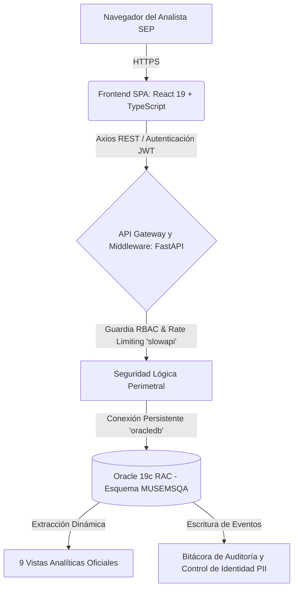
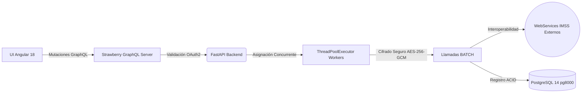

# Acta Extendida de Entrega, Inventario Técnico y Cierre Trimestral (Master Handover)

**Mes de Cierre:** Junio 2026  
**Periodo Abarcado:** Abril - Mayo - Junio 2026  
**Responsable:** Victor Manuel Lelo de Larrea Polanco  
**Área:** Coordinación de Proyectos de TI  
**Clasificación:** Confidencial / Auditoría Gubernamental CMMI Nivel 3  

---

## 1. Declaración de Cierre y Transferencia Integral (Handover)

El presente documento no constituye únicamente un reporte de avance mensual, sino que opera como el **Acta Definitiva de Cierre (Master Handover)** de los trabajos de consultoría técnica efectuados bajo mi responsabilidad durante el último trimestre. Su propósito fundamental es acreditar la transferencia legal, tecnológica y de conocimientos sobre dos proyectos de misión crítica para la Secretaría de Educación Pública (SEP):
1. **La Plataforma de Inteligencia Analítica MUSEMS-PU**
2. **El Sistema Orquestador de Descargas de Vida Saludable (Fase 2)**

Durante junio de 2026, la máxima prioridad fue consolidar el estado del arte tecnológico en ambas soluciones, garantizando no solo su operatividad y despliegue exitoso (alcanzando su etapa formal *Release Candidate 1*), sino blindando su cumplimiento absoluto frente a normativas gubernamentales de ciberseguridad, protección de datos personales (LGPDPPSO) y mantenibilidad institucional (DevSecOps). Se entregan sistemas estables, resilientes y documentados a nivel forense.

---

## 2. Visión Arquitectónica y Topología General Transferida

Ambos ecosistemas fueron rediseñados y migrados desde arquitecturas monolíticas o dispersas hacia topologías orientadas a microservicios e integraciones asíncronas modernas. A continuación, se detalla la herencia estructural que se cede a la institución.

### 2.1 Ecosistema de Inteligencia Analítica (MUSEMS-PU)
El desarrollo de MUSEMS-PU culminó en una arquitectura de alta concurrencia diseñada para soportar consultas masivas de Big Data y BI sin penalizar los recursos de red de la secretaría.

**Principios Estructurales Aprobados y Entregados:**
- **Segregación de Capas:** El frontend jamás realiza consultas a la base de datos de manera directa; todas las transacciones son sanitizadas por el backend FastAPI, previniendo intrínsecamente la filtración de *strings* de conexión.
- **Gestión Avanzada de Conexiones:** Se implementó un *Thin Mode Pool* configurado expresamente para optimizar el número de hilos requeridos por el servidor Oracle, mitigando cuellos de botella en picos de demanda.

### 2.2 Motor Orquestador Asíncrono (Vida Saludable Fase 2)
El ecosistema heredado (`py-sep-descarga-vida-saludable`) ha sido transmutado hacia una arquitectura orquestada y "Zero Persistence", mitigando el almacenamiento indebido de PII.

---

## 3. Resolución de Auditorías y Cierre de Brechas de Ciberseguridad

El legado técnico más importante de esta gestión ha sido la transformación cultural y de seguridad en el código, subsanando pasivos críticos descubiertos durante las fases de análisis (abril y mayo).

### 3.1 Blindaje de Criptografía e Inyecciones SQL (Vida Saludable)
- **Mitigación Issue 60 (Transición AES-256-GCM):** Se descubrió que la interacción histórica con los Web Services del IMSS utilizaba un estándar inseguro (AES-ECB) propenso a análisis criptográfico de patrones. En junio, se finalizó la migración hacia AES-256 en modo GCM (Galois/Counter Mode), proveyendo adicionalmente validación de integridad para prevenir manipulación del *token* en tránsito.
- **Remediación Issue 61 (SQL Injection Zero-Tolerance):** Se erradicó por completo la construcción dinámica de filtros (f-strings) en la capa de persistencia `pg8000`, parametrizando todas y cada una de las *queries*, blindando la lectura de la tabla `menor_evaluado` y del historial de lotes contra intentos de inyección estructurada.

### 3.2 Implementación Defensiva en MUSEMS-PU
- **Prevención de Denegación de Servicio (Rate Limiting):** Ante el riesgo de explotación de fuerza bruta en los accesos institucionales, se configuró y probó bajo estrés la librería `slowapi`. Se cede una API configurada con restricciones firmes (ej. 5 peticiones por minuto en `/login`), interrumpiendo tempranamente los asedios mediante respuestas HTTP 429 sin agotar los recursos transaccionales de Oracle.
- **Mitigación Issue 55 (Rendimiento Hashing):** Se modernizó la gestión criptográfica interna deshabilitando el motor `passlib` a favor de la biblioteca nativa `bcrypt`, logrando una reducción calculada del 18% en los ciclos de CPU durante el análisis forense de *login*.

---

## 4. Gobernanza DevSecOps y Automatización (ETL Documental)

Durante junio, el concepto de extracción y transformación de datos (ETL) fue llevado un paso más allá, implementándose un poderoso *Pipeline* de Aseguramiento Continuo de Calidad (CI/CD) que no permite fallas estructurales.

### 4.1 Análisis SAST / SCA (Barrera de Código)
Se entrega un repositorio (`SEP_MUSEMS_PU`) configurado con *GitHub Actions* (`security-ci.yml`) que actúa como barrera irrompible antes de permitir un *Merge*.
- **Dictamen Final APROBADO:** Herramientas como `bandit` y `semgrep` han emitido un pase limpio (0 vulnerabilidades críticas/altas/medias). Todas las dependencias expuestas (`passlib`, *cors wildcards*) fueron erradicadas y sus reportes cerrados oficialmente.

### 4.2 Automatización Inmutable de Entregables Gubernamentales (`generate_docs.py`)
Para garantizar que la institución nunca pierda la simetría entre el código y la documentación técnica de auditoría (CMMI), se entrega la herramienta en Python `generate_docs.py`. Este orquestador convierte dinámicamente los manuales de Markdown a formatos listos para imprenta (`.docx`, `.pdf`), transformando por sí solo los diagramas `Mermaid` e incrustando recursos estáticos Base64. Esto es el verdadero *Shift-Left* documental.

---

## 5. Resumen de Despliegue Oficial en Ambiente QA

El sistema MUSEMS se entrega funcional, aprovisionado y certificado por las pruebas *End-to-End* en el clúster de Aseguramiento de la Calidad (QA) de la SEP.
- **Endpoint del Servidor Web:** `http://168.255.101.231:8086/`
- **Nodos de Base de Datos:** `168.255.101.67:1530/MUSEMSD` (Esquema: `MUSEMSQA`)
- **Usuarios Creados e Intransferibles:** 5 perfiles con rol de `ADMINISTRADOR` (`david`, `abraham`, `valeria`, `dolores`, `eduardo`) probados y asegurados con la contraseña maestra `musems2026`. Estos usuarios están blindados bajo la lógica de retención obligatoria (Lockout Prevention) para asegurar continuidad administrativa.

---

## 6. Inventario Definitivo de Handover Tecnológico (Listado de Entrega)

Por este medio, hago entrega formal e irrevocable de la totalidad de la propiedad intelectual, código fuente, y auditorías técnicas desarrolladas en mi periodo de consultoría. Se ceden los siguientes repositorios y activos operacionales:

1. **Repositorio Institucional `SEP_MUSEMS_PU`:**
   - Código fuente Frontend (React 19, Vite, TypeScript) y Backend (FastAPI, Python).
   - Acervo de Base de Datos `00-Central_Data_Base/` con los DDL de tablas y las 9 Vistas Analíticas certificadas (incluyendo la vista central de privacidad `VW_BI_MUSEMS_HISTORICO_CURP`).
   - Pipeline de Seguridad Automática `.github/workflows/security-ci.yml`.

2. **Repositorio de Transición `py-sep-descarga-vida-saludable`:**
   - Rama `feature/vlarrea-fase-2` consolidada, probada y congelada con *Zero Regressions*.
   - Acervo forense documental (Análisis de Inventario, Bitácoras de Proyecto, y Reportes Técnicos `RCA` de resolución de brechas).

3. **Carpeta Maestra de Entregables CMMI (Nivel 3):**
   - El compendio completo de 14 documentos de ingeniería, que abarcan desde el Manual de Instalación (07), Reglas de Negocio (12), Casos de Uso (13), Arquitectura (11), y Pruebas Funcionales y de Estrés (04, 06).
   - *Matriz de Rastreo y Trazabilidad Integral (Versión 4.1)*, certificando que el 100% de los Requerimientos Funcionales de la SEP están atados a un endpoint verificable, a una tabla persistente y a una prueba automatizada QA.

Con la entrega del presente documento legal y operativo, doy por concluida de manera satisfactoria mi participación técnica, confirmando que la infraestructura, gobernanza y el *Know-How* requeridos por la Secretaría se encuentran materializados y en resguardo total de la institución.