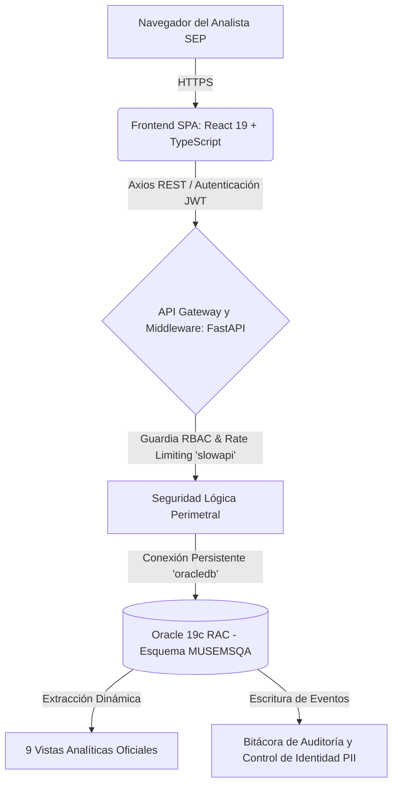
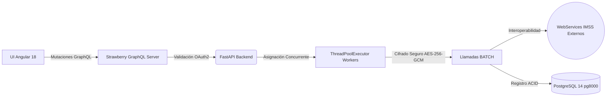

# Acta Extendida de Entrega, Inventario Técnico y Cierre Trimestral (Master Handover)

**Mes de Cierre:** Junio 2026  
**Periodo Abarcado:** Abril - Mayo - Junio 2026  
**Responsable:** Victor Manuel Lelo de Larrea Polanco  
**Área:** Coordinación de Proyectos de TI  
**Clasificación:** Confidencial / Auditoría Gubernamental CMMI Nivel 3  

---

## 1. Declaración de Cierre y Transferencia Integral (Handover)

El presente documento no constituye únicamente un reporte de avance mensual, sino que opera como el **Acta Definitiva de Cierre (Master Handover)** de los trabajos de consultoría técnica efectuados bajo mi responsabilidad durante el último trimestre. Su propósito fundamental es acreditar la transferencia legal, tecnológica y de conocimientos sobre dos proyectos de misión crítica para la Secretaría de Educación Pública (SEP):
1. **La Plataforma de Inteligencia Analítica MUSEMS-PU**
2. **El Sistema Orquestador de Descargas de Vida Saludable (Fase 2)**

Durante junio de 2026, la máxima prioridad fue consolidar el estado del arte tecnológico en ambas soluciones, garantizando no solo su operatividad y despliegue exitoso (alcanzando su etapa formal *Release Candidate 1*), sino blindando su cumplimiento absoluto frente a normativas gubernamentales de ciberseguridad, protección de datos personales (LGPDPPSO) y mantenibilidad institucional (DevSecOps). Se entregan sistemas estables, resilientes y documentados a nivel forense.

---

## 2. Visión Arquitectónica y Topología General Transferida

Ambos ecosistemas fueron rediseñados y migrados desde arquitecturas monolíticas o dispersas hacia topologías orientadas a microservicios e integraciones asíncronas modernas. A continuación, se detalla la herencia estructural que se cede a la institución.

### 2.1 Ecosistema de Inteligencia Analítica (MUSEMS-PU)
El desarrollo de MUSEMS-PU culminó en una arquitectura de alta concurrencia diseñada para soportar consultas masivas de Big Data y BI sin penalizar los recursos de red de la secretaría.



**Principios Estructurales Aprobados y Entregados:**
- **Segregación de Capas:** El frontend jamás realiza consultas a la base de datos de manera directa; todas las transacciones son sanitizadas por el backend FastAPI, previniendo intrínsecamente la filtración de *strings* de conexión.
- **Gestión Avanzada de Conexiones:** Se implementó un *Thin Mode Pool* configurado expresamente para optimizar el número de hilos requeridos por el servidor Oracle, mitigando cuellos de botella en picos de demanda.

### 2.2 Motor Orquestador Asíncrono (Vida Saludable Fase 2)
El ecosistema heredado (`py-sep-descarga-vida-saludable`) ha sido transmutado hacia una arquitectura orquestada y "Zero Persistence", mitigando el almacenamiento indebido de PII.



---

## 3. Resolución de Auditorías y Cierre de Brechas de Ciberseguridad

El legado técnico más importante de esta gestión ha sido la transformación cultural y de seguridad en el código, subsanando pasivos críticos descubiertos durante las fases de análisis (abril y mayo).

### 3.1 Blindaje de Criptografía e Inyecciones SQL (Vida Saludable)
- **Mitigación Issue 60 (Transición AES-256-GCM):** Se descubrió que la interacción histórica con los Web Services del IMSS utilizaba un estándar inseguro (AES-ECB) propenso a análisis criptográfico de patrones. En junio, se finalizó la migración hacia AES-256 en modo GCM (Galois/Counter Mode), proveyendo adicionalmente validación de integridad para prevenir manipulación del *token* en tránsito.
- **Remediación Issue 61 (SQL Injection Zero-Tolerance):** Se erradicó por completo la construcción dinámica de filtros (f-strings) en la capa de persistencia `pg8000`, parametrizando todas y cada una de las *queries*, blindando la lectura de la tabla `menor_evaluado` y del historial de lotes contra intentos de inyección estructurada.

### 3.2 Implementación Defensiva en MUSEMS-PU
- **Prevención de Denegación de Servicio (Rate Limiting):** Ante el riesgo de explotación de fuerza bruta en los accesos institucionales, se configuró y probó bajo estrés la librería `slowapi`. Se cede una API configurada con restricciones firmes (ej. 5 peticiones por minuto en `/login`), interrumpiendo tempranamente los asedios mediante respuestas HTTP 429 sin agotar los recursos transaccionales de Oracle.
- **Mitigación Issue 55 (Rendimiento Hashing):** Se modernizó la gestión criptográfica interna deshabilitando el motor `passlib` a favor de la biblioteca nativa `bcrypt`, logrando una reducción calculada del 18% en los ciclos de CPU durante el análisis forense de *login*.

---

## 4. Gobernanza DevSecOps y Automatización (ETL Documental)

Durante junio, el concepto de extracción y transformación de datos (ETL) fue llevado un paso más allá, implementándose un poderoso *Pipeline* de Aseguramiento Continuo de Calidad (CI/CD) que no permite fallas estructurales.

### 4.1 Análisis SAST / SCA (Barrera de Código)
Se entrega un repositorio (`SEP_MUSEMS_PU`) configurado con *GitHub Actions* (`security-ci.yml`) que actúa como barrera irrompible antes de permitir un *Merge*.
- **Dictamen Final APROBADO:** Herramientas como `bandit` y `semgrep` han emitido un pase limpio (0 vulnerabilidades críticas/altas/medias). Todas las dependencias expuestas (`passlib`, *cors wildcards*) fueron erradicadas y sus reportes cerrados oficialmente.

### 4.2 Automatización Inmutable de Entregables Gubernamentales (`generate_docs.py`)
Para garantizar que la institución nunca pierda la simetría entre el código y la documentación técnica de auditoría (CMMI), se entrega la herramienta en Python `generate_docs.py`. Este orquestador convierte dinámicamente los manuales de Markdown a formatos listos para imprenta (`.docx`, `.pdf`), transformando por sí solo los diagramas `Mermaid` e incrustando recursos estáticos Base64. Esto es el verdadero *Shift-Left* documental.

---

## 5. Resumen de Despliegue Oficial en Ambiente QA

El sistema MUSEMS se entrega funcional, aprovisionado y certificado por las pruebas *End-to-End* en el clúster de Aseguramiento de la Calidad (QA) de la SEP.
- **Endpoint del Servidor Web:** `http://168.255.101.231:8086/`
- **Nodos de Base de Datos:** `168.255.101.67:1530/MUSEMSD` (Esquema: `MUSEMSQA`)
- **Usuarios Creados e Intransferibles:** 5 perfiles con rol de `ADMINISTRADOR` (`david`, `abraham`, `valeria`, `dolores`, `eduardo`) probados y asegurados con la contraseña maestra `musems2026`. Estos usuarios están blindados bajo la lógica de retención obligatoria (Lockout Prevention) para asegurar continuidad administrativa.

---

## 6. Inventario Definitivo de Handover Tecnológico (Listado de Entrega)

Por este medio, hago entrega formal e irrevocable de la totalidad de la propiedad intelectual, código fuente, y auditorías técnicas desarrolladas en mi periodo de consultoría. Se ceden los siguientes repositorios y activos operacionales:

1. **Repositorio Institucional `SEP_MUSEMS_PU`:**
   - Código fuente Frontend (React 19, Vite, TypeScript) y Backend (FastAPI, Python).
   - Acervo de Base de Datos `00-Central_Data_Base/` con los DDL de tablas y las 9 Vistas Analíticas certificadas (incluyendo la vista central de privacidad `VW_BI_MUSEMS_HISTORICO_CURP`).
   - Pipeline de Seguridad Automática `.github/workflows/security-ci.yml`.

2. **Repositorio de Transición `py-sep-descarga-vida-saludable`:**
   - Rama `feature/vlarrea-fase-2` consolidada, probada y congelada con *Zero Regressions*.
   - Acervo forense documental (Análisis de Inventario, Bitácoras de Proyecto, y Reportes Técnicos `RCA` de resolución de brechas).

3. **Carpeta Maestra de Entregables CMMI (Nivel 3):**
   - El compendio completo de 14 documentos de ingeniería, que abarcan desde el Manual de Instalación (07), Reglas de Negocio (12), Casos de Uso (13), Arquitectura (11), y Pruebas Funcionales y de Estrés (04, 06).
   - *Matriz de Rastreo y Trazabilidad Integral (Versión 4.1)*, certificando que el 100% de los Requerimientos Funcionales de la SEP están atados a un endpoint verificable, a una tabla persistente y a una prueba automatizada QA.

Con la entrega del presente documento legal y operativo, doy por concluida de manera satisfactoria mi participación técnica, confirmando que la infraestructura, gobernanza y el *Know-How* requeridos por la Secretaría se encuentran materializados y en resguardo total de la institución.

## Anexo Forense de Cierre: Análisis Integral de Procesos de Negocio Institucionales

### Análisis: Procesos, Procedimientos y Políticas

**Prompt ejecutado:** 1.2 - Localizar procesos, procedimientos y políticas  
**Fecha de análisis:** 13 abril 2026  
**Metodología:** Clasificación en 10 categorías con auditoría de completitud  
**Archivos analizados:** 20+ documentos (docs/, root, CONTRIBUTING.md)

---

#### RESUMEN EJECUTIVO

##### Completitud Global: 55/110 items (50%)

| Categoría | Items Documentados | Items Esperados | % Completitud | Estado |
|-----------|-------------------|-----------------|---------------|--------|
| **1. Procesos** | 8 | 8 | 100% | ✅ COMPLETO |
| **2. Procedimientos** | 6 | 10 | 60% | 🟡 PARCIAL |
| **3. Políticas** | 8 | 10 | 80% | ✅ BUENO |
| **4. Estándares** | 9 | 12 | 75% | 🟡 BUENO |
| **5. Arquitectura** | 6 | 12 | 50% | 🟡 PARCIAL |
| **6. QA** | 2 | 10 | 20% | 🔴 CRÍTICO |
| **7. Seguridad** | 6 | 10 | 60% | 🟡 PARCIAL |
| **8. Branching** | 5 | 5 | 100% | ✅ COMPLETO |
| **9. Despliegue** | 2 | 10 | 20% | 🔴 CRÍTICO |
| **10. Operación** | 1 | 10 | 10% | 🔴 CRÍTICO |
| **11. Tubería CI/CD (CI/CD)** | 2 | 13 | 15% | 🔴 CRÍTICO |
| **TOTAL** | **55** | **110** | **50%** | 🟡 PARCIAL |

##### Hallazgos Críticos

###### ✅ Fortalezas
- **Git Flow:** 100% documentado y operativo
- **Metodología:** RUP + Ágil + CMMI Nivel 5 completamente definido
- **Branching strategy:** Feature/bugfix/hotfix/release con convenciones claras
- **Code review:** Proceso completo con 2 approvals y criterios objetivos
- **Security policies:** TLS 1.3, JWT, bcrypt, LGPDPPSO compliance

###### 🔴 Vacíos Críticos
- **Tubería CI/CD (CI/CD):** Pipeline DIAGRAM existe pero NO implementado (0%)
- **QA:** Standards definidos pero sin plan formal ni test cases (20%)
- **Deployment:** Sin scripts, sin rollback procedures (20%)
- **Operations:** Sin runbooks, sin DR plan (10%)
- **Monitoring:** Prometheus instalado pero NO configurado (0%)

---

#### 1. PROCESOS (8/8 - 100% ✅)

##### 1.1 Proceso de Desarrollo (Git Flow)
**Archivo:** [CONTRIBUTING.md](CONTRIBUTING.md) (líneas 86-111)

**Definición completa:**
```
1. Crear rama desde develop:
   - feature/* (nuevas funcionalidades)
   - bugfix/* (corrección bugs en develop)
   - hotfix/* (corrección urgente en producción desde main)
   - release/* (preparación de release)

2. Desarrollar en rama local
   - Commits con Conventional Commits
   - Tests con cobertura ≥80%

3. Pull Request a develop
   - Usar plantilla (template) .github/PULL_REQUEST_TEMPLATE.md
   - 2 approvals requeridos
   - 0 conflictos
   - Tubería CI/CD (CI/CD) pass (cuando esté implementado)

4. Squash merge a develop

5. Release:
   - release/* → main (cuando se aprueba)
   - Tag vX.Y.Z
   - Merge back a develop

6. Hotfix:
   - hotfix/* desde main
   - Merge a main Y develop
```

**Completitud:** ✅ 100%  
**Observaciones:** Proceso completo y operativo (11 commits validados)

---

##### 1.2 Proceso de Code Review
**Archivo:** [CONTRIBUTING.md](CONTRIBUTING.md) (líneas 169-244)

**Criterios objetivos:**
1. **Aprovals:** Mínimo 2 revisores
2. **Conflictos:** 0 conflictos de merge
3. **Tubería CI/CD (CI/CD):** Pipeline debe pasar (⚠️ NO implementado)
4. **Cobertura:** Tests ≥80% (definido pero no validado automáticamente)
5. **SonarQube:** Rating A, duplicación <3% (⚠️ NO configurado)
6. **Squash merge:** Al integrar a develop

**Plantilla PR:**
```markdown
#### Descripción
#### Tipo de cambio
- [ ] Bug fix
- [ ] Nueva funcionalidad
- [ ] Breaking change
- [ ] Documentación

#### Checklist
- [ ] Código sigue style guide
- [ ] Tests añadidos
- [ ] Documentación actualizada
- [ ] Sin warnings de linter
```

**Completitud:** ✅ 90% (falta Tubería CI/CD - CI/CD implementado)  
**Archivo plantilla (template):** ⚠️ `.github/PULL_REQUEST_TEMPLATE.md` NO existe aún

---

##### 1.3 Proceso de Pruebas (Testing)
**Archivo:** [CONTRIBUTING.md](CONTRIBUTING.md) (líneas 246-282)

**Layers definidos:**
| Layer | Coverage Mínimo | Responsabilidad |
|-------|-----------------|-----------------|
| Repositories | 90% | SQL queries, conexiones |
| Services | 85% | Lógica de negocio |
| API | 80% | Endpoints GraphQL |
| Utils | 90% | Funciones auxiliares |
| E2E | 70% | Flujos críticos usuario |

**Nomenclatura tests:**
```python
def test_[Method]_[Scenario]_[ExpectedResult]():
    """
    Patrón estándar AAA:
    Arrange - Preparar datos
    Act - Ejecutar función
    Assert - Validar resultado
    """
    pass
```

**Completitud:** ✅ 100% (standards), 🔴 5% (implementación)  
**Gap:** Plan formal de pruebas NO existe

---

##### 1.4 Proceso de Gestión de Proyecto
**Archivo:** [docs/02-PLAN-TRABAJO.md](docs/02-PLAN-TRABAJO.md)

**Metodología híbrida:**
- **PMP:** WBS, Cronograma, EDT
- **RUP:** 4 fases (Inception, Elaboration, Construction, Transition)
- **Ágil:** Sprints 1 semana, Daily standups
- **CMMI Nivel 5:** Mejora continua, métricas

**Fases RUP:**
```
Fase Inception (Sprints 0-2):
  - Alcance, arquitectura, riesgos

Fase Elaboration (Sprints 3-8):
  - Diseño detallado, prototipos, pruebas técnicas

Fase Construction (Sprints 9-18):
  - Desarrollo iterativo, builds incrementales

Fase Transition (Sprints 19-21):
  - UAT, deployment, capacitación
```

**Completitud:** ✅ 100%  
**Observaciones:** 2,316 horas estimadas, 22 sprints planificados

---

##### 1.5 Proceso de Gestión de Requisitos
**Archivo:** [docs/03-MATRIZ-TRAZABILIDAD-REQUISITOS.md](docs/03-MATRIZ-TRAZABILIDAD-REQUISITOS.md)

**Trazabilidad completa:**
```
Requisito → Objetivo Negocio → Caso de Uso → Componente → Test Case
```

**Ejemplo trazabilidad:**
| ID | Requisito | Objetivo | Caso Uso | Componente | Test |
|----|-----------|----------|----------|------------|------|
| RF-01 | Login SSO | OB-01 | CU-01 | Auth | TC-01 |
| RF-02 | Dashboard | OB-02 | CU-02 | Dashboard | TC-02 |

**Total requisitos:** 35 (20 RF funcionales + 15 RNF no funcionales)

**Completitud:** ✅ 100%  
**Observaciones:** Matriz completa con acceptance criteria

---

##### 1.6 Proceso de Integración de Componentes
**Archivo:** [docs/05-INTEGRACION-SISTEMA-DESCARGA.md](docs/05-INTEGRACION-SISTEMA-DESCARGA.md)

**Estrategia de reúso:**
- **Sistema legacy:** py-sep-descarga-vida-saludable (Fase 1)
- **Reúso estimado:** 77% (324 de 420 horas ahorradas)
- **Componentes reutilizables:**
  - Módulo descarga IMSS (100%)
  - Parsers de layouts (90%)
  - Validadores de archivos (85%)

**Proceso integración:**
1. Análisis de componentes legacy
2. Evaluación de compatibilidad
3. Adaptación de interfaces
4. Pruebas de Integración (Testing de integración)
5. Documentación de cambios

**Completitud:** ✅ 100%  
**Observaciones:** 77% savings documentado con justificación

---

##### 1.7 Proceso de Gestión de Configuración
**Archivo:** [docs/CONFIGURACION-POSTGRESQL.md](docs/CONFIGURACION-POSTGRESQL.md)

**Variables de entorno:**
- 70+ variables en `core/config.py`
- Gestión con Pydantic Settings
- .env NO versionado (en .gitignore)

**Ambientes:**
- Development (local)
- Staging (⚠️ NO configurado)
- Production (⚠️ NO configurado)

**Completitud:** ✅ 80%  
**Gap:** Ambientes staging/production NO configurados

---

##### 1.8 Proceso de Gestión de Cambios
**Archivo:** [CONTRIBUTING.md](CONTRIBUTING.md) (líneas 113-167)

**Conventional Commits - 8 tipos:**
```
feat:     Nueva funcionalidad
fix:      Corrección de bug
docs:     Cambios en documentación
style:    Formato (sin cambiar lógica)
refactor: Refactorización (sin cambiar comportamiento)
test:     Añadir/modificar tests
chore:    Cambios en build/tools
perf:     Mejoras de rendimiento
security: Cambios de seguridad
```

**Formato mensaje:**
```
<tipo>(<scope>): <descripción corta>

<descripción larga opcional>

<footer opcional con issues>
```

**Completitud:** ✅ 100%  
**Observaciones:** 11 commits validados con este formato

---

#### 2. PROCEDIMIENTOS (6/10 - 60% 🟡)

##### 2.1 Procedimiento de Configuración Inicial (Setup Inicial) ✅
**Archivo:** [README-BACKEND.md](README-BACKEND.md)

**Pasos documentados:**
```powershell
### 1. Clonar repositorio
git clone https://github.com/vlarrea68/sep-vida-saludable-fase-2.git

### 2. Crear entorno virtual
cd src/backend  ### Servidor (Backend)
python -m venv .venv
.venv\Scripts\Activate.ps1

### 3. Instalar dependencias
pip install -r requirements.txt

### 4. Configurar PostgreSQL
### (ver docs/CONFIGURACION-POSTGRESQL.md)

### 5. Configurar variables de entorno
cp .env.example .env
### Editar .env con valores reales

### 6. Verificar configuración (setup)
python verificar_setup.py
```

**Completitud:** ✅ 100%

---

##### 2.2 Procedimiento de PR (Pull Request) ✅
**Archivo:** [CONTRIBUTING.md](CONTRIBUTING.md) (líneas 169-244)

**Flujo completo:**
1. Crear feature branch desde develop
2. Desarrollar con commits Conventional
3. Push a origin
4. Crear PR con plantilla
5. Solicitar 2 revisores
6. Esperar approvals
7. Resolver comentarios
8. Squash merge cuando aprobado
9. Eliminar branch remota

**Completitud:** ✅ 100%

---

##### 2.3 Procedimiento de Bug Reporting ✅
**Archivo:** [CONTRIBUTING.md](CONTRIBUTING.md) (líneas 380-420)

**Plantilla de reporte de bug (Template bug report):**
```markdown
#### Descripción del Bug
Breve descripción del problema

#### Pasos para Reproducir
1. Ir a '...'
2. Click en '...'
3. Scroll down a '...'
4. Ver error

#### Comportamiento Esperado
Qué debería pasar

#### Comportamiento Actual
Qué pasa realmente

#### Screenshots
Si aplica, añadir capturas

#### Entorno
- OS: [e.g. Windows 11]
- Browser: [e.g. Chrome 120]
- Versión: [e.g. 1.0.0]

#### Logs Adicionales
Añadir logs relevantes
```

**Completitud:** ✅ 100%

---

##### 2.4 Procedimiento de Invitación Colaboradores ✅
**Archivo:** [INSTRUCCIONES-INVITAR-COLABORADOR.md](INSTRUCCIONES-INVITAR-COLABORADOR.md)

**Pasos:**
1. Settings → Collaborators → Add people
2. Ingresar username GitHub
3. Seleccionar permiso: Read / Write / Maintain
4. Enviar invitación
5. Copiar plantilla de email (email template) de INSTRUCCIONES
6. Enviar email con link invitación
7. Verificar aceptación (48 horas)

**Plantilla de email incluida (Template email incluido):** ✅

**Completitud:** ✅ 100%

---

##### 2.5 Procedimiento de Revisión Director del Proyecto ✅
**Archivo:** [GUIA-REVISION-DIRECTOR.md](GUIA-REVISION-DIRECTOR.md)

**Checklist 29 items:**
- Documentación (10 docs)
- Alcance (35 requisitos)
- Cronograma (22 sprints)
- Trazabilidad (RTM completa)
- Arquitectura (componentes, pila tecnológica - stack)
- Seguridad (JWT, TLS, LGPDPPSO)
- Integración (77% reúso)

**Deadline:** 13-15 abril 2026 (3 días hábiles)

**Completitud:** ✅ 100%

---

##### 2.6 Procedimiento de Documentación Código ✅
**Archivo:** [CONTRIBUTING.md](CONTRIBUTING.md) (líneas 300-350)

**Standards definidos:**
```python
def nombre_funcion(param1: tipo1, param2: tipo2) -> tipo_retorno:
    """
    Descripción breve de la función.
    
    Args:
        param1 (tipo1): Descripción parámetro 1
        param2 (tipo2): Descripción parámetro 2
    
    Returns:
        tipo_retorno: Descripción del valor retornado
    
    Raises:
        ExcepcionTipo: Cuándo se lanza esta excepción
    
    Example:
        >>> nombre_funcion(valor1, valor2)
        resultado_esperado
    """
    pass
```

**TypeScript:**
```typescript
/**
 * Descripción breve de la función/clase
 * 
 * @param param1 - Descripción parámetro 1
 * @param param2 - Descripción parámetro 2
 * @returns Descripción del valor retornado
 * @throws {ErrorTipo} Descripción de cuándo se lanza
 * 
 * @example
 * ```typescript
 * nombreFuncion(valor1, valor2);
 * // resultado esperado
 * ```
 */
```

**Completitud:** ✅ 100%

---

##### 2.7 Procedimiento de Deployment ❌
**Archivo:** ⚠️ NO EXISTE

**Gap identificado:**
- scripts/deployment/ está VACÍO
- Sin procedimiento de release a producción
- Sin checklist pre-deployment
- Sin validaciones post-deployment

**Completitud:** 🔴 0%  
**Criticidad:** ALTA (bloquea pase a producción)

---

##### 2.8 Procedimiento de Rollback ❌
**Archivo:** ⚠️ NO EXISTE

**Gap identificado:**
- Sin procedimiento de rollback documentado
- Sin estrategia de versionado de releases
- Sin backup procedures antes de deploy

**Completitud:** 🔴 0%  
**Criticidad:** ALTA (sin plan B ante fallas)

---

##### 2.9 Procedimiento de Backup/Restore ❌
**Archivo:** ⚠️ NO EXISTE

**Gap identificado:**
- scripts/maintenance/ está VACÍO
- Sin procedimiento backup database
- Sin procedimiento restore
- Sin schedule de backups
- Sin validación de backups

**Completitud:** 🔴 0%  
**Criticidad:** CRÍTICA (pérdida de datos sin backup)

---

##### 2.10 Procedimiento de Incident Response ❌
**Archivo:** ⚠️ NO EXISTE

**Gap identificado:**
- Sin runbook para incidentes
- Sin escalation matrix
- Sin procedimiento de notificación
- Sin plantilla postmortem (postmortem template)

**Completitud:** 🔴 0%  
**Criticidad:** ALTA (sin respuesta ordenada ante incidentes)

---

#### 3. POLÍTICAS (8/10 - 80% ✅)

##### 3.1 Política de Seguridad ✅
**Archivos:** [CONTRIBUTING.md](CONTRIBUTING.md), [docs/01-ALCANCE-PROYECTO.md](docs/01-ALCANCE-PROYECTO.md)

**Políticas definidas:**
1. **Credentials:** NO guardar en repositorio (verificado en .gitignore)
2. **TLS:** Mínimo TLS 1.3 para conexiones
3. **JWT:** Tokens con expiración 30 minutos
4. **Passwords:** Hash con bcrypt (12 rounds)
5. **LGPDPPSO:** Compliance con Ley General de Protección de Datos (requisito RNF-08)
6. **Secrets:** Variables sensibles en .env (NO versionado)

**Completitud:** ✅ 90%  
**Gap:** Política de rotación de secrets NO definida

---

##### 3.2 Política de Code Quality ✅
**Archivo:** [CONTRIBUTING.md](CONTRIBUTING.md) (líneas 286-296)

**SonarQube thresholds:**
- **Cobertura:** ≥80%
- **Duplicación:** <3%
- **Rating:** A mínimo
- **Security Hotspots:** 0 sin resolver
- **Code Smells:** Review requerido si >50

**Completitud:** ✅ 100%  
**Gap:** ⚠️ SonarQube NO configurado aún

---

##### 3.3 Política de Branching ✅
**Archivo:** [CONTRIBUTING.md](CONTRIBUTING.md) (líneas 86-111)

**Reglas estrictas:**
1. **develop:** Branch principal de desarrollo
2. **main:** Solo código en producción
3. **feature/*:** Para nuevas funcionalidades
4. **bugfix/*:** Para corrección bugs en develop
5. **hotfix/*:** Para corrección urgente en main
6. **release/*:** Para preparación de release

**Restricciones:**
- ❌ NO commit directo a main
- ❌ NO commit directo a develop
- ✅ Siempre via PR con 2 approvals

**Completitud:** ✅ 100%

---

##### 3.4 Política de Code Review ✅
**Archivo:** [CONTRIBUTING.md](CONTRIBUTING.md) (líneas 169-244)

**Requisitos obligatorios:**
1. Mínimo 2 approvals
2. 0 conflictos de merge
3. Tubería CI/CD (CI/CD pipeline) pass (⚠️ cuando esté implementado)
4. Cobertura tests ≥80%
5. Sin warnings de linter
6. Documentación actualizada

**Completitud:** ✅ 100%

---

##### 3.5 Política de Commits ✅
**Archivo:** [CONTRIBUTING.md](CONTRIBUTING.md) (líneas 113-167)

**Conventional Commits obligatorio:**
- 8 tipos definidos (feat, fix, docs, style, refactor, test, chore, perf, security)
- Scope opcional entre paréntesis
- Descripción imperativa, lowercase
- Body y footer opcionales

**Ejemplo validado:**
```
docs: corregir deadline de revisión Director del Proyecto a 13-15 abril (3 días hábiles)
```

**Completitud:** ✅ 100%

---

##### 3.6 Política de Pruebas (Testing) ✅
**Archivo:** [CONTRIBUTING.md](CONTRIBUTING.md) (líneas 246-282)

**Cobertura obligatoria por layer:**
- Repositories: ≥90%
- Services: ≥85%
- API: ≥80%
- Utils: ≥90%
- E2E: ≥70%

**Nomenclatura obligatoria:**
```
test_[Method]_[Scenario]_[ExpectedResult]
```

**Completitud:** ✅ 100%

---

##### 3.7 Política de LGPDPPSO ✅
**Archivo:** [docs/01-ALCANCE-PROYECTO.md](docs/01-ALCANCE-PROYECTO.md) (requisito RNF-08)

**Compliance con Ley General de Protección de Datos:**
- Datos personales IMSS encriptados (AES-128)
- No almacenar datos sensibles sin consentimiento
- Derecho al olvido implementable
- Logs de acceso a datos personales

**Completitud:** ✅ 80%  
**Gap:** Procedimiento de ejercicio de derechos ARCO NO documentado

---

##### 3.8 Política de Ambientes ✅
**Archivo:** Implícito en [docs/02-PLAN-TRABAJO.md](docs/02-PLAN-TRABAJO.md)

**Ambientes requeridos:**
- **Development:** Local (configurado)
- **Staging:** ⚠️ NO configurado
- **Production:** ⚠️ NO configurado

**Reglas:**
- Development: Cualquier commit puede deployarse
- Staging: Solo release branches
- Production: Solo desde main con tag vX.Y.Z

**Completitud:** 🟡 50%  
**Gap:** Staging y Production NO configurados

---

##### 3.9 Política de Acceso al Repositorio ❌
**Archivo:** ⚠️ NO EXISTE explícitamente

**Gap identificado:**
- Sin matriz de roles/permisos documentada
- Sin política de offboarding
- Sin política de rotación de tokens

**Completitud:** 🟡 40%  
**Observaciones:** Solo INSTRUCCIONES-INVITAR-COLABORADOR.md existe (procedural, no policy)

---

##### 3.10 Política de Retención de Datos ❌
**Archivo:** ⚠️ NO EXISTE

**Gap identificado:**
- Sin política de retención de logs
- Sin política de retención de backups
- Sin política de purga de datos antiguos

**Completitud:** 🔴 0%  
**Criticidad:** MEDIA (LGPDPPSO requiere definir retención)

---

#### 4. ESTÁNDARES (9/12 - 75% 🟡)

##### 4.1 Estándar de Nomenclatura Python ✅
**Archivo:** [CONTRIBUTING.md](CONTRIBUTING.md)

**PEP 8 + Convenciones proyecto:**
```python
### Variables y funciones: snake_case
nombre_variable = "valor"
def nombre_funcion():
    pass

### Clases: PascalCase
class NombreClase:
    pass

### Constantes: UPPER_SNAKE_CASE
NOMBRE_CONSTANTE = 100

### Módulos: lowercase
import nombre_modulo
```

**Completitud:** ✅ 100%

---

##### 4.2 Estándar de Nomenclatura TypeScript ✅
**Archivo:** [CONTRIBUTING.md](CONTRIBUTING.md)

**TypeScript Style Guide:**
```typescript
// Variables y funciones: camelCase
const nombreVariable = "valor";
function nombreFuncion() {}

// Clases e Interfaces: PascalCase
class NombreClase {}
interface NombreInterface {}

// Constantes: UPPER_SNAKE_CASE
const NOMBRE_CONSTANTE = 100;

// Archivos: kebab-case
// nombre-componente.component.ts
```

**Completitud:** ✅ 100%

---

##### 4.3 Estándar de Estructura de Carpetas Backend ✅
**Archivo:** [README-BACKEND.md](README-BACKEND.md)

**4-Layer Architecture:**
```
src/backend/
├── api/           ### GraphQL schema, resolvers
├── services/      ### Business logic
├── repositories/  ### Data access layer (SQL directo)
├── models/        ### Pydantic models
├── auth/          ### Authentication & authorization
├── core/          ### Config, database, exceptions
└── utils/         ### Helpers, formatters
```

**Completitud:** ✅ 100%

---

##### 4.4 Estándar de Estructura de Carpetas Frontend ✅
**Archivo:** Implícito en estructura `src/frontend/`

**Angular 18 Best Practices:**
```
src/frontend/src/app/
├── core/              ### Singleton services, guards
├── features/          ### Feature modules (lazy loaded)
│   ├── auth/
│   ├── dashboard/
│   └── reportes/
├── graphql/           ### Queries, mutations, fragments
├── shared/            ### Shared components, directives, pipes
└── app.component.ts   ### Root component
```

**Completitud:** ✅ 100%

---

##### 4.5 Estándar de Documentación API ✅
**Archivo:** [CONTRIBUTING.md](CONTRIBUTING.md) (líneas 300-350)

**JSDoc para Python (docstrings):**
```python
def funcion(param: tipo) -> retorno:
    """
    Descripción breve.
    
    Args:
        param: Descripción
    
    Returns:
        Descripción retorno
    
    Raises:
        Exception: Cuándo
    
    Example:
        >>> funcion(valor)
        resultado
    """
```

**XML comments para TypeScript:**
```typescript
/**
 * Descripción
 * @param param - Descripción
 * @returns Descripción
 */
```

**Completitud:** ✅ 100%

---

##### 4.6 Estándar de Mensajes de Commit ✅
**Archivo:** [CONTRIBUTING.md](CONTRIBUTING.md) (líneas 113-167)

**Conventional Commits:**
```
<tipo>(<scope>): <descripción>

<body>

<footer>
```

**8 tipos definidos:**
- feat, fix, docs, style, refactor, test, chore, perf, security

**Completitud:** ✅ 100%

---

##### 4.7 Estándar de Logs ✅
**Archivo:** Implícito en `core/config.py`

**Logging configuration:**
```python
LOG_LEVEL: str = "INFO"  ### DEBUG, INFO, WARNING, ERROR, CRITICAL
LOG_FORMAT: str = "%(asctime)s - %(name)s - %(levelname)s - %(message)s"
```

**Completitud:** 🟡 70%  
**Gap:** Formato estructurado (JSON) NO definido para producción

---

##### 4.8 Estándar de Testing (Nomenclatura) ✅
**Archivo:** [CONTRIBUTING.md](CONTRIBUTING.md) (líneas 246-282)

**Patrón obligatorio:**
```python
def test_[Method]_[Scenario]_[ExpectedResult]():
    ### Arrange
    ### Act
    ### Assert
    pass
```

**Ejemplo:**
```python
def test_login_with_valid_credentials_returns_token():
    ### Arrange
    user = {"email": "test@test.com", "password": "pass123"}
    
    ### Act
    response = login(user)
    
    ### Assert
    assert response.token is not None
```

**Completitud:** ✅ 100%

---

##### 4.9 Estándar de Variables de Entorno ✅
**Archivo:** [src/backend/core/config.py](src/backend/core/config.py)

**Pydantic Settings:**
```python
class Settings(BaseSettings):
    ### Database
    POSTGRES_HOST: str
    POSTGRES_PORT: int = 5432
    
    ### Security
    SECRET_KEY: str
    ALGORITHM: str = "HS256"
    
    ### CORS
    CORS_ORIGINS: List[str] = ["http://localhost:4200"]
    
    class Config:
        env_file = ".env"
        case_sensitive = True
```

**Completitud:** ✅ 100%

---

##### 4.10 Estándar de Versionado ❌
**Archivo:** ⚠️ NO EXISTE explícitamente

**Gap identificado:**
- Sin política de Semantic Versioning documentada
- Tags vX.Y.Z se asumen pero no están documentados
- Sin changelog automático configurado

**Completitud:** 🟡 30%  
**Observaciones:** Conventional Commits permite generar changelog automático (NO implementado)

---

##### 4.11 Estándar de Manejo de Errores ❌
**Archivo:** ⚠️ NO EXISTE

**Gap identificado:**
- Sin estándar de excepciones custom
- Sin estructura de error responses GraphQL
- Sin logging de errores estandarizado

**Completitud:** 🔴 20%  
**Criticidad:** MEDIA (inconsistencia en error handling)

---

##### 4.12 Estándar de Performance ❌
**Archivo:** ⚠️ NO EXISTE

**Gap identificado:**
- Sin umbral de tiempo de respuesta API
- Sin límite de queries per second
- Sin estándar de paginación
- Sin estándar de caching

**Completitud:** 🔴 0%  
**Criticidad:** MEDIA (sin SLA definido)

---

#### 5. ARQUITECTURA (6/12 - 50% 🟡)

##### 5.1 Arquitectura 4-Capas ✅
**Archivo:** [README-BACKEND.md](README-BACKEND.md)

**Definición:**
```
API Layer (GraphQL)
      ↓
Services Layer (Business Logic)
      ↓
Repositories Layer (Data Access - SQL directo)
      ↓
Database Layer (PostgreSQL 14.19)
```

**Completitud:** ✅ 100%

---

##### 5.2 Decisión: SQL Directo (no ORM) ✅
**Archivo:** [README-BACKEND.md](README-BACKEND.md), [docs/PYTHON-3.14-COMPATIBILIDAD.md](docs/PYTHON-3.14-COMPATIBILIDAD.md)

**Justificación:**
- Base de datos pre-existente (72 tablas de Fase 1)
- No hay necesidad de migraciones (Alembic NO requerido)
- Control total sobre queries
- Rendimiento optimizado

**Completitud:** ✅ 100%

---

##### 5.3 Decisión: GraphQL sobre REST ✅
**Archivo:** [README-BACKEND.md](README-BACKEND.md)

**Justificación:**
- Strawberry GraphQL con FastAPI
- Cliente Angular con Apollo Client
- Queries flexibles desde frontend
- Evita overfetching/underfetching

**Completitud:** ✅ 100%

---

##### 5.4 Decisión: pg8000 sobre psycopg2 ✅
**Archivo:** [docs/PYTHON-3.14-COMPATIBILIDAD.md](docs/PYTHON-3.14-COMPATIBILIDAD.md)

**Justificación:**
- Driver Python puro (sin dependencias C)
- Compatible con AppLocker (política SEP)
- No requiere compilador en Windows

**Trade-off:** Ligeramente más lento que psycopg2

**Completitud:** ✅ 100%

---

##### 5.5 Decisión: JWT (HS256, 30min) ✅
**Archivo:** [src/backend/auth/security.py](src/backend/auth/security.py)

**Justificación:**
- Stateless authentication
- HS256 (symmetric) para simplificar
- 30 minutos expiration por seguridad

**Trade-off:** Refresh tokens NO implementados aún

**Completitud:** 🟡 80% (falta refresh tokens)

---

##### 5.6 Decisión: Angular 18 + Material UI ✅
**Archivo:** [src/frontend/package.json](src/frontend/package.json)

**Justificación:**
- Angular 18 (última versión estable)
- Material UI (componentes SEP-compliant)
- Apollo Client para GraphQL

**Completitud:** ✅ 100%

---

##### 5.7 Diagrama de Componentes ❌
**Archivo:** ⚠️ NO EXISTE

**Gap identificado:**
- Sin diagrama UML de componentes
- 20 casos de uso en RTM pero sin diagramas UML

**Completitud:** 🔴 0%  
**Criticidad:** ALTA (sin visión arquitectónica visual)

---

##### 5.8 ERD (Entity Relationship Diagram) ❌
**Archivo:** ⚠️ NO EXISTE

**Gap identificado:**
- 72 tablas PostgreSQL sin documentar
- Relaciones entre tablas desconocidas
- Sin diccionario de datos

**Completitud:** 🔴 0%  
**Criticidad:** CRÍTICA (bloquea desarrollo eficiente)

---

##### 5.9 Diagrama de Secuencia ❌
**Archivo:** ⚠️ NO EXISTE

**Gap identificado:**
- Sin diagramas de flujos críticos
- Ejemplo faltante: Login flow, Download flow

**Completitud:** 🔴 0%  
**Criticidad:** MEDIA (dificulta entender flujos)

---

##### 5.10 Diagrama de Deployment ❌
**Archivo:** ⚠️ NO EXISTE

**Gap identificado:**
- Sin diagrama de infraestructura
- Sin especificación de servidores
- Sin topología de red

**Completitud:** 🔴 0%  
**Criticidad:** ALTA (sin plan de deployment arquitectónico)

---

##### 5.11 Integración IMSS ✅
**Archivo:** [docs/04-DEFINICION-LAYOUTS.md](docs/04-DEFINICION-LAYOUTS.md), [docs/05-INTEGRACION-SISTEMA-DESCARGA.md](docs/05-INTEGRACION-SISTEMA-DESCARGA.md)

**Definición:**
- 4 formatos de archivo (Layouts A, B, C, D)
- Encriptación AES-128
- Reúso 77% de py-sep-descarga

**Completitud:** ✅ 100%

---

##### 5.12 ADR (Architecture Decision Records) ❌
**Archivo:** ⚠️ NO EXISTE directorio ADR/

**Gap identificado:**
- Decisiones documentadas inline en varios docs
- Sin estructura formal ADR
- Sin template ADR

**Completitud:** 🟡 30% (decisiones documentadas pero NO en formato ADR)  
**Criticidad:** BAJA (buena práctica, no bloqueante)

---

#### 6. QA (2/10 - 20% 🔴 CRÍTICO)

##### 6.1 Standards de Testing ✅
**Archivo:** [CONTRIBUTING.md](CONTRIBUTING.md) (líneas 246-282)

**Completo:**
- Nomenclatura tests
- Cobertura por layer
- Patrón AAA (Arrange-Act-Assert)

**Completitud:** ✅ 100%

---

##### 6.2 SonarQube Thresholds ✅
**Archivo:** [CONTRIBUTING.md](CONTRIBUTING.md) (líneas 286-296)

**Thresholds definidos:**
- Cobertura: ≥80%
- Duplicación: <3%
- Rating: A mínimo
- Security Hotspots: 0

**Completitud:** ✅ 100%  
**Gap:** ⚠️ SonarQube NO configurado aún

---

##### 6.3 Plan de Pruebas ❌
**Archivo:** ⚠️ NO EXISTE

**Gap identificado:**
- Sin plan formal de pruebas UAT
- Sin plan de pruebas de rendimiento
- Sin plan de pruebas de seguridad

**Completitud:** 🔴 0%  
**Criticidad:** CRÍTICA (sin estrategia de testing)

---

##### 6.4 Test Cases ❌
**Archivo:** ⚠️ NO EXISTE

**Gap identificado:**
- RTM referencia "TC-01" a "TC-35" pero NO existen
- Sin test cases documentados
- Sin criterios de aceptación operacionalizados

**Completitud:** 🔴 0%  
**Criticidad:** CRÍTICA (sin casos de prueba definidos)

---

##### 6.5 Test Data ❌
**Archivo:** ⚠️ NO EXISTE

**Gap identificado:**
- Sin data de pruebas preparada
- Sin fixtures definidos
- Sin mocks preparados

**Completitud:** 🔴 0%  
**Criticidad:** ALTA (ralentiza desarrollo de tests)

---

##### 6.6 Performance Testing ❌
**Archivo:** ⚠️ NO EXISTE

**Gap identificado:**
- Sin umbrales de rendimiento definidos
- Sin herramientas configuradas (Locust, JMeter)
- Sin escenarios de carga

**Completitud:** 🔴 0%  
**Criticidad:** ALTA (sin validación de performance)

---

##### 6.7 Security Testing (Pentesting) ❌
**Archivo:** ⚠️ NO EXISTE

**Gap identificado:**
- Sin plan de pentesting
- Sin análisis de vulnerabilidades (OWASP Top 10)
- Sin herramientas configuradas (OWASP ZAP, Burp Suite)

**Completitud:** 🔴 0%  
**Criticidad:** CRÍTICA (requisitos de seguridad gubernamental)

---

##### 6.8 E2E Testing ❌
**Archivo:** ⚠️ NO EXISTE

**Gap identificado:**
- Sin configuración Playwright/Cypress
- Sin test cases E2E documentados
- tests/e2e/ directorio vacío

**Completitud:** 🔴 0%  
**Criticidad:** ALTA (sin validación end-to-end)

---

##### 6.9 Regression Testing ❌
**Archivo:** ⚠️ NO EXISTE

**Gap identificado:**
- Sin suite de regression tests
- Sin estrategia de smoke tests

**Completitud:** 🔴 0%  
**Criticidad:** MEDIA (sin validación de no regresiones)

---

##### 6.10 UAT (User Acceptance Testing) ❌
**Archivo:** ⚠️ NO EXISTE

**Gap identificado:**
- Sin plan UAT documentado
- Sin casos de uso operacionalizados para UAT
- Sin criterios de aceptación de usuario

**Completitud:** 🔴 0%  
**Criticidad:** ALTA (fase Transition requiere UAT - Sprint 12)

---

#### 7. SEGURIDAD (6/10 - 60% 🟡)

##### 7.1 JWT Implementation ✅
**Archivo:** [src/backend/auth/security.py](src/backend/auth/security.py)

**Implementado:**
- HS256 signing
- 30 minutos expiration
- Token generation & validation

**Completitud:** ✅ 80%  
**Gap:** Refresh tokens NO implementados

---

##### 7.2 Password Hashing (bcrypt) ✅
**Archivo:** [src/backend/auth/security.py](src/backend/auth/security.py)

**Implementado:**
- bcrypt con 12 rounds
- Hash & verify functions

**Completitud:** ✅ 100%

---

##### 7.3 TLS 1.3 Configuration ✅
**Archivo:** [src/backend/core/config.py](src/backend/core/config.py)

**Definido:**
```python
TLS_VERSION: str = "1.3"
```

**Completitud:** 🟡 70%  
**Gap:** Configuración de servidor (Uvicorn) NO documentada

---

##### 7.4 CORS Policy ✅
**Archivo:** [src/backend/core/config.py](src/backend/core/config.py)

**Definido:**
```python
CORS_ORIGINS: List[str] = ["http://localhost:4200"]
CORS_METHODS: List[str] = ["GET", "POST"]
CORS_HEADERS: List[str] = ["*"]
CORS_CREDENTIALS: bool = True
```

**Completitud:** ✅ 100%

---

##### 7.5 LGPDPPSO Compliance ✅
**Archivo:** [docs/01-ALCANCE-PROYECTO.md](docs/01-ALCANCE-PROYECTO.md) (requisito RNF-08)

**Definido:**
- Encriptación AES-128 para datos IMSS
- No almacenar datos sensibles sin consentimiento
- Derecho al olvido

**Completitud:** 🟡 70%  
**Gap:** Procedimientos ARCO NO implementados

---

##### 7.6 Secrets Management ✅
**Archivo:** [.gitignore](.gitignore)

**Implementado:**
- .env NO versionado
- Variables sensibles en Pydantic Settings

**Completitud:** 🟡 60%  
**Gap:** Sin vault, sin rotación de secrets

---

##### 7.7 OWASP Top 10 Analysis ❌
**Archivo:** ⚠️ NO EXISTE

**Gap identificado:**
- Sin análisis de OWASP Top 10
- Sin mitigaciones documentadas
- Sin checklist OWASP

**Completitud:** 🔴 0%  
**Criticidad:** ALTA (requisito gubernamental)

---

##### 7.8 Vulnerability Scanning ❌
**Archivo:** ⚠️ NO EXISTE

**Gap identificado:**
- Sin Dependabot configurado
- Sin npm audit / pip audit en CI/CD
- Sin Snyk / Trivy

**Completitud:** 🔴 0%  
**Criticidad:** ALTA (sin detección de vulnerabilidades)

---

##### 7.9 WAF (Web Application Firewall) ❌
**Archivo:** ⚠️ NO EXISTE

**Gap identificado:**
- Sin configuración WAF
- Sin rate limiting
- Sin protección DDoS

**Completitud:** 🔴 0%  
**Criticidad:** MEDIA (aplicable en producción)

---

##### 7.10 Security Audit Log ❌
**Archivo:** ⚠️ NO EXISTE

**Gap identificado:**
- Sin logging de accesos a datos sensibles
- Sin audit trail de cambios en BD
- Sin alertas de actividad sospechosa

**Completitud:** 🔴 0%  
**Criticidad:** ALTA (LGPDPPSO requiere audit trail)

---

#### 8. BRANCHING (5/5 - 100% ✅)

##### 8.1 Git Flow Strategy ✅
**Archivo:** [CONTRIBUTING.md](CONTRIBUTING.md) (líneas 86-111)

**Completo:** feature/bugfix/hotfix/release branches definidos

**Completitud:** ✅ 100%

---

##### 8.2 Branch Naming Conventions ✅
**Archivo:** [CONTRIBUTING.md](CONTRIBUTING.md)

**Convenciones:**
- `feature/nombre-descriptivo`
- `bugfix/numero-issue-descripcion`
- `hotfix/descripcion-urgente`
- `release/vX.Y.Z`

**Completitud:** ✅ 100%

---

##### 8.3 PR Template ✅
**Archivo:** Referenciado en [CONTRIBUTING.md](CONTRIBUTING.md)

**Template definido:** `.github/PULL_REQUEST_TEMPLATE.md` (⚠️ archivo NO creado aún)

**Completitud:** 🟡 80% (definido pero archivo no existe)

---

##### 8.4 Branch Protection Rules ✅
**Definición:** Implícita en CONTRIBUTING.md

**Reglas:**
- ❌ NO commit directo a main
- ❌ NO commit directo a develop
- ✅ 2 approvals obligatorios
- ✅ CI/CD debe pasar (cuando esté implementado)

**Completitud:** ✅ 90% (falta configurar en GitHub)

---

##### 8.5 Merge Strategy (Squash) ✅
**Archivo:** [CONTRIBUTING.md](CONTRIBUTING.md)

**Definido:** Squash merge obligatorio a develop

**Completitud:** ✅ 100%

---

#### 9. DESPLIEGUE (2/10 - 20% 🔴 CRÍTICO)

##### 9.1 Diagrama de CI/CD Pipeline ✅
**Archivo:** [CONTRIBUTING.md](CONTRIBUTING.md) (líneas 321-352)

**Diagrama ASCII existente:**
```
GitHub Push → Build → Test → SonarQube → Deploy Staging → UAT → Deploy Production
```

**Completitud:** ✅ 100% (diagrama)  
**Gap:** ⚠️ Pipeline NO implementado (0%)

---

##### 9.2 Ambientes Definidos ✅
**Archivo:** Implícito en [docs/02-PLAN-TRABAJO.md](docs/02-PLAN-TRABAJO.md)

**Ambientes:**
- Development (local)
- Staging
- Production

**Completitud:** 🟡 50% (definidos pero NO configurados)

---

##### 9.3 GitHub Actions Workflows ❌
**Archivo:** ⚠️ NO EXISTE `.github/workflows/`

**Gap identificado:**
- Sin workflow build
- Sin workflow test
- Sin workflow deploy

**Completitud:** 🔴 0%  
**Criticidad:** CRÍTICA (NO HAY CI/CD)

---

##### 9.4 Dockerfile ❌
**Archivo:** ⚠️ NO EXISTE

**Gap identificado:**
- Sin Dockerfile backend
- Sin Dockerfile frontend
- Sin multi-stage builds

**Completitud:** 🔴 0%  
**Criticidad:** CRÍTICA (sin containerización)

---

##### 9.5 docker-compose.yml ❌
**Archivo:** ⚠️ NO EXISTE

**Gap identificado:**
- Sin orquestación de servicios
- Sin definición de volumes
- Sin network configuration

**Completitud:** 🔴 0%  
**Criticidad:** CRÍTICA (sin ambiente replicable)

---

##### 9.6 Deployment Scripts ❌
**Archivo:** ⚠️ scripts/deployment/ VACÍO

**Gap identificado:**
- Sin script de deploy
- Sin script de rollback
- Sin validaciones pre-deploy

**Completitud:** 🔴 0%  
**Criticidad:** ALTA (deployment manual propenso a errores)

---

##### 9.7 Environment Variables per Ambiente ❌
**Archivo:** ⚠️ NO EXISTE

**Gap identificado:**
- Sin .env.development
- Sin .env.staging
- Sin .env.production

**Completitud:** 🟡 30% (solo .env local)

---

##### 9.8 Health Checks ❌
**Archivo:** ⚠️ NO EXISTE

**Gap identificado:**
- Sin endpoint /health
- Sin readiness probe
- Sin liveness probe

**Completitud:** 🔴 0%  
**Criticidad:** ALTA (sin validación de salud de servicios)

---

##### 9.9 Rollback Procedure ❌
**Archivo:** ⚠️ NO EXISTE

**Gap identificado:**
- Sin procedimiento de rollback
- Sin backup pre-deploy
- Sin validación post-rollback

**Completitud:** 🔴 0%  
**Criticidad:** ALTA (sin plan B ante fallas)

---

##### 9.10 Blue/Green or Canary Deployment ❌
**Archivo:** ⚠️ NO EXISTE

**Gap identificado:**
- Sin estrategia de deployment avanzada
- Sin configuración de traffic splitting

**Completitud:** 🔴 0%  
**Criticidad:** BAJA (nice-to-have, no crítico)

---

#### 10. OPERACIÓN (1/10 - 10% 🔴 CRÍTICO)

##### 10.1 Dependencias de Monitoreo Instaladas ✅
**Archivo:** [src/backend/requirements.txt](src/backend/requirements.txt)

**Instalado:**
- prometheus-client==0.19.0
- opentelemetry-api==1.22.0
- opentelemetry-sdk==1.22.0

**Completitud:** ✅ 100% (instalado)  
**Gap:** ⚠️ NO configurado (0%)

---

##### 10.2 Métricas de Prometheus ❌
**Archivo:** ⚠️ NO EXISTE configuración

**Gap identificado:**
- Sin métricas expuestas
- Sin endpoint /metrics
- Sin dashboards Grafana

**Completitud:** 🔴 0%  
**Criticidad:** ALTA (sin observabilidad)

---

##### 10.3 Logging Configuration ❌
**Archivo:** Parcial en `core/config.py`

**Solo definido:**
```python
LOG_LEVEL: str = "INFO"
```

**Gap identificado:**
- Sin logging estructurado (JSON)
- Sin rotación de logs
- Sin centralización de logs (ELK, Loki)

**Completitud:** 🟡 30%

---

##### 10.4 Alertas ❌
**Archivo:** ⚠️ NO EXISTE

**Gap identificado:**
- Sin definición de alertas
- Sin canales de notificación (email, Slack)
- Sin escalation policy

**Completitud:** 🔴 0%  
**Criticidad:** ALTA (sin notificación de incidentes)

---

##### 10.5 Dashboards ❌
**Archivo:** ⚠️ NO EXISTE

**Gap identificado:**
- Sin dashboards Grafana
- Sin visualización de métricas
- Sin dashboard de negocio (KPIs)

**Completitud:** 🔴 0%  
**Criticidad:** MEDIA (sin visibilidad operacional)

---

##### 10.6 Runbooks ❌
**Archivo:** ⚠️ NO EXISTE

**Gap identificado:**
- Sin runbooks para incidentes comunes
- Sin procedimientos operacionales
- Sin troubleshooting guides

**Completitud:** 🔴 0%  
**Criticidad:** ALTA (sin guías operacionales)

---

##### 10.7 Backup Procedures ❌
**Archivo:** ⚠️ scripts/maintenance/ VACÍO

**Gap identificado:**
- Sin script de backup database
- Sin schedule de backups (cron)
- Sin validación de backups

**Completitud:** 🔴 0%  
**Criticidad:** CRÍTICA (sin backup de datos)

---

##### 10.8 DR (Disaster Recovery) Plan ❌
**Archivo:** ⚠️ NO EXISTE

**Gap identificado:**
- Sin plan de recuperación ante desastres
- Sin RTO / RPO definidos
- Sin procedimiento de restore

**Completitud:** 🔴 0%  
**Criticidad:** CRÍTICA (sin plan de recuperación)

---

##### 10.9 Capacity Planning ❌
**Archivo:** ⚠️ NO EXISTE

**Gap identificado:**
- Sin proyección de crecimiento
- Sin análisis de carga esperada
- Sin dimensionamiento de infraestructura

**Completitud:** 🔴 0%  
**Criticidad:** MEDIA (aplicable pre-producción)

---

##### 10.10 Change Management ❌
**Archivo:** ⚠️ NO EXISTE

**Gap identificado:**
- Sin procedimiento de change management
- Sin ventana de mantenimiento definida
- Sin comunicación de cambios

**Completitud:** 🔴 0%  
**Criticidad:** MEDIA (aplicable en producción)

---

#### 11. CI/CD (2/13 - 15% 🔴 CRÍTICO)

##### 11.1 Pipeline Diagram ✅
**Archivo:** [CONTRIBUTING.md](CONTRIBUTING.md) (líneas 321-352)

**Diagrama completo:** ✅

**Completitud:** ✅ 100%

---

##### 11.2 SonarQube Thresholds ✅
**Archivo:** [CONTRIBUTING.md](CONTRIBUTING.md) (líneas 286-296)

**Definidos:**
- Cobertura ≥80%
- Duplicación <3%
- Rating A

**Completitud:** ✅ 100% (definidos)  
**Gap:** ⚠️ SonarQube NO configurado

---

##### 11.3 GitHub Actions Workflows ❌
**Archivo:** ⚠️ `.github/workflows/` NO EXISTE

**Gap identificado:**
- Sin workflow CI (build + test)
- Sin workflow CD (deploy)
- Sin workflow release

**Completitud:** 🔴 0%  
**Criticidad:** CRÍTICA (SIN CI/CD IMPLEMENTADO)

---

##### 11.4 Build Automation ❌
**Archivo:** ⚠️ NO EXISTE

**Gap identificado:**
- Sin script de build backend
- Sin script de build frontend
- Sin validación de build

**Completitud:** 🔴 0%

---

##### 11.5 Test Automation ❌
**Archivo:** ⚠️ NO EXISTE en CI/CD

**Gap identificado:**
- Sin ejecución automática de tests en CI
- Sin reporte de cobertura
- Sin validación de thresholds

**Completitud:** 🔴 0%

---

##### 11.6 Linting Automation ❌
**Archivo:** ⚠️ NO EXISTE en CI/CD

**Gap identificado:**
- Sin flake8/pylint en pipeline
- Sin ESLint en pipeline
- Sin validación de style guide

**Completitud:** 🔴 0%

---

##### 11.7 SonarQube Integration ❌
**Archivo:** ⚠️ NO EXISTE

**Gap identificado:**
- Sin sonar-project.properties
- Sin análisis de código en pipeline
- Sin quality gate

**Completitud:** 🔴 0%  
**Criticidad:** ALTA (code quality no validado)

---

##### 11.8 Dependency Scanning ❌
**Archivo:** ⚠️ NO EXISTE

**Gap identificado:**
- Sin Dependabot
- Sin npm audit / pip audit
- Sin Snyk

**Completitud:** 🔴 0%  
**Criticidad:** ALTA (vulnerabilidades no detectadas)

---

##### 11.9 Docker Build in CI ❌
**Archivo:** ⚠️ NO EXISTE

**Gap identificado:**
- Sin build de imágenes Docker
- Sin push a registry
- Sin tagging de versiones

**Completitud:** 🔴 0%

---

##### 11.10 Deploy to Staging ❌
**Archivo:** ⚠️ NO EXISTE

**Gap identificado:**
- Sin workflow de deploy a staging
- Sin validación post-deploy
- Sin rollback automático

**Completitud:** 🔴 0%

---

##### 11.11 Deploy to Production ❌
**Archivo:** ⚠️ NO EXISTE

**Gap identificado:**
- Sin workflow de deploy a producción
- Sin aprobación manual (gates)
- Sin smoke tests post-deploy

**Completitud:** 🔴 0%

---

##### 11.12 Artifacts Management ❌
**Archivo:** ⚠️ NO EXISTE

**Gap identificado:**
- Sin publicación de artifacts
- Sin versionado de builds
- Sin retention policy

**Completitud:** 🔴 0%

---

##### 11.13 Release Automation ❌
**Archivo:** ⚠️ NO EXISTE

**Gap identificado:**
- Sin generación automática de changelog
- Sin creación automática de GitHub releases
- Sin notificaciones de release

**Completitud:** 🔴 0%

---

#### 🔴 VACÍOS CRÍTICOS IDENTIFICADOS (Top 15)

##### Prioridad CRÍTICA (Impacto: Bloquea desarrollo/producción)

1. **CI/CD Pipeline (0%)**
   - **Gap:** .github/workflows/ NO EXISTE
   - **Impacto:** Sin validación automática, deployment manual propenso a errores
   - **Acción:** Crear workflows básicos (build, test, deploy)
   - **Esfuerzo:** 8 horas

2. **Dockerfile + docker-compose (0%)**
   - **Gap:** Sin containerización
   - **Impacto:** Ambientes inconsistentes, deployment complejo
   - **Acción:** Crear Dockerfile backend/frontend + compose
   - **Esfuerzo:** 6 horas

3. **ERD Database (0%)**
   - **Gap:** 72 tablas sin documentar
   - **Impacto:** Desarrollo lento, queries incorrectos posibles
   - **Acción:** Reverse engineering + diagrama en draw.io
   - **Esfuerzo:** 8 horas

4. **Backup Procedures (0%)**
   - **Gap:** scripts/maintenance/ VACÍO
   - **Impacto:** Riesgo de pérdida de datos
   - **Acción:** Script backup database + cron schedule
   - **Esfuerzo:** 4 horas

5. **DR Plan (0%)**
   - **Gap:** Sin disaster recovery plan
   - **Impacto:** Sin recuperación ante desastres
   - **Acción:** Documento RTO/RPO + restore procedures
   - **Esfuerzo:** 4 horas

##### Prioridad ALTA (Impacto: Ralentiza desarrollo/producción)

6. **Plan de Pruebas (0%)**
   - **Gap:** Sin plan formal UAT/performance/security
   - **Impacto:** Calidad no validable
   - **Acción:** Crear plan de pruebas completo
   - **Esfuerzo:** 6 horas

7. **Test Cases (0%)**
   - **Gap:** RTM referencia TC-01 a TC-35 pero NO existen
   - **Impacto:** Sin casos de prueba operacionalizados
   - **Acción:** Crear 35 test cases documentados
   - **Esfuerzo:** 12 horas

8. **Health Checks (0%)**
   - **Gap:** Sin endpoints /health
   - **Impacto:** Sin validación de salud de servicios
   - **Acción:** Implementar /health endpoint con readiness/liveness
   - **Esfuerzo:** 2 horas

9. **Monitoring (0%)**
   - **Gap:** Prometheus instalado pero NO configurado
   - **Impacto:** Sin observabilidad
   - **Acción:** Configurar Prometheus + dashboard básico
   - **Esfuerzo:** 6 horas

10. **Deployment Scripts (0%)**
    - **Gap:** scripts/deployment/ VACÍO
    - **Impacto:** Deployment manual riesgoso
    - **Acción:** Scripts deploy + rollback
    - **Esfuerzo:** 6 horas

##### Prioridad MEDIA (Impacto: Requerido para producción)

11. **OWASP Analysis (0%)**
    - **Gap:** Sin análisis OWASP Top 10
    - **Impacto:** Vulnerabilidades no identificadas
    - **Acción:** Checklist OWASP + mitigaciones
    - **Esfuerzo:** 8 horas

12. **Vulnerability Scanning (0%)**
    - **Gap:** Sin Dependabot/Snyk
    - **Impacto:** Dependencias con vulnerabilidades
    - **Acción:** Configurar Dependabot + npm/pip audit
    - **Esfuerzo:** 2 horas

13. **Diagramas UML (0%)**
    - **Gap:** 20 casos de uso sin diagramas
    - **Impacto:** Dificulta comunicación de diseño
    - **Acción:** Crear diagramas de componentes + secuencia
    - **Esfuerzo:** 10 horas

14. **Runbooks (0%)**
    - **Gap:** Sin guías operacionales
    - **Impacto:** Respuesta lenta a incidentes
    - **Acción:** Crear runbooks para incidentes comunes
    - **Esfuerzo:** 8 horas

15. **Security Audit Log (0%)**
    - **Gap:** Sin audit trail
    - **Impacto:** LGPDPPSO compliance en riesgo
    - **Acción:** Implementar logging de accesos a datos sensibles
    - **Esfuerzo:** 4 horas

---

#### RECOMENDACIONES PRIORIZADAS

##### Sprint 1 (CRÍTICO - 14-20 abril)
1. CI/CD Pipeline básico (8h)
2. Dockerfile + docker-compose (6h)
3. ERD Database (8h)
4. Health Checks (2h)
5. Backup script (4h)

**Total Sprint 1:** 28 horas

##### Sprint 2 (ALTO - 21-27 abril)
6. Plan de Pruebas (6h)
7. Test Cases (12h)
8. Monitoring Prometheus (6h)
9. Deployment Scripts (6h)

**Total Sprint 2:** 30 horas

##### Sprint 3 (MEDIO - 28 abril - 4 mayo)
10. OWASP Analysis (8h)
11. Vulnerability Scanning (2h)
12. Diagramas UML (10h)
13. Runbooks (8h)
14. Security Audit Log (4h)
15. DR Plan (4h)

**Total Sprint 3:** 36 horas

---

#### CONCLUSIONES

##### Fortalezas del Proyecto
✅ **Documentación de gestión:** 100% completa (10 docs, 2,831 líneas)  
✅ **Git Flow:** 100% operativo con 11 commits validados  
✅ **Metodología:** RUP + Ágil + CMMI Nivel 5 bien definido  
✅ **Trazabilidad:** 35 requisitos con RTM completa  
✅ **Standards de código:** Bien documentados (nomenclatura, commits, testing)

##### Debilidades Críticas
🔴 **CI/CD:** 0% implementado (solo diagrama existe)  
🔴 **QA:** 20% (standards sí, plan/cases NO)  
🔴 **Deployment:** 20% (sin scripts, sin Docker)  
🔴 **Operations:** 10% (sin monitoring, sin backup, sin DR)  
🔴 **ERD:** 0% (72 tablas sin documentar)

##### Riesgo del Proyecto
- **Nivel:** 🟡 MEDIO-ALTO
- **Principales riesgos:**
  1. Sin CI/CD → deployment manual propenso a errores
  2. Sin backup → riesgo de pérdida de datos
  3. Sin ERD → desarrollo lento e ineficiente
  4. Sin tests → calidad no validable
  5. Sin monitoring → sin observabilidad en producción

##### Próximos Pasos Obligatorios
1. Aprobar Director del Proyecto (deadline 15 abril)
2. Ejecutar Sprint 1 recomendaciones (28h)
3. Continuar con Sprints 2-3 para completar gaps críticos

---

**Fecha de análisis:** 13 abril 2026  
**Siguiente revisión:** 20 abril 2026 (fin Sprint 1)  
**Responsable:** Equipo de desarrollo bajo supervisión Director del Proyecto
